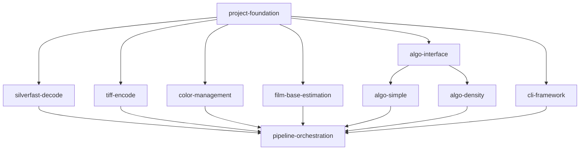

# Negative Converter — Tasks

Step-1 (MVP) plan for the `nc` CLI negative→positive converter. See
[design-spec.md](design-spec.md) for the full design (and [design-spec.html](design-spec.html)
for the human-readable version).

> **Progress log:** [progress.md](progress.md) records *how* each task is carried
> out — what was done, decisions made, what works, what doesn't. **Read it before
> starting a task**, and keep your task's section updated as you work, so the next
> task can build on what you learned.

## Design

### Overview
A command-line tool (`nc`) that reads a film-negative scan (SilverFast HDR/HDRi
first), converts it to a positive image, and writes a TIFF. "AI-friendly" means
**every conversion parameter is a CLI flag** and the tool is deterministic and
scriptable with JSON recipes/reports — not that ML processes the image.

### Architecture
Pure-function pipeline stages, orchestrated by the CLI layer:

```
decode → film-base estimate → algorithm (simple|density) → output color transform → encode
```

- **io/decode** — SilverFast HDR (48-bit RGB) / HDRi (64-bit RGB+IR) → linear `f32` `LinearImage` (IR preserved, not consumed).
- **io/encode** — `LinearImage` → 16-bit or 32-bit float TIFF, embedded ICC, sidecar JSON, optional IR export.
- **pipeline/film_base** — estimate `Dmin` from unexposed border, with CLI override.
- **pipeline/color** — lcms2 working→output transform; depth-aware default profile.
- **algo** — `Converter` trait + two implementations: `simple` (inversion baseline) and `density` (Cineon/negadoctor density-domain, default).
- **cli + main** — clap subcommands (`convert`/`inspect`/`estimate`/`params`), recipe load/merge, JSON report, exit codes.

### Key choices
- **Rust**, single static binary. Pure functions per stage; CLI is the only orchestrator.
- **32-bit float linear working space** throughout; bit-depth reduction only at encode.
- **Pluggable algorithms** via a `Converter` trait so more can be added later.
- Density conversion and print rendering are **separate sub-stages** (core fidelity rule).
- IR channel is **preserved but not acted on** in Step 1 (dust removal is a roadmap follow-up).

## Dependencies



Dependency list (a task is executable when all its deps are `[x]` done):

- `project-foundation`: (none)
- `silverfast-decode`: `project-foundation`
- `tiff-encode`: `project-foundation`
- `color-management`: `project-foundation`
- `film-base-estimation`: `project-foundation`
- `algo-interface`: `project-foundation`
- `cli-framework`: `project-foundation`
- `algo-simple`: `algo-interface`
- `algo-density`: `algo-interface`
- `pipeline-orchestration`: `silverfast-decode`, `tiff-encode`, `color-management`, `film-base-estimation`, `algo-simple`, `algo-density`, `cli-framework`

## Tasks

**Legend:** `[ ]` not started · `[~]` in progress · `[x]` done

### Phase 1: Foundation
> Goal: a building Cargo project with the core types every stage shares.

- [x] [Project foundation and core types](tasks/project-foundation.md)

### Phase 2: Building blocks
> Goal: each pipeline stage built and unit-tested in isolation. All parallelizable.

- [ ] [SilverFast HDR/HDRi decode](tasks/silverfast-decode.md)
- [ ] [TIFF encode and output](tasks/tiff-encode.md)
- [ ] [Color management](tasks/color-management.md)
- [ ] [Film-base / Dmin estimation](tasks/film-base-estimation.md)
- [x] [Algorithm interface](tasks/algo-interface.md)
- [x] [CLI framework](tasks/cli-framework.md)

### Phase 3: Algorithms
> Goal: the two negative→positive converters, both selectable.

- [ ] [Simple inversion algorithm](tasks/algo-simple.md)
- [ ] [Density-domain algorithm](tasks/algo-density.md)

### Phase 4: Integration
> Goal: the full CLI works end to end on a real scan.

- [ ] [Pipeline orchestration](tasks/pipeline-orchestration.md)
