# Negative Converter — Tasks

Step-1 (MVP) plan for the `nc` CLI negative→positive converter. See
[design-spec.md](design-spec.md) for the full design.

> **Progress log:** [progress.md](progress.md) records *how* each task is carried
> out — what was done, decisions made, what works, what doesn't. **Read it before
> starting a task**, and keep your task's section updated as you work, so the next
> task can build on what you learned.

## Design

### Overview
A command-line tool (`nc`) that reads a film-negative scan (SilverFast HDR/HDRi
first), converts it to a positive image, and writes a TIFF. "AI-friendly" means
**every conversion parameter is a CLI flag** and the tool is deterministic and
scriptable with JSON recipes/reports — not that ML processes the image.

### Architecture
Pure-function pipeline stages, orchestrated by the CLI layer:

```
decode → validate input semantics → film-base → negative reconstruction
       → density curve → FilmRgbImage → NC film RGB v1 → linear ACEScg
         ├→ film-master encode
         └→ shared print controls → SDR/HDR render/profile → encode
```

The target `film-master` branch preserves NC's intentional film, lens,
development, and scanner rendering in unclamped linear ACEScg. It includes
reconstruction, the selected exponential/sigmoid density curve, and supported
fixed/roll Dmax placement, but bypasses later print/display controls and rejects
frame-local auto Dmax. Simple and density paths produce one typed
`FilmRgbImage`; NC film RGB v1 interprets that rendering consistently as linear
Rec.709/D65 and maps it into ACEScg/D60. This is film-rendering intent, not
physical scene recovery. Optional measured correction profiles have no
downstream blockers. Today’s `--output-hdr` remains a rendered float TIFF, not
the future master branch.

- **io/decode** — SilverFast HDR (48-bit RGB) / HDRi (64-bit RGB+IR) → linear `f32` scanner measurements (IR preserved, not consumed); input semantics remain explicit rather than silently assigning Rec.709.
- **io/encode** — current `LinearImage` → 16-bit or 32-bit float TIFF with ICC;
  planned display output adds ISO gain-map JPEG and PQ/HLG AVIF while retaining
  linear ACEScg film masters.
- **pipeline/film_base** — estimate `Dmin` from unexposed border, with CLI override.
- **pipeline/color** — map typed NC film RGB v1 into linear ACEScg, then transform/render it for the selected output; optional correction is explicit.
- **algo** — current `Converter` implementations migrate to tagged `simple` or `density` reconstruction, with density selecting an exponential (default) or sigmoid curve.
- **cli + main** — clap subcommands (`convert`/`inspect`/`estimate`/`params`/`roll`), recipe load/merge, JSON report, exit codes.

### Key choices
- **Rust**, single static binary. Pure functions per stage; CLI is the only orchestrator.
- **Normally 32-bit float linear image buffers:** scanner measurement coordinates before reconstruction, typed NC film RGB after the density curve, and linear ACEScg after the versioned working-space mapping; bit-depth reduction only at encode.
- **Pluggable algorithms** via a `Converter` trait so more can be added later.
- Density conversion and print rendering are **separate sub-stages** (core fidelity rule).
- IR channel is **preserved but not acted on** in Step 1 (dust removal is a roadmap follow-up).

## Dependencies

```mermaid
graph TD
  project-foundation --> silverfast-decode
  project-foundation --> tiff-encode
  project-foundation --> color-management
  project-foundation --> film-base-estimation
  project-foundation --> algo-interface
  project-foundation --> cli-framework
  algo-interface --> algo-simple
  algo-interface --> algo-density
  silverfast-decode --> pipeline-orchestration
  tiff-encode --> pipeline-orchestration
  color-management --> pipeline-orchestration
  film-base-estimation --> pipeline-orchestration
  algo-simple --> pipeline-orchestration
  algo-density --> pipeline-orchestration
  cli-framework --> pipeline-orchestration
  cli-framework --> stdout-broken-pipe-safety
  pipeline-orchestration --> transactional-output-writes
  pipeline-orchestration --> memory-preflight
  pipeline-orchestration --> dependency-hygiene
  pipeline-orchestration --> release-readiness
  pipeline-orchestration --> value-domain-terminology
  memory-preflight --> streaming-tiled-io
  real-scan-verification --> streaming-tiled-io
  film-base-estimation --> auto-base-redesign
  ir-holder-detection --> white-holder-support
  pipeline-orchestration --> estimate-reuse-output
  estimate-reuse-output --> grid-verdict-enum
  film-base-estimation --> grid-verdict-enum
  pipeline-orchestration --> real-scan-verification
  pipeline-orchestration --> perf-instrumentation
  pipeline-orchestration --> perf-telemetry
  perf-telemetry --> telemetry-strategy
  telemetry-strategy --> telemetry-schema-v2
  telemetry-schema-v2 --> telemetry-ingestion-service
  telemetry-schema-v2 --> telemetry-upload
  telemetry-ingestion-service --> telemetry-upload
  telemetry-upload --> telemetry-panic-hook
  dmax-white-anchor --> real-scan-verification
  dmax-reference --> real-scan-verification
  algo-density --> dmax-white-anchor
  algo-interface --> algo-sigmoid
  dmax-white-anchor --> algo-sigmoid
  algo-density --> auto-neutral-wb
  pipeline-orchestration --> auto-neutral-wb
  algo-density --> regional-color-balance
  algo-density --> density-safety-bounds
  pipeline-orchestration --> density-safety-bounds
  algo-density --> bw-support
  pipeline-orchestration --> bw-support
  dmax-white-anchor --> bw-support
  film-base-estimation --> film-base-content-fallback
  auto-base-redesign --> ir-holder-detection
  auto-base-redesign --> auto-base-neutral-stock
  dmax-white-anchor --> dmax-reference
  dmax-reference --> dense-base-dmax-plausibility
  pipeline-orchestration --> roll-conversion
  dmax-white-anchor --> roll-conversion
  pipeline-orchestration --> conversion-versioning
  pipeline-orchestration --> input-data-semantics
  input-data-semantics --> scanner-profile-before-density-experiment
  color-management --> scanner-profile-before-density-experiment
  input-data-semantics --> negative-reconstruction-density-curves
  dmax-reference --> negative-reconstruction-density-curves
  algo-sigmoid --> negative-reconstruction-density-curves
  negative-reconstruction-density-curves --> film-rgb-working-space
  color-management --> film-rgb-working-space
  film-rgb-working-space --> film-master-render-pipeline
  dmax-reference --> film-master-render-pipeline
  film-rgb-working-space --> optional-color-correction-profiles
  film-master-render-pipeline --> optional-color-correction-profiles
  color-management --> display-p3-output
  color-management --> hdr-output-spike
  film-master-render-pipeline --> sdr-display-rendering
  display-p3-output --> sdr-display-rendering
  hdr-output-spike --> sdr-display-rendering
  film-master-render-pipeline --> hdr-display-rendering
  hdr-output-spike --> hdr-display-rendering
  sdr-display-rendering --> gain-map-hdr-output
  hdr-display-rendering --> gain-map-hdr-output
  hdr-display-rendering --> hdr-avif-output
  gain-map-hdr-output --> output-presets
  hdr-avif-output --> output-presets
  roll-conversion --> output-presets
  conversion-versioning --> output-presets
  output-presets --> display-output-acceptance
  real-scan-verification --> display-output-acceptance
  real-scan-verification --> conversion-analysis-tooling
  roll-conversion --> base-acquisition-planner
  auto-base-redesign --> base-acquisition-planner
  ir-holder-detection --> base-acquisition-planner
  film-base-content-fallback --> base-acquisition-planner
  dmax-reference --> base-acquisition-planner
```



Dependency list (a task is executable when all its deps are `[x]` done):

- `project-foundation`: (none)
- `silverfast-decode`: `project-foundation`
- `tiff-encode`: `project-foundation`
- `color-management`: `project-foundation`
- `film-base-estimation`: `project-foundation`
- `algo-interface`: `project-foundation`
- `cli-framework`: `project-foundation`
- `algo-simple`: `algo-interface`
- `algo-density`: `algo-interface`
- `pipeline-orchestration`: `silverfast-decode`, `tiff-encode`, `color-management`, `film-base-estimation`, `algo-simple`, `algo-density`, `cli-framework`
- `auto-base-redesign` (post-MVP): `film-base-estimation`
- `white-holder-support` (post-MVP, the RGB-only fallback for the no-IR path):
  `ir-holder-detection` (`auto-base-redesign` is now transitive via `ir-holder-detection`)
- `estimate-reuse-output` (post-MVP): `pipeline-orchestration`
- `grid-verdict-enum` (post-MVP): `estimate-reuse-output`, `film-base-estimation`
- `real-scan-verification` (post-MVP): `pipeline-orchestration`, `dmax-white-anchor`, `dmax-reference`
- `conversion-analysis-tooling` (post-MVP, spike): `real-scan-verification`
- `perf-instrumentation` (post-MVP, **parked**): `pipeline-orchestration` — LAB
  criterion benches; prototyped and parked on branch
  `prototype/perf-bench-instrumentation`, superseded by `perf-telemetry` as the
  real (real-world, not lab) direction
- `perf-telemetry` (post-MVP): `pipeline-orchestration`
- `telemetry-strategy` (post-MVP, spike): `perf-telemetry`
- `telemetry-schema-v2` (post-MVP): `telemetry-strategy`
- `telemetry-ingestion-service` (post-MVP): `telemetry-schema-v2`
- `telemetry-upload` (post-MVP): `telemetry-schema-v2`, `telemetry-ingestion-service`
- `telemetry-panic-hook` (post-MVP): `telemetry-upload`
- `stdout-broken-pipe-safety` (post-MVP, hardening): `cli-framework`
- `dmax-white-anchor` (post-MVP): `algo-density`
- `algo-sigmoid` (post-MVP): `algo-interface`, `dmax-white-anchor`
- `auto-neutral-wb` (post-MVP): `algo-density`, `pipeline-orchestration`
- `regional-color-balance` (post-MVP): `algo-density`
- `density-safety-bounds` (post-MVP): `algo-density`, `pipeline-orchestration`
- `bw-support` (post-MVP): `algo-density`, `pipeline-orchestration`, `dmax-white-anchor`
- `film-base-content-fallback` (post-MVP): `film-base-estimation`
- `ir-holder-detection` (post-MVP): `auto-base-redesign`
- `auto-base-neutral-stock` (post-MVP): `auto-base-redesign`
- `dmax-reference` (post-MVP): `dmax-white-anchor`
- `dense-base-dmax-plausibility` (post-MVP): `dmax-reference`
- `roll-conversion` (post-MVP): `pipeline-orchestration`, `dmax-white-anchor`
- `base-acquisition-planner` (post-MVP): `roll-conversion`, `auto-base-redesign`, `ir-holder-detection`, `film-base-content-fallback`, `dmax-reference`
- `conversion-versioning` (post-MVP): `pipeline-orchestration`
- `input-data-semantics` (post-MVP): `pipeline-orchestration`
- `scanner-profile-before-density-experiment` (post-MVP, **deferred experiment**): `input-data-semantics`, `color-management`
- `negative-reconstruction-density-curves` (post-MVP): `input-data-semantics`, `dmax-reference`, `algo-sigmoid`
- `film-rgb-working-space` (post-MVP): `negative-reconstruction-density-curves`, `color-management`
- `film-master-render-pipeline` (post-MVP): `film-rgb-working-space`, `dmax-reference`
- `optional-color-correction-profiles` (post-MVP, **optional / deferred**): `film-rgb-working-space`, `film-master-render-pipeline`; no downstream blockers
- `display-p3-output` (post-MVP): `color-management`
- `hdr-output-spike` (post-MVP, spike): `color-management`
- `sdr-display-rendering` (post-MVP): `film-master-render-pipeline`, `display-p3-output`, `hdr-output-spike`
- `hdr-display-rendering` (post-MVP): `film-master-render-pipeline`, `hdr-output-spike`
- `gain-map-hdr-output` (post-MVP): `sdr-display-rendering`, `hdr-display-rendering`
- `hdr-avif-output` (post-MVP): `hdr-display-rendering`
- `output-presets` (post-MVP): `gain-map-hdr-output`, `hdr-avif-output`, `roll-conversion`, `conversion-versioning`
- `display-output-acceptance` (post-MVP): `output-presets`, `real-scan-verification`
- `transactional-output-writes` (post-MVP, hardening): `pipeline-orchestration`
- `memory-preflight` (post-MVP, hardening): `pipeline-orchestration`
- `value-domain-terminology` (post-MVP, cleanup, **preserves data flow**): `pipeline-orchestration`
- `dependency-hygiene` (post-MVP, cleanup): `pipeline-orchestration` (dep removal is standalone)
- `release-readiness` (post-MVP, productization): `pipeline-orchestration` (doc fixes now; packaging best after `display-output-acceptance`)
- `streaming-tiled-io` (post-MVP, **evaluate-first**): `memory-preflight`, `real-scan-verification`

> **Post-MVP follow-ups** (Phases 5–6) are recorded for continuity and are **not**
> blockers of `pipeline-orchestration` / the Step-1 MVP. Phase 5 came out of
> real-scan verification of `film-base-estimation`; Phase 6 out of the PR #12
> review and the Negative Lab Pro feature comparison (see `progress.md`).

## Tasks

**Legend:** `[ ]` not started · `[~]` in progress · `[x]` done

### Phase 1: Foundation
> Goal: a building Cargo project with the core types every stage shares.

- [x] [Project foundation and core types](tasks/project-foundation.md)

### Phase 2: Building blocks
> Goal: each pipeline stage built and unit-tested in isolation. All parallelizable.

- [x] [SilverFast HDR/HDRi decode](tasks/silverfast-decode.md)
- [x] [TIFF encode and output](tasks/tiff-encode.md)
- [x] [Color management](tasks/color-management.md)
- [x] [Film-base / Dmin estimation](tasks/film-base-estimation.md)
- [x] [Algorithm interface](tasks/algo-interface.md)
- [x] [CLI framework](tasks/cli-framework.md)

### Phase 3: Algorithms
> Goal: the two negative→positive converters, both selectable.

- [x] [Simple inversion algorithm](tasks/algo-simple.md)
- [x] [Density-domain algorithm](tasks/algo-density.md)

### Phase 4: Integration
> Goal: the full CLI works end to end on a real scan.

- [x] [Pipeline orchestration](tasks/pipeline-orchestration.md)

### Phase 5: Follow-ups (post-Step-1)
> Deferred improvements from real-scan verification; not blockers of the MVP.
> See design-spec §12 (roadmap) and the `film-base-estimation` progress notes.

- [x] [Robust auto film-base detection](tasks/auto-base-redesign.md)
- [ ] [Light film holder support](tasks/white-holder-support.md)
- [x] [Reuse-ready `nc estimate` output](tasks/estimate-reuse-output.md)
- [ ] [Grid agreement verdict enum](tasks/grid-verdict-enum.md)
- [ ] [IR-assisted film-holder detection](tasks/ir-holder-detection.md)
- [ ] [Content-based film-base fallback (Tier 3)](tasks/film-base-content-fallback.md) — owns `--base-content`; supersedes the content-source sub-item in `auto-base-redesign` (tell that task's owner)
- [ ] [Neutral-base robustness for auto film-base detection](tasks/auto-base-neutral-stock.md)

### Phase 6: Conversion quality (NLP-parity follow-ups)
> Default-output quality gaps identified by the PR #12 review and the Negative
> Lab Pro comparison (2026-07-13, see `progress.md`). Deterministic statistics
> only — no ML (the "AI-friendly ≠ ML" rule holds).

- [x] [Display-range white anchor (Dmax)](tasks/dmax-white-anchor.md) — shipped legacy semantics; the replacement density-curve stage owns its curve-specific placement/shape meaning
- [x] [Roll-fixed Dmax from a fully-exposed reference frame](tasks/dmax-reference.md) — shipped roll-fixed acquisition/default policy; the replacement density-curve stage preserves scalar exponential placement and sigmoid curve shaping
- [ ] [Stock-aware Dmax plausibility (dense-base stocks)](tasks/dense-base-dmax-plausibility.md) — from real-scan verification (2026-07-23): the reference-Dmax `≳1.0` floor + base-uniformity check are C41-calibrated and false-alarm on Harman Phoenix's dense/non-orange base; make the floor stock-relative while keeping a loud failure on genuinely wrong regions
- [x] [Sigmoid / H&D-curve tone algorithm](tasks/algo-sigmoid.md)
- [x] [Auto neutral white balance](tasks/auto-neutral-wb.md)
- [x] [Regional (shadow/highlight) color balance](tasks/regional-color-balance.md)
- [ ] [Black & white negative support (mono color model)](tasks/bw-support.md)
- [ ] [Density safety bounds](tasks/density-safety-bounds.md) — from the
  density-safety review: physical bounds on `density_scale`/`offset`/`gamma` (the
  sigmoid-bounds analogue density lacks) + a degenerate-output (histogram/dynamic-
  range collapse) warning catching the finite-all-black underflow the loss counters
  miss, with a false-positive guard validated on real scans.
- [x] [Input data semantics and validation](tasks/input-data-semantics.md) — resolve transfer encoding independently from scanner-device versus colorimetric meaning; report evidence and reject ambiguity instead of automatically applying an ICC transform before density conversion
- [x] [Post-reconstruction characterization runtime](tasks/post-reconstruction-color-characterization.md) — **closed—superseded**; retained as decision history and replaced by `negative-reconstruction-density-curves`, `film-rgb-working-space`, `film-master-render-pipeline`, and `optional-color-correction-profiles`
- [ ] [Negative reconstruction and density curves](tasks/negative-reconstruction-density-curves.md) — adopt tagged simple/density reconstruction, make exponential/sigmoid tagged density curves, and produce typed `FilmRgbImage`
- [ ] [NC Film RGB working-space mapping](tasks/film-rgb-working-space.md) — map every film rendering through versioned NC film RGB v1 into typed linear ACEScg/D60
- [ ] [Film-master and shared display pipeline](tasks/film-master-render-pipeline.md) — route intentional ACEScg film rendering to `film-master` or shared WB → exposure → black/range adjustments before SDR/HDR
- [ ] [Optional color-correction profiles](tasks/optional-color-correction-profiles.md) — **optional / deferred** measured neutralization with explicit selection and provenance; blocks no output task
- [ ] [Scanner ICC before-density experiment](tasks/scanner-profile-before-density-experiment.md) — **deferred / lower priority**: compare raw density ratios with applying the same scanner ICC to image and Dmin first; independent of the superseded characterization proposal and the normal NC film RGB mapping

### Phase 6B: Color-defined display outputs
> Establish the color-accurate SDR path first, then add standards-based HDR
> rendering and a backward-compatible gain-map output. These tasks define the
> intended product default that Phase 7 verifies.

- [ ] [Display P3 output](tasks/display-p3-output.md) — synthesize and embed a standards-conforming Display P3 ICC profile for the SDR/base rendition
- [~] [HDR still-output spike](tasks/hdr-output-spike.md) — decide ISO HDR/gain-map container, encoder, metadata, reference-white, and cross-platform strategy before implementation
- [ ] [SDR display rendering](tasks/sdr-display-rendering.md) — render intentional linear ACEScg film values into a valid Display P3 or sRGB SDR rendition with explicit reference-white, tone, and gamut policy
- [ ] [Display-HDR rendering](tasks/hdr-display-rendering.md) — render intentional linear ACEScg film values into BT.2020 PQ/HLG with explicit headroom, tone, and gamut mapping
- [ ] [ISO gain-map HDR output](tasks/gain-map-hdr-output.md) — write a backward-compatible Display P3 JPEG base plus ISO 21496-1 and Ultra HDR v1 gain-map metadata
- [ ] [HDR AVIF output](tasks/hdr-avif-output.md) — encode the rendered 10-bit BT.2020 PQ/HLG signals as deterministic AVIF v1.2 Advanced Profile files
- [ ] [Output presets and guidance](tasks/output-presets.md) — make `gain-map-hdr` the default, expose clear compatibility/master/PQ/HLG choices, and migrate `nc roll` naming/manifests to resolved containers

### Phase 7: Acceptance
> Core full-size verification runs as soon as the existing TIFF pipeline and
> Dmax anchor are ready, so it can inform memory/streaming work. Final display
> acceptance separately waits for the new presets and HDR encoders. Optional
> measured correction profiles do not block it.

- [x] [Real-scan core verification](tasks/real-scan-verification.md) — exercise decoding, Dmin/Dmax, current TIFF conversion, IR, determinism, and resource use on full-size scans without waiting for the display-output roadmap. **Done 2026-07-23** (see `docs/reports/real-scan-verification.md`): all rows pass on 5 real rolls; measured peak ~930 MiB @ 18.7 MP feeds `streaming-tiled-io` STEP 0; frozen recipes + harness feed `display-output-acceptance`; follow-up `dense-base-dmax-plausibility` filed; default-SDR paleness routes to the display-output roadmap
- [ ] [Display-output acceptance](tasks/display-output-acceptance.md) — verify the final gain-map default, SDR fallback, explicit output presets, metadata, and cross-device behavior on the same real scans
- [ ] [Conversion-analysis tooling (spike)](tasks/conversion-analysis-tooling.md) — grow the real-scan-verify harness into a toolkit: asset manifest, image-library analysis of results, and NLP-vs-nc comparison. Spike: decide scope/structure first.

### Phase 8: Pre-release productization
> Measurement and hardening before releasing to users (2026-07-14 telemetry
> discussion). Local-only instrumentation first; remote telemetry stays a
> deliberately separate, opt-in roadmap item (design-spec §12).

- [~] [Performance instrumentation](tasks/perf-instrumentation.md) — **parked**:
  the LAB criterion-benchmark approach was prototyped and parked on branch
  `prototype/perf-bench-instrumentation` (not merged; see its
  `docs/prototypes/perf-bench-instrumentation.md`). The real, real-world direction
  shipped as `perf-telemetry` below.
- [x] [Embedded performance + context telemetry](tasks/perf-telemetry.md) — the
  real-world successor to `perf-instrumentation`: an opt-in JSON telemetry record
  per `nc convert` run (image + timing + context) to a local JSONL log / one-off
  file, no new entrypoint. Lifts the prototype's per-stage timing.
- [x] [Telemetry strategy spike](tasks/telemetry-strategy.md) — approved
  [strategy](telemetry-strategy.md): custom JSON to Cloudflare Worker + D1,
  anonymous schema-minimized upload, persistent explicit consent, crash-safe
  detached draining, success/failure events, and sanitized panic reporting.
- [ ] [Telemetry event schema v2](tasks/telemetry-schema-v2.md) — add typed
  success/failure local events and a separately versioned, privacy-minimized
  upload projection with random per-event deduplication IDs.
- [ ] [Telemetry ingestion service](tasks/telemetry-ingestion-service.md) — build
  the validating Cloudflare Worker + D1 endpoint, exact deduplication, 180-day
  retention, hard FREE-plan quotas, abuse quarantine/kill switch, and initial
  advisory performance/failure queries.
- [ ] [Background telemetry upload](tasks/telemetry-upload.md) — ship the local
  consent-selected active JSONL through generation-bound collection/request
  leases and its private spool, durable recovery, detached helpers, retries,
  non-stranding retarget, lock-stable inactive purge, caps, and maintenance
  commands.
- [ ] [Sanitized panic telemetry](tasks/telemetry-panic-hook.md) — publish
  persistent-managed-consent panic events as isolated atomic ready files with
  only capped, normalized `nc` function/module frames; no per-run hook, shared
  append stream, payloads, source paths, or native-crash claim.
- [ ] [Transactional output writes](tasks/transactional-output-writes.md) — from
  the output-atomicity review: write every artifact (primary TIFF, IR, sidecar,
  report-file) to a same-directory temp, fsync, then rename, so a failed/interrupted
  run never leaves a truncated final file. Honest guarantee: no partial files +
  minimized inconsistency window, not literal multi-file atomicity (a crash between
  renames can still mix old/new artifacts).
- [ ] [Memory preflight & in-place transform](tasks/memory-preflight.md) — from the
  memory-safety review (Phase A, cheap): predict peak allocation and fail loudly
  over a budget before allocating (reconciling the dishonest 4 GiB input limit),
  and drop the whole-image clone in `to_output` (transform in place, skip IR).
- [ ] [Streaming / tiled I/O](tasks/streaming-tiled-io.md) — memory-safety review
  Phase B (expensive, **evaluate-first**): strip/tile decode + streaming encode.
  STEP 0 gate — evaluate from measured peak whether this is needed at all; if data
  is insufficient, collect it first; proceed only if real scans exceed the budget.
- [ ] [Value-domain terminology & Dmin/Dmax clarity](tasks/value-domain-terminology.md) — extract design-spec §4 terminology into a standalone doc + an agent skill, and make `Dmin`/`Dmax` human-clear. Preserves the data flow; details at execution.
- [ ] [Dependency & module hygiene](tasks/dependency-hygiene.md) — from the
  hygiene review: drop three unused crates (`image`, `kamadak-exif`, `palette` —
  verified builds without them; `image` pulls a large codec tree) and unify the two
  `Algorithm` enums onto `types::Algorithm`, removing the dead copy and its
  `#[allow(dead_code)]`. Pure cleanup, byte-identical output.
- [ ] [Stdout broken-pipe safety](tasks/stdout-broken-pipe-safety.md) — make every
  stdout JSON write (the report via `emit_report`, `nc params`) tolerate a closed
  pipe (e.g. `nc … | head`) without a panic/backtrace. Pre-existing on `main`, not
  caused by the telemetry work.
- [ ] [Conversion versioning & baseline comparison](tasks/conversion-versioning.md) — `v0` baseline recorded in [reports/v0-baseline.md](reports/v0-baseline.md)
- [ ] [Release readiness](tasks/release-readiness.md) — from the release-readiness
  review: (1) correct public docs that misstate the product (README "pre-implementation"
  + "planned", TASKS.md "two algorithms" omitting sigmoid, obsolete `--out-depth` in
  `pipeline-orchestration`, PUA-wrapped `citeturn` tokens in the research report); (2) license (user
  decision), Cargo release metadata, supported platforms (lcms2-sys C FFI constraint),
  and binary packaging.

### Phase 9: Roll workflow (batch conversion)
> Two conversion workflows established in the 2026-07 design discussion: **roll**
> (detect the base + Dmax once, convert the whole roll with a frozen recipe —
> strongly preferred) and **single** (per-frame best-effort). "Auto mode" is just
> roll conversion's default behavior on a batch. Roll-fixed `Dmin` / `Dmax`
> depend on `dmax-reference`; the cascade depends on the detectors above.

- [x] [Roll conversion (batch + frozen recipe)](tasks/roll-conversion.md)
- [ ] [Base-acquisition planner (the cascade)](tasks/base-acquisition-planner.md)
