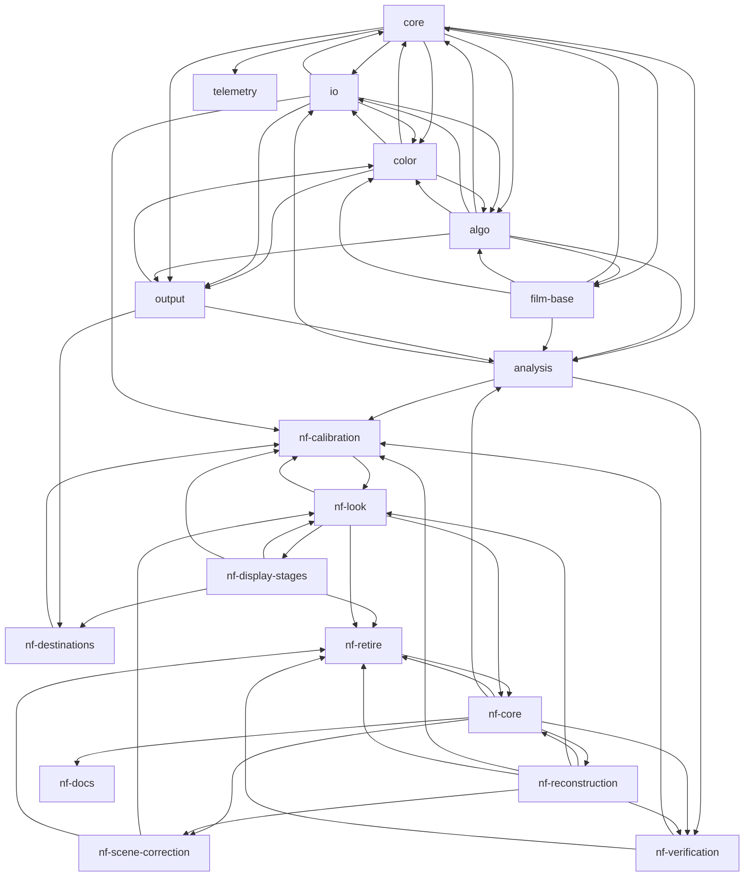

# Hanten — Tasks

Step-1 (MVP) plan for the `hanten` CLI negative→positive converter. See
[design-spec.md](design-spec.md) for the full design.

> **Progress log:** one file per epic under [progress/](progress/) records *how*
> each task is carried out — what was done, decisions made, what works, what
> doesn't. **Before starting a task, read your epic's progress file in full, plus
> the `Epic summary` section of every epic you depend on** — then keep your own
> task's section updated as you work, so the next task can build on what you
> learned.

## Design

### Overview
A command-line tool (`nc`) that reads a film-negative scan (SilverFast HDR/HDRi
first), converts it to a positive image, and writes a TIFF (including the
display-linear and Rec.2100-coded HDR TIFFs) or an explicitly selected
`ultra-hdr-v1` gain-map JPEG or `hdr-pq`/`hdr-hlg` AVIF. "AI-friendly" means
**every conversion parameter is a CLI flag** and the tool is deterministic and
scriptable with JSON recipes/reports — not that ML processes the image.

### Architecture
Pure-function pipeline stages, orchestrated by the CLI layer:

```
decode → validate input semantics → film-base → preset dispatch
  ├→ film-master: stages::render_film_master
  │    → tagged reconstruction (simple | density, including density curve)
  │    → FilmRgbImage → NC film RGB v1 → linear ACEScg → TIFF encode
  └→ display presets: stages::render_display_source
       → tagged reconstruction (simple | density, including density curve)
       → FilmRgbImage → NC film RGB v1 → linear ACEScg → shared print controls
       → ultra-hdr-v1: SDR/HDR + gain map → JPEG package
       → hdr-pq / hdr-hlg: HDR → Rec.2100 PQ/HLG → 10-bit 4:4:4 AVIF
       → hdr-pq-tiff / hdr-hlg-tiff: the same signal → 16-bit TIFF codes
       → hdr-linear-tiff: HDR, no transfer → 32-bit float BT.2020 TIFF
```

The target `film-master` branch preserves NC's intentional film, lens,
development, and scanner rendering in unclamped linear ACEScg. Its contract is
**whatever the configured reconstruction produces**, unclamped, with fixed/roll
Dmax placement, bypassing every later print/display control and rejecting
frame-local fitting — it is *not* tied to a particular curve shape, and already
varies with every curve knob. Under today's default that
happens to include the reference-anchored sigmoid's toe/midtone/shoulder
rendering; `algo/reconstruction-render-curve-split` is moving the shoulder to the
display stage, which changes the default master's rendering but not this
contract. Exponential and simple remain advanced/diagnostic paths pending a
separate retirement decision. All paths
produce one typed `FilmRgbImage`; NC film RGB v1 interprets that rendering
consistently as linear Rec.709/D65 and maps it into ACEScg/D60. This is
film-rendering intent, not physical scene recovery. Optional measured correction
profiles have no downstream blockers. The rendered float TIFF is
`hdr-linear-tiff` (the `legacy` path's `--out-depth f32` retired with it), and is
not the master branch.

One bullet per epic below — the name is the epic id the task list is grouped
under, and the parenthesized paths are the modules it owns.

- **io** (`io/decode.rs`, `io/encode.rs`, `pipeline/input_semantics.rs`) — SilverFast HDR (48-bit RGB) / HDRi (64-bit RGB+IR) → linear `f32` scanner measurements (IR carried through, consumed only by `film-base/ir-holder-detection`); input semantics remain explicit rather than silently assigning Rec.709. On the way out, `LinearImage` → 16-bit or 32-bit float TIFF with ICC, retaining linear ACEScg film masters; the planned display-output encoders are the `output` epic's. Buffer strategy (preflight, streaming) lives here too.
- **film-base** (`pipeline/film_base.rs`) — estimate `Dmin` from unexposed border,
  with CLI override, and measure the roll-fixed `Dmax` anchor from a reference
  frame. The two are *different quantities* (see design-spec §4) that share this
  measurement surface.
- **color** (`pipeline/color.rs`, `pipeline/working_space.rs`,
  `pipeline/colorimetry/`) — map typed NC film RGB v1 into linear ACEScg,
  centralize auditable color-space definitions and derived coefficients, then
  transform/render it for the selected output; optional correction is explicit.
- **algo** (`src/algo/`) — `algo::reconstruct` resolves the tagged
  `reconstruction` recipe object into simple or density reconstruction. The
  reference-anchored sigmoid **is** the product default as of `pipeline_version` 2
  (2026-08-08) and owns floor/toe, midtone, and shoulder placement;
  exponential/simple remain explicit advanced references. The print controls run
  past the ACEScg boundary (`render_split`); the film-RGB print stage retired with
  `legacy`.
- **output** (the encoders downstream of `color`) — the display renditions:
  Display P3 / SDR, BT.2020 PQ/HLG, explicit legacy Ultra HDR v1 gain-map JPEG
  (with final ISO metadata planned), AVIF, and the presets that resolve them
  together.
- **core** (`cli.rs`, `main.rs`, `types.rs`, `pipeline/stages.rs`) — clap subcommands (`convert`/`inspect`/`estimate`/`params`/`roll`), recipe load/merge, JSON report, exit codes, the roll/batch workflow, the shared types, and the pure algorithm→output-color render core the CLI drives.
- **telemetry** (`src/telemetry.rs`) — that module and the opt-in upload stack. Operational, never a conversion knob.
- **analysis** (`scripts/`) — the real-scan verification harness, the `nctool` Python toolkit, the asset manifest, and NLP comparison. Verifies the pipeline; is not part of it.

### Key choices
- **Rust**, single static binary. Pure functions per stage; CLI is the only orchestrator.
- **Normally 32-bit float linear image buffers:** scanner measurement coordinates before reconstruction, typed NC film RGB after the density curve, and linear ACEScg after the versioned working-space mapping; bit-depth reduction only at encode.
- **Pluggable algorithms** behind the tagged `reconstruction` recipe object, resolved by `algo::reconstruct`, so more can be added later.
- Density conversion and print rendering are **separate sub-stages** (core fidelity rule).
- IR channel is **preserved and not acted on by the conversion path**, with one exception: on a marker-verified IR plane that *measures* able to separate holder from film on that frame (`film-base/ir-usability-detection`), `film_base::estimate` consumes IR to mask the opaque holder before the auto rebate search (`film-base/ir-holder-detection`). `--film-type` is provenance only and gates nothing. IR dust removal remains a roadmap follow-up.

## Dependencies

Epic rollup (derived from the task graph — do not author epic-level edges here;
regenerate this whenever the task edges change). Cycles below are legitimate
projections of an acyclic task graph, not defects.


```mermaid
graph TD
  core
  io
  film-base
  algo
  color
  output
  telemetry
  analysis
  nf-core
  nf-reconstruction
  nf-scene-correction
  nf-look
  nf-display-stages
  nf-destinations
  nf-calibration
  nf-verification
  nf-retire
  nf-docs
  core --> io
  core --> color
  core --> film-base
  core --> algo
  io --> core
  color --> core
  film-base --> core
  algo --> core
  analysis --> io
  core --> analysis
  core --> telemetry
  algo --> analysis
  film-base --> analysis
  algo --> film-base
  io --> color
  io --> algo
  film-base --> algo
  color --> algo
  algo --> io
  algo --> color
  film-base --> color
  color --> output
  color --> io
  output --> color
  io --> output
  core --> output
  algo --> output
  output --> analysis
  nf-reconstruction --> nf-core
  nf-retire --> nf-core
  nf-core --> nf-reconstruction
  nf-core --> nf-scene-correction
  nf-reconstruction --> nf-scene-correction
  nf-scene-correction --> nf-look
  nf-reconstruction --> nf-look
  nf-look --> nf-display-stages
  nf-display-stages --> nf-look
  nf-display-stages --> nf-destinations
  output --> nf-destinations
  nf-destinations --> nf-calibration
  nf-display-stages --> nf-calibration
  nf-verification --> nf-calibration
  analysis --> nf-calibration
  io --> nf-calibration
  nf-look --> nf-calibration
  nf-reconstruction --> nf-calibration
  nf-calibration --> nf-look
  analysis --> nf-verification
  nf-core --> nf-verification
  nf-reconstruction --> nf-verification
  nf-core --> nf-retire
  nf-verification --> nf-retire
  nf-display-stages --> nf-retire
  nf-reconstruction --> nf-retire
  nf-look --> nf-retire
  nf-look --> nf-core
  nf-scene-correction --> nf-retire
  nf-core --> nf-docs
  nf-core --> analysis
```

```mermaid
graph TD
  subgraph core
    core/product-naming
    core/project-foundation
    core/cli-framework
    core/pipeline-orchestration
    core/conversion-versioning
    core/recipe-replay-fidelity
    core/stdout-broken-pipe-safety
    core/value-domain-terminology
    core/dependency-hygiene
    core/release-readiness
    core/roll-conversion
    core/base-acquisition-planner
    core/recipe-composition
    core/profile-authoring
    core/unfrozen-auto-mode-warning
    core/calibration-recipe-section
  end
  subgraph io
    io/silverfast-decode
    io/tiff-encode
    io/input-data-semantics
    io/transactional-output-writes
    io/memory-preflight
    io/streaming-tiled-io
    io/multi-frame-memory-growth
    io/scanner-density-calibration
    io/gray-primary-decode
    io/positive-input-mode
  end
  subgraph film-base
    film-base/estimation
    film-base/auto-base-redesign
    film-base/ir-holder-detection
    film-base/content-fallback
    film-base/estimate-reuse-output
    film-base/dmax-reference
    film-base/ir-usability-detection
    film-base/holder-depth-mask
    film-base/holder-cap-contamination
    film-base/holder-masked-measurement
    film-base/tiling-uniformity-validator
    film-base/half-frame-calibration
  end
  subgraph algo
    algo/interface
    algo/simple
    algo/density
    algo/sigmoid
    algo/negative-reconstruction-density-curves
    algo/reference-anchored-sigmoid
    algo/exponential-anchor-placement
    algo/dmax-white-anchor
    algo/density-safety-bounds
    algo/auto-neutral-wb
    algo/regional-color-balance
    algo/bw-support
    algo/film-stock-profiles
    algo/characteristic-curve-coverage
    algo/reconstruction-render-curve-split
    algo/conversion-presets
  end
  subgraph color
    color/management
    color/film-rgb-working-space
    color/film-master-render-pipeline
    color/post-reconstruction-color-characterization
    color/optional-color-correction-profiles
    color/scanner-profile-before-density-experiment
    color/colorimetry-source-of-truth
  end
  subgraph output
    output/display-p3-output
    output/hdr-output-spike
    output/sdr-display-rendering
    output/hdr-display-rendering
    output/gain-map-hdr-output
    output/ultrahdr-dependency-externalization
    output/iso-gain-map-metadata
    output/mp-container-conformance
    output/gain-map-dialect-activation
    output/sdr-preset-followups
    output/adobe-rgb-gamut
    output/sdr-report-block
    output/sdr-jpeg-preset
    output/linear-render
    output/display-tone-mapping
    output/output-path-suffix
    output/hdr-avif-output
    output/hdr-avif-windows-packaging
    output/lossless-hdr-tiff
    output/presets
    output/parallel-display-stages
    output/parallel-hdr-stages
    output/avif-row-multithreading
    output/post-fanout-encode-slowdown
  end
  subgraph telemetry
    telemetry/perf-instrumentation
    telemetry/perf-telemetry
    telemetry/strategy
    telemetry/schema-v2
    telemetry/ingestion-service
    telemetry/upload
    telemetry/panic-hook
  end
  subgraph analysis
    analysis/real-scan-verification
    analysis/display-output-acceptance
    analysis/conversion-analysis-tooling
    analysis/asset-manifest
    analysis/conversion-metrics
    analysis/nlp-comparison
    analysis/drive-asset-migration
    analysis/comparison-review-tooling
    analysis/metrics-chart-design
    analysis/metrics-visualization
    analysis/harness-regression-tests
    analysis/calibration-frame-capture
    analysis/review-reference-cells
    analysis/review-build-axis
    analysis/probe-fixture-roll-names
    analysis/manifest-seed-roles
    analysis/review-test-local-binary
  end
  subgraph nf-core
    nf-core/buffer-strategy
    nf-core/subcommands
    nf-core/recipe-schema
    nf-core/report-contract
    nf-core/new-flow-flag
    nf-core/stage-skeleton
    nf-core/minimal-end-to-end
    nf-core/knob-availability-audit
    nf-core/default-flip
    nf-core/one-luma-dot
  end
  subgraph nf-reconstruction
    nf-reconstruction/anchor-spike
    nf-reconstruction/fixed-decode
    nf-reconstruction/anchor-rule
    nf-reconstruction/gamma-split
    nf-reconstruction/curve-endpoint-warning
    nf-reconstruction/mono-decode
  end
  subgraph nf-scene-correction
    nf-scene-correction/stage
    nf-scene-correction/flare-removal
    nf-scene-correction/levels-knob
    nf-scene-correction/roll-white-balance
  end
  subgraph nf-look
    nf-look/desaturation-spike
    nf-look/stage
    nf-look/per-channel-grade
    nf-look/path-to-white
    nf-look/desaturation-band-refit
    nf-look/contrast
    nf-look/look-presets
    nf-look/stock-data-home
    nf-look/scene-range-mapping
    nf-look/desaturation-band-fit
  end
  subgraph nf-display-stages
    nf-display-stages/fit-range
    nf-display-stages/fit-gamut
    nf-display-stages/parametric-operator
    nf-display-stages/branch-contract
    nf-display-stages/gamut-map-share
  end
  subgraph nf-destinations
    nf-destinations/preset-set
    nf-destinations/direct-preset
    nf-destinations/memory-profiles
    nf-destinations/default-destination
  end
  subgraph nf-calibration
    nf-calibration/anchor-comparison
    nf-calibration/roll-white-rule
    nf-calibration/saturation-margin
    nf-calibration/scale-ladder
    nf-calibration/scale-gamma-loop
    nf-calibration/offset-question
    nf-calibration/neutrality-gate
    nf-calibration/user-calibration-procedure
  end
  subgraph nf-verification
    nf-verification/reference-snapshot
    nf-verification/fingerprints
    nf-verification/stage-goldens
    nf-verification/benchmark-set
    nf-verification/film-rgb-export
  end
  subgraph nf-retire
    nf-retire/characteristic
    nf-retire/legacy-custom
    nf-retire/display-tones
    nf-retire/sigmoid-and-simple
    nf-retire/dmax-machinery
    nf-retire/regional-balance
    nf-retire/print-prefix-rename
  end
  subgraph nf-docs
    nf-docs/reference-sweep
    nf-docs/design-spec
    nf-docs/using-nc
    nf-docs/claude-md
  end
  core/project-foundation --> io/silverfast-decode
  core/project-foundation --> io/tiff-encode
  core/project-foundation --> color/management
  core/project-foundation --> film-base/estimation
  core/project-foundation --> algo/interface
  core/project-foundation --> core/cli-framework
  algo/interface --> algo/simple
  algo/interface --> algo/density
  io/silverfast-decode --> core/pipeline-orchestration
  io/tiff-encode --> core/pipeline-orchestration
  color/management --> core/pipeline-orchestration
  film-base/estimation --> core/pipeline-orchestration
  algo/simple --> core/pipeline-orchestration
  algo/density --> core/pipeline-orchestration
  core/cli-framework --> core/pipeline-orchestration
  core/cli-framework --> core/stdout-broken-pipe-safety
  core/pipeline-orchestration --> io/transactional-output-writes
  core/pipeline-orchestration --> io/memory-preflight
  core/pipeline-orchestration --> core/dependency-hygiene
  core/pipeline-orchestration --> core/release-readiness
  core/pipeline-orchestration --> core/value-domain-terminology
  io/memory-preflight --> io/streaming-tiled-io
  io/memory-preflight --> io/multi-frame-memory-growth
  analysis/real-scan-verification --> io/streaming-tiled-io
  film-base/estimation --> film-base/auto-base-redesign
  core/pipeline-orchestration --> film-base/estimate-reuse-output
  core/pipeline-orchestration --> analysis/real-scan-verification
  core/pipeline-orchestration --> telemetry/perf-instrumentation
  core/pipeline-orchestration --> telemetry/perf-telemetry
  telemetry/perf-telemetry --> telemetry/strategy
  telemetry/strategy --> telemetry/schema-v2
  telemetry/schema-v2 --> telemetry/ingestion-service
  telemetry/schema-v2 --> telemetry/upload
  telemetry/ingestion-service --> telemetry/upload
  telemetry/upload --> telemetry/panic-hook
  algo/dmax-white-anchor --> analysis/real-scan-verification
  film-base/dmax-reference --> analysis/real-scan-verification
  algo/density --> algo/dmax-white-anchor
  algo/interface --> algo/sigmoid
  algo/dmax-white-anchor --> algo/sigmoid
  algo/density --> algo/auto-neutral-wb
  core/pipeline-orchestration --> algo/auto-neutral-wb
  algo/density --> algo/regional-color-balance
  algo/density --> algo/density-safety-bounds
  core/pipeline-orchestration --> algo/density-safety-bounds
  algo/density --> algo/bw-support
  core/pipeline-orchestration --> algo/bw-support
  algo/dmax-white-anchor --> algo/bw-support
  film-base/estimation --> film-base/content-fallback
  film-base/auto-base-redesign --> film-base/ir-holder-detection
  algo/dmax-white-anchor --> film-base/dmax-reference
  core/pipeline-orchestration --> core/roll-conversion
  algo/dmax-white-anchor --> core/roll-conversion
  core/pipeline-orchestration --> core/conversion-versioning
  core/conversion-versioning --> core/recipe-replay-fidelity
  algo/reference-anchored-sigmoid --> core/recipe-replay-fidelity
  core/pipeline-orchestration --> io/input-data-semantics
  io/input-data-semantics --> color/scanner-profile-before-density-experiment
  color/management --> color/scanner-profile-before-density-experiment
  io/input-data-semantics --> algo/negative-reconstruction-density-curves
  film-base/dmax-reference --> algo/negative-reconstruction-density-curves
  algo/sigmoid --> algo/negative-reconstruction-density-curves
  algo/negative-reconstruction-density-curves --> algo/reference-anchored-sigmoid
  algo/negative-reconstruction-density-curves --> algo/exponential-anchor-placement
  film-base/dmax-reference --> algo/reference-anchored-sigmoid
  algo/reference-anchored-sigmoid --> algo/film-stock-profiles
  algo/reference-anchored-sigmoid --> algo/reconstruction-render-curve-split
  color/film-master-render-pipeline --> algo/reconstruction-render-curve-split
  algo/film-stock-profiles --> algo/conversion-presets
  algo/film-stock-profiles --> algo/characteristic-curve-coverage
  analysis/calibration-frame-capture --> io/scanner-density-calibration
  io/silverfast-decode --> io/gray-primary-decode
  io/gray-primary-decode --> algo/bw-support
  film-base/ir-holder-detection --> film-base/ir-usability-detection
  film-base/ir-usability-detection --> film-base/holder-masked-measurement
  film-base/ir-usability-detection --> film-base/holder-depth-mask
  film-base/holder-depth-mask --> film-base/holder-cap-contamination
  film-base/holder-depth-mask --> film-base/holder-masked-measurement
  core/conversion-versioning --> film-base/holder-masked-measurement
  film-base/dmax-reference --> film-base/holder-masked-measurement
  film-base/holder-masked-measurement --> film-base/tiling-uniformity-validator
  core/roll-conversion --> core/calibration-recipe-section
  core/conversion-versioning --> core/calibration-recipe-section
  core/calibration-recipe-section --> core/recipe-composition
  core/calibration-recipe-section --> core/profile-authoring
  core/calibration-recipe-section --> core/base-acquisition-planner
  core/cli-framework --> core/recipe-composition
  core/roll-conversion --> core/recipe-composition
  core/recipe-composition --> core/profile-authoring
  core/cli-framework --> core/profile-authoring
  core/roll-conversion --> core/unfrozen-auto-mode-warning
  core/base-acquisition-planner --> film-base/half-frame-calibration
  film-base/estimate-reuse-output --> film-base/tiling-uniformity-validator
  algo/reference-anchored-sigmoid --> analysis/comparison-review-tooling
  algo/film-stock-profiles --> io/scanner-density-calibration
  io/input-data-semantics --> io/scanner-density-calibration
  algo/negative-reconstruction-density-curves --> color/film-rgb-working-space
  color/management --> color/film-rgb-working-space
  color/film-rgb-working-space --> color/film-master-render-pipeline
  film-base/dmax-reference --> color/film-master-render-pipeline
  color/film-rgb-working-space --> color/optional-color-correction-profiles
  color/film-master-render-pipeline --> color/optional-color-correction-profiles
  io/input-data-semantics --> color/post-reconstruction-color-characterization
  color/management --> color/post-reconstruction-color-characterization
  film-base/dmax-reference --> color/post-reconstruction-color-characterization
  color/management --> output/display-p3-output
  color/management --> output/hdr-output-spike
  color/film-master-render-pipeline --> output/sdr-display-rendering
  output/display-p3-output --> output/sdr-display-rendering
  output/hdr-output-spike --> output/sdr-display-rendering
  color/film-master-render-pipeline --> output/hdr-display-rendering
  output/hdr-output-spike --> output/hdr-display-rendering
  output/sdr-display-rendering --> output/gain-map-hdr-output
  output/hdr-display-rendering --> output/gain-map-hdr-output
  output/gain-map-hdr-output --> output/ultrahdr-dependency-externalization
  output/iso-gain-map-metadata --> output/ultrahdr-dependency-externalization
  output/gain-map-hdr-output --> output/iso-gain-map-metadata
  output/iso-gain-map-metadata --> output/mp-container-conformance
  output/iso-gain-map-metadata --> output/gain-map-dialect-activation
  output/presets --> output/sdr-preset-followups
  output/presets --> output/adobe-rgb-gamut
  output/presets --> output/sdr-report-block
  output/presets --> output/sdr-jpeg-preset
  output/sdr-display-rendering --> output/sdr-jpeg-preset
  io/input-data-semantics --> io/positive-input-mode
  color/film-master-render-pipeline --> io/positive-input-mode
  analysis/comparison-review-tooling --> analysis/review-reference-cells
  analysis/comparison-review-tooling --> analysis/review-build-axis
  output/sdr-display-rendering --> output/linear-render
  output/sdr-display-rendering --> output/display-tone-mapping
  output/hdr-display-rendering --> output/display-tone-mapping
  output/gain-map-hdr-output --> color/colorimetry-source-of-truth
  output/hdr-display-rendering --> output/hdr-avif-output
  output/hdr-display-rendering --> output/lossless-hdr-tiff
  color/colorimetry-source-of-truth --> output/lossless-hdr-tiff
  io/transactional-output-writes --> output/lossless-hdr-tiff
  output/iso-gain-map-metadata --> output/presets
  output/hdr-avif-output --> output/presets
  output/hdr-avif-output --> output/hdr-avif-windows-packaging
  output/hdr-avif-output --> output/output-path-suffix
  output/sdr-display-rendering --> output/parallel-display-stages
  color/film-master-render-pipeline --> output/parallel-display-stages
  output/parallel-display-stages --> output/parallel-hdr-stages
  output/hdr-display-rendering --> output/parallel-hdr-stages
  output/gain-map-hdr-output --> output/parallel-hdr-stages
  output/hdr-avif-output --> output/avif-row-multithreading
  core/conversion-versioning --> output/avif-row-multithreading
  output/parallel-hdr-stages --> output/post-fanout-encode-slowdown
  output/lossless-hdr-tiff --> output/presets
  algo/reference-anchored-sigmoid --> output/presets
  core/roll-conversion --> output/presets
  core/conversion-versioning --> output/presets
  output/presets --> analysis/display-output-acceptance
  analysis/real-scan-verification --> analysis/display-output-acceptance
  analysis/real-scan-verification --> analysis/conversion-analysis-tooling
  analysis/real-scan-verification --> analysis/harness-regression-tests
  analysis/conversion-analysis-tooling --> analysis/asset-manifest
  analysis/asset-manifest --> analysis/conversion-metrics
  analysis/conversion-metrics --> analysis/nlp-comparison
  analysis/conversion-metrics --> analysis/metrics-chart-design
  analysis/metrics-chart-design --> analysis/metrics-visualization
  analysis/comparison-review-tooling --> analysis/metrics-visualization
  analysis/asset-manifest --> analysis/drive-asset-migration
  analysis/asset-manifest --> analysis/probe-fixture-roll-names
  analysis/asset-manifest --> analysis/manifest-seed-roles
  analysis/asset-manifest --> analysis/calibration-frame-capture
  core/roll-conversion --> core/base-acquisition-planner
  film-base/auto-base-redesign --> core/base-acquisition-planner
  film-base/ir-holder-detection --> core/base-acquisition-planner
  film-base/dmax-reference --> core/base-acquisition-planner
  nf-core/new-flow-flag --> nf-core/stage-skeleton
  nf-core/stage-skeleton --> nf-core/minimal-end-to-end
  nf-reconstruction/fixed-decode --> nf-core/minimal-end-to-end
  nf-core/new-flow-flag --> nf-core/knob-availability-audit
  nf-core/minimal-end-to-end --> nf-core/default-flip
  nf-core/knob-availability-audit --> nf-core/default-flip
  nf-retire/sigmoid-and-simple --> nf-core/default-flip
  nf-retire/display-tones --> nf-core/default-flip
  nf-retire/dmax-machinery --> nf-core/default-flip
  nf-core/stage-skeleton --> nf-reconstruction/fixed-decode
  nf-reconstruction/fixed-decode --> nf-reconstruction/anchor-rule
  nf-reconstruction/anchor-spike --> nf-reconstruction/anchor-rule
  nf-reconstruction/anchor-spike --> nf-look/path-to-white
  nf-look/desaturation-spike --> nf-look/path-to-white
  nf-look/desaturation-spike --> nf-look/desaturation-band-fit
  nf-look/desaturation-band-fit --> nf-look/path-to-white
  nf-look/desaturation-spike --> nf-display-stages/gamut-map-share
  nf-display-stages/gamut-map-share --> nf-look/path-to-white
  nf-look/path-to-white --> nf-calibration/anchor-comparison
  nf-reconstruction/anchor-spike --> nf-calibration/anchor-comparison
  nf-calibration/anchor-comparison --> nf-calibration/roll-white-rule
  nf-display-stages/parametric-operator --> nf-calibration/roll-white-rule
  nf-calibration/roll-white-rule --> nf-calibration/saturation-margin
  nf-calibration/roll-white-rule --> nf-look/desaturation-band-refit
  nf-display-stages/parametric-operator --> nf-look/desaturation-band-refit
  nf-reconstruction/fixed-decode --> nf-reconstruction/gamma-split
  nf-reconstruction/anchor-rule --> nf-reconstruction/curve-endpoint-warning
  nf-reconstruction/fixed-decode --> nf-reconstruction/mono-decode
  nf-core/stage-skeleton --> nf-scene-correction/stage
  nf-reconstruction/fixed-decode --> nf-scene-correction/stage
  nf-scene-correction/stage --> nf-scene-correction/flare-removal
  nf-scene-correction/stage --> nf-scene-correction/levels-knob
  nf-scene-correction/stage --> nf-scene-correction/roll-white-balance
  nf-scene-correction/roll-white-balance --> nf-look/path-to-white
  nf-scene-correction/stage --> nf-look/stage
  nf-look/stage --> nf-look/per-channel-grade
  nf-look/stage --> nf-look/path-to-white
  nf-look/stage --> nf-look/contrast
  nf-reconstruction/gamma-split --> nf-look/contrast
  nf-look/contrast --> nf-look/look-presets
  nf-look/per-channel-grade --> nf-look/look-presets
  nf-look/stage --> nf-look/stock-data-home
  nf-look/stage --> nf-look/scene-range-mapping
  nf-scene-correction/stage --> nf-look/scene-range-mapping
  nf-look/stage --> nf-display-stages/fit-range
  nf-display-stages/fit-range --> nf-display-stages/fit-gamut
  nf-display-stages/fit-range --> nf-display-stages/parametric-operator
  nf-display-stages/fit-range --> nf-display-stages/branch-contract
  nf-display-stages/fit-gamut --> nf-display-stages/branch-contract
  nf-display-stages/branch-contract --> nf-destinations/preset-set
  output/output-path-suffix --> nf-destinations/preset-set
  nf-destinations/preset-set --> nf-destinations/direct-preset
  output/adobe-rgb-gamut --> nf-destinations/direct-preset
  nf-destinations/preset-set --> nf-destinations/memory-profiles
  nf-destinations/preset-set --> nf-destinations/default-destination
  nf-destinations/direct-preset --> nf-destinations/default-destination
  nf-destinations/preset-set --> nf-calibration/scale-gamma-loop
  nf-verification/reference-snapshot --> nf-calibration/scale-gamma-loop
  nf-calibration/scale-gamma-loop --> nf-calibration/offset-question
  nf-calibration/scale-gamma-loop --> nf-calibration/neutrality-gate
  analysis/calibration-frame-capture --> nf-calibration/neutrality-gate
  io/scanner-density-calibration --> nf-calibration/user-calibration-procedure
  nf-calibration/scale-gamma-loop --> nf-calibration/user-calibration-procedure
  analysis/review-build-axis --> nf-verification/reference-snapshot
  nf-core/minimal-end-to-end --> nf-verification/fingerprints
  nf-core/minimal-end-to-end --> nf-verification/stage-goldens
  nf-verification/reference-snapshot --> nf-verification/benchmark-set
  nf-core/minimal-end-to-end --> nf-verification/benchmark-set
  nf-reconstruction/fixed-decode --> nf-verification/film-rgb-export
  nf-core/minimal-end-to-end --> nf-retire/legacy-custom
  nf-verification/reference-snapshot --> nf-retire/legacy-custom
  nf-retire/legacy-custom --> nf-retire/display-tones
  nf-display-stages/fit-range --> nf-retire/display-tones
  nf-retire/legacy-custom --> nf-retire/sigmoid-and-simple
  nf-verification/stage-goldens --> nf-retire/sigmoid-and-simple
  nf-reconstruction/fixed-decode --> nf-retire/sigmoid-and-simple
  nf-reconstruction/anchor-rule --> nf-retire/dmax-machinery
  nf-retire/legacy-custom --> nf-retire/dmax-machinery
  nf-look/per-channel-grade --> nf-retire/regional-balance
  nf-retire/legacy-custom --> nf-retire/print-prefix-rename
  nf-scene-correction/stage --> nf-retire/print-prefix-rename
  nf-core/default-flip --> nf-docs/using-nc
  nf-core/default-flip --> analysis/display-output-acceptance
  nf-retire/sigmoid-and-simple --> nf-retire/characteristic
  nf-look/stock-data-home --> nf-retire/characteristic
  nf-core/stage-skeleton --> nf-core/report-contract
  nf-core/stage-skeleton --> nf-core/recipe-schema
  nf-core/minimal-end-to-end --> nf-core/subcommands
  nf-core/stage-skeleton --> nf-core/buffer-strategy
  nf-look/path-to-white --> nf-core/one-luma-dot
  nf-calibration/scale-ladder --> nf-look/path-to-white
  nf-calibration/scale-ladder --> nf-calibration/scale-gamma-loop
```

Dependency list (a task is executable when all its deps are `[x]` done):

- `core/project-foundation`: (none)
- `core/cli-framework`: `core/project-foundation`
- `core/pipeline-orchestration`: `io/silverfast-decode`, `io/tiff-encode`, `color/management`, `film-base/estimation`, `algo/simple`, `algo/density`, `core/cli-framework`
- `core/conversion-versioning` (post-MVP): `core/pipeline-orchestration`
- `core/recipe-replay-fidelity` (post-MVP): `core/conversion-versioning`, `algo/reference-anchored-sigmoid`
- `core/stdout-broken-pipe-safety` (post-MVP, hardening): `core/cli-framework`
- `core/value-domain-terminology` (post-MVP, cleanup, **preserves data flow**): `core/pipeline-orchestration`
- `core/dependency-hygiene` (post-MVP, cleanup): `core/pipeline-orchestration` (dep removal is standalone)
- `core/release-readiness` (post-MVP, productization): `core/pipeline-orchestration`
  — doc fixes now; packaging best sequenced after analysis/display-output-acceptance
- `core/roll-conversion` (post-MVP): `core/pipeline-orchestration`, `algo/dmax-white-anchor`
- `core/base-acquisition-planner` (post-MVP): `core/roll-conversion`, `core/calibration-recipe-section`, `film-base/auto-base-redesign`, `film-base/ir-holder-detection`, `film-base/dmax-reference`
- `io/silverfast-decode`: `core/project-foundation`
- `io/tiff-encode`: `core/project-foundation`
- `io/input-data-semantics` (post-MVP): `core/pipeline-orchestration`
- `io/transactional-output-writes` (post-MVP, hardening): `core/pipeline-orchestration`
- `io/memory-preflight` (post-MVP, hardening): `core/pipeline-orchestration`
- `io/streaming-tiled-io` (post-MVP, **evaluate-first**): `io/memory-preflight`, `analysis/real-scan-verification`
- `io/multi-frame-memory-growth` (hardening): `io/memory-preflight`
  — the gate judges each frame alone, and a roll of slightly different frame sizes
  peaks several times higher (0.6 → 2.8 GB over 35 frames)
- `io/gray-primary-decode` (post-MVP): `io/silverfast-decode`
  — accept a 16-bit **grayscale primary** (IR page unchanged). Neither existing task owns it:
  `io/silverfast-decode` required `Gray(16)` only for the IR plane beside an RGB IFD0, and
  `algo/bw-support` explicitly excludes input-format work. Blocks `algo/bw-support`
- `io/positive-input-mode` (post-MVP): `io/input-data-semantics`, `color/film-master-render-pipeline`
- `io/scanner-density-calibration` (post-MVP): `io/input-data-semantics`, `algo/film-stock-profiles`, `analysis/calibration-frame-capture`
  — postponed 2026-09-12 pending the frames. Tier 1 (the non-calibrating diagnostic) is
  implementable without them, but tier 1 alone does not fulfil the task's goal — which is why
  this is a **hard edge** while `film-base/dmax-anchor-reliability`'s holder prerequisite is
  only prose. The rule: a hard edge when the task's *goal* is unreachable without the
  dependency (absolute density needs the frames, and tier 1 is explicitly non-calibrating);
  prose when only *one approach* needs it (roll-wide content is one of that task's four
  directions, and its establishing half is genuinely unblocked). Splitting tier 1 into its own
  task would buy back one diagnostic's worth of readiness and is not worth a task
  — `algo/reference-anchored-sigmoid` is now transitive via `algo/film-stock-profiles`.
  The registry is a real prerequisite: this task's verification needs the per-stock
  nominal `D-min` and its own spec forbids keeping a second copy. Note the sigmoid task
  runs its *own* diagnostic checks inside its baseline harness, so it is never blocked
  here and cannot end up validating defaults against a scale only this task could have
  measured. Tier 1 (unexposed frame) is non-calibrating; tier 2 needs a calibrated
  transmission step wedge
- `film-base/estimation`: `core/project-foundation`
- `film-base/auto-base-redesign` (post-MVP): `film-base/estimation`
- `film-base/ir-holder-detection` (post-MVP): `film-base/auto-base-redesign`
- `film-base/content-fallback` (post-MVP): `film-base/estimation`
- `film-base/estimate-reuse-output` (post-MVP): `core/pipeline-orchestration`
- `film-base/dmax-reference` (post-MVP): `algo/dmax-white-anchor`
- `film-base/ir-usability-detection` (post-MVP): `film-base/ir-holder-detection`
  — decide IR usability from the **plane itself**, not from `--film-type`, which becomes a hint.
  Measured 2026-08-11: IR separability tracks the frame's *density*, not the stock's chemistry —
  an unexposed silver frame separates 20:1 (0.47 film vs 0.02 holder) while its leader is
  uniformly opaque. Today's gate is wrong for exactly the frame `Dmin` uses
- `film-base/holder-depth-mask` (post-MVP): `film-base/ir-usability-detection`
  — one **effective area** for every measurement path: the IR-measured holder cut, then a
  static inset (default 5% of the **original** frame's shorter edge, user-overridable). **Two
  cuts in order, not alternatives** — the inset runs whether or not IR did. Widened 2026-09-16
  to own the inset it had disowned. nc never searches for a rebate; where IR cannot separate,
  the depth is the user's to state. Returns a **per-edge rectangle**, not a mask, and ships
  the knob, the report/`inspect` surface and **one consumer** (`auto_dmax`, region only) so
  the flag is not accepted-and-ignored. Default renders byte-identical, fingerprints unmoved
  (`recipe` refreshed in place, no bump); `--auto-d-max` runs change. **Done 2026-09-17** —
  two bugs the measurement caught (a holder ring's corners collapsing every edge; a 6 px
  sliver segment dragging one edge to the cap, a 7x over-cut) are recorded in the progress log
- `film-base/holder-cap-contamination` (post-MVP): `film-base/holder-depth-mask`
  — a holder deeper than the march cap (25% of the shorter edge) leaves the **perpendicular**
  edges' depths artifacts rather than floors, because the trim they are measured over is
  truncated with it: 120 px top holder + 10 px sides reports left/right as 100, a 10x over-cut.
  `holder-depth-mask` made it loud (per-edge `capped`, a `--strict` warning, corrected prose);
  this makes the measurement right. Candidates: decline when an edge and a perpendicular edge
  both cap (`CappedEdges::contaminated`), or trim from a source other than the capped report.
  **Raising the cap is rejected** with reasons in the task file. Zero of 31 real IR frames cap,
  so this is a robustness gap — but `half-frame-calibration`'s geometry can reach it
- `film-base/holder-masked-measurement` (post-MVP): `film-base/ir-usability-detection`, `film-base/holder-depth-mask`, `core/conversion-versioning`, `film-base/dmax-reference`
  — **area x method** and nothing else (user, 2026-09-16): the effective area or a user-stated
  one, measured by a whole-area percentile (leading) or the grid. **Retires the rebate-band
  search** (`rebate_candidates` / `select_auto_base`) — accepted as a breaking change, nc is not
  shipped — which parks `auto-base-real-scan-refusal`, `auto-base-neutral-stock` and
  `white-holder-support` and changes `core/base-acquisition-planner`'s auto rung. Estimates the
  **centre** instead of p97, which biases ~0.046 density (0.16 stops, the "pale" direction).
  **Pixel change**: one `pipeline_version` bump. Provenance is per-run
- `film-base/tiling-uniformity-validator` (post-MVP): `film-base/holder-masked-measurement`, `film-base/estimate-reuse-output`
  — coarse tiling in the estimate's own pass, reporting within-tile (grain) separately from
  between-tile (gradient): measured 0.0081 on Gold 200 against 0.0390 on Portra 160, reproducing
  the baseline report's blue-gradient finding. Covers `Dmax`, which has no check today. **Retires
  `--grid`** (it no longer selects an estimator) and absorbs the removed
  `film-base/grid-verdict-enum`. Diagnostics only — no pixel change
- `core/calibration-recipe-section` (post-MVP): `core/roll-conversion`, `core/conversion-versioning`
- `core/recipe-composition` (post-MVP): `core/cli-framework`, `core/roll-conversion`, `core/calibration-recipe-section`
  — repeatable `--params` (file or `-`), `roll` gains convert's override flags, one precedence
  chain `defaults < params A < params B < … < flags`. **No schema change**: both halves are
  already valid partial recipes (verified 2026-08-11); only repeatability is missing.
  Implements the design-spec §8 target
- `core/profile-authoring` (post-MVP): `core/recipe-composition`, `core/cli-framework`, `core/calibration-recipe-section`
  — `hanten params` becomes `hanten profile`: takes the override flags, validates config-only, writes an
  annotated JSONC look with `--out`, no image. **Deletes `--dump-params`**, which is
  byte-identical to the sidecar and carries nothing the image produced — the same flags over two
  different scans emit identical files
- `core/unfrozen-auto-mode-warning` (post-MVP): `core/roll-conversion`
  — a recipe carrying `dmax: "auto"` or an auto white balance re-measures every frame, defeating
  the roll, and nothing warns today. Roll already warns on a non-explicit base; same hazard,
  same plumbing
- `core/product-naming` (cross-cutting): none
  — name the product Hanten; the **binary is `hanten`** while `nc` stays the crate and
  every identifier. The boundary's home is CLAUDE.md. No dependencies, but it touches
  README/CLAUDE.md/design-spec and should run **alone between merges**, not beside the
  `nf-*` migration
- `film-base/half-frame-calibration` (post-MVP, **deferred**, blocks nothing): `core/base-acquisition-planner`
  — one frame that is part unexposed and part leader serving as both references (HP5 frame 1330).
  Convenience over the planner's one-reference-per-frame path
- `algo/interface`: `core/project-foundation`
- `algo/simple`: `algo/interface`
- `algo/density`: `algo/interface`
- `algo/sigmoid` (post-MVP): `algo/interface`, `algo/dmax-white-anchor`
- `algo/negative-reconstruction-density-curves` (post-MVP): `io/input-data-semantics`, `film-base/dmax-reference`, `algo/sigmoid`
- `algo/reference-anchored-sigmoid` (post-MVP): `algo/negative-reconstruction-density-curves`, `film-base/dmax-reference`
- `algo/exponential-anchor-placement` (post-MVP): `algo/negative-reconstruction-density-curves`
  — renamed from `algo/exponential-mid-grey-anchor` on 2026-08-12 when the direction changed
  from pinning mid-grey to **pinning the black end at the film base**; the name now tracks the
  mechanism (`AnchorPlacement`, now carried by **both** curves) rather than one placement.
  Shipped 2026-08-29 with **no default moved**: measured on ten real frames, the exponential is
  not competitive at any anchor — at the sigmoid's own anchor it blows 21.4% of the frame to
  white with zero top-decile separation, because it has no shoulder. Its problem was never the
  anchor, so `white-at-dmax` stays its default on evidence rather than caution.
  **Rescoped 2026-09-02** by `algo/reconstruction-render-curve-split`: that measurement was
  taken under the *old fixed-ceiling knee*, and under the shipped unbounded display operator
  the same curve measures 3.89-5.95% blown. The verdict stands against the **pairing** it was
  measured in, not against the curve. The black pin
  (candidate 5b, "most likely GO" on shadow numbers) is *dominated* by the shipped default when
  judged as a whole picture
- `algo/film-stock-profiles` (post-MVP): `algo/reference-anchored-sigmoid`
- `algo/characteristic-curve-coverage` (post-MVP): `algo/film-stock-profiles`
  — filed 2026-09-10, closed the same day. The wiring
  (`to_density → check_tables → apply_curve_per_channel → FilmRgbImage`) now carries four
  property tests over the real `algo::reconstruct` plus a 1-ULP golden. Edged into
  `algo/split-default-migration` rather than `algo/conversion-presets`, because that is
  where the default actually moves — and it is still the one that owns the
  `PIPELINE_FINGERPRINTS` row, which stays unwritten here on purpose: the gate covers the
  *default* render, and it hashes raw f32 bits with no 1-ULP window
- `algo/reconstruction-render-curve-split` (post-MVP, **verdict reached 2026-09-02**):
  `algo/reference-anchored-sigmoid`, `color/film-master-render-pipeline`
  — filed 2026-08-10 to move the sigmoid character to the *display* stage, restoring the
  "density conversion and print rendering are separate sub-stages" rule the current curve
  partly collapses. **The split holds**, measured on seven frames at matched lightness. The
  curve is the shipped sigmoid with **both knees off** — the toe buys nothing and costs black
  depth — which is bit-exactly the exponential. That does not contradict
  `algo/exponential-anchor-placement`'s negative verdict so much as **rescope** it: that
  measured the curve under the *old fixed-ceiling knee* at its own anchor, and the pairing was
  what failed. The HDR-headroom half was already decided: `GainMapMax` answers to the
  **shoulder** alone, which runs during reconstruction and strips above-white values before
  either display branch sees them. `film-master` looked like the sharpest constraint and was
  not one: its contract is the configured reconstruction, not a curve shape
- `algo/conversion-presets` (post-MVP): `algo/film-stock-profiles`
  — filed 2026-09-09. `--preset` names five reconstruction + display bundles, because every
  configuration worth shipping is a *bundle* whose numbers are meaningless separately: the
  `print_exposure` that matches one brightness runs 1.59–2.17 across reconstructions, and
  `sigmoid-knees` cannot use that knob at all (`--display-tone none` is bounded by the
  render ceiling, so a scalar gain after the curve is refused — its brightness comes from
  the anchor instead). Also the reason the default can move without breaking `film-master`:
  a preset does not set `output.preset`, and the non-display presets keep resolving their
  own tone and exposure.
- `algo/dmax-white-anchor` (post-MVP): `algo/density`
- `algo/density-safety-bounds` (post-MVP): `algo/density`, `core/pipeline-orchestration`
- `algo/auto-neutral-wb` (post-MVP): `algo/density`, `core/pipeline-orchestration`
- `algo/regional-color-balance` (post-MVP): `algo/density`
- `algo/bw-support` (post-MVP): `algo/density`, `core/pipeline-orchestration`, `algo/dmax-white-anchor`, `io/gray-primary-decode`
- `color/management`: `core/project-foundation`
- `color/film-rgb-working-space` (post-MVP): `algo/negative-reconstruction-density-curves`, `color/management`
- `color/film-master-render-pipeline` (post-MVP): `color/film-rgb-working-space`, `film-base/dmax-reference`
- `color/post-reconstruction-color-characterization` (post-MVP, **closed—superseded**; the deps below are decision history, not a live prerequisite set): `io/input-data-semantics`, `color/management`, `film-base/dmax-reference`
- `color/optional-color-correction-profiles` (post-MVP, **optional / deferred**): `color/film-rgb-working-space`, `color/film-master-render-pipeline`; no downstream blockers
- `color/scanner-profile-before-density-experiment` (post-MVP, **deferred experiment**): `io/input-data-semantics`, `color/management`
- `color/colorimetry-source-of-truth` (post-MVP): `output/gain-map-hdr-output`
- `output/display-p3-output` (post-MVP): `color/management`
- `output/hdr-output-spike` (post-MVP, spike): `color/management`
- `output/sdr-display-rendering` (post-MVP): `color/film-master-render-pipeline`, `output/display-p3-output`, `output/hdr-output-spike`
- `output/hdr-display-rendering` (post-MVP): `color/film-master-render-pipeline`, `output/hdr-output-spike`
- `output/gain-map-hdr-output` (post-MVP): `output/sdr-display-rendering`, `output/hdr-display-rendering`
- `output/ultrahdr-dependency-externalization` (post-MVP, **deferred maintenance**; no downstream blockers): `output/gain-map-hdr-output`, `output/iso-gain-map-metadata`
  — **re-scoped 2026-08-05** from "externalize to a published crate" to "remove the
  native dependency entirely"; the id is deliberately unchanged so its links,
  progress sections, and the `check-vendored-native.py` reference keep resolving.
  The published `ultrahdr-sys` crate cannot qualify: it obtains libjpeg-turbo
  either by build-time clone at a mutable tag or from a machine-installed library,
  and that `GIT_TAG` lives inside the crate's own bundled CMake with no
  `ExternalProject_Add` override — so no version bump fixes it. `iso-gain-map-metadata`
  is a real prerequisite, not sequencing: re-implementing container assembly must
  reproduce **both** dialects, so its C.4.3/C.4.6 placement rules have to be settled
  or the ISO container work gets written twice
- `output/iso-gain-map-metadata` (post-MVP): `output/gain-map-hdr-output`
- `output/mp-container-conformance` (post-MVP, **deferred conformance**; no downstream blockers): `output/iso-gain-map-metadata`
  — split out 2026-08-06 after reading CIPA DC-007-2025: the gain map is typed
  `Undefined` (`000000`) where Table 4 assigns `050000` and marks `000000` "shall not
  be used", and the baseline is JFIF with no Exif APP1 where §4.2.1/§5.1 specify an
  Exif file. **Neither blocks function** — ImageIO reconstructs HDR from nc's file
  today with both gaps present — so this is conformance-claim work. Deliberately
  *not* a dependency of `output/presets`: it changes shipped `ultra-hdr-v1` container
  bytes and would otherwise hold the product default behind an unrelated change
- `output/gain-map-dialect-activation` (post-MVP; no downstream blockers): `output/iso-gain-map-metadata`
  — Android 15+ is the only platform that reads *both* dialects, so the only place
  coexistence is observable. Rescoped 2026-09-13: the CLI half shipped as `gain-map-hdr`
- `output/sdr-preset-followups` (post-MVP; no downstream blockers): `output/presets`
- `output/adobe-rgb-gamut` (post-MVP): `output/presets`
- `output/sdr-report-block` (post-MVP): `output/presets`
- `output/sdr-jpeg-preset` (post-MVP): `output/presets`, `output/sdr-display-rendering`
- `output/linear-render` (**done** 2026-09-01; no downstream blockers):
  `output/sdr-display-rendering`
  — shipped `print.display_tone` / `--display-tone <shoulder|none>`, applied by both display
  branches and rejected by the legacy branch and `film-master`. `none` skips the display
  Hermite so a reconstruction already bounded at reference white is not shouldered twice;
  gamut mapping and the transfer encode still run. Self-policing rather than curve-gated.
  The selector is the extension point `output/display-tone-mapping`'s operator plugs into —
  a payload variant is a pure recipe addition, only the CLI wiring changes
- `output/display-tone-mapping` (**done** 2026-09-02; no downstream blockers):
  `output/sdr-display-rendering`, `output/hdr-display-rendering`
  — replaced the fixed-ceiling Hermite knee with a real tone-mapping operator carrying a
  stated **white point** (`--display-tone reinhard` / `--display-tone-headroom`, default 6
  stops), opt-in with no default moved. Measured 2026-08-28: the knee cannot hold content
  overshooting by more than ~a stop (20.8% of the frame pinned at the ceiling with zero
  separation, on both outputs), moving the knee makes it worse, and extended Reinhard at
  `W = 64` beat the shipped sigmoid on both metrics on both probe frames. Accepted by every
  display preset — the gain-map pair required ratioing against `min(sdr, 1)` first, and the
  HDR branch a *lifted* form over an asymptotic base. Two things a later task inherits: the
  operator costs ~1 stop at diffuse white on **both** branches (a rendering-intent question,
  left open), and `GainMapMax` is the wrong instrument for judging it — 4.87x shouldered vs
  4.79x unbounded, identical on every frame, where the plateau share separates them
  6.6–15.2% against 0.26–0.61%
- `output/hdr-avif-output` (post-MVP): `output/hdr-display-rendering`
- `output/hdr-avif-windows-packaging` (post-MVP): `output/hdr-avif-output`
- `output/lossless-hdr-tiff` (post-MVP): `output/hdr-display-rendering`, `color/colorimetry-source-of-truth`, `io/transactional-output-writes`
- `output/presets` (post-MVP): `output/iso-gain-map-metadata`, `output/hdr-avif-output`, `output/lossless-hdr-tiff`, `algo/reference-anchored-sigmoid`, `core/roll-conversion`, `core/conversion-versioning`
- `output/output-path-suffix` (post-MVP): `output/hdr-avif-output`
  — let `-o` name the output without its container; derive the suffix from the resolved preset,
  honour a matching explicit one (including `.jpeg` over `.jpg`), keep failing on a mismatch.
  Coordinated with `output/presets`, which owns the "never silently renamed" wording and
  container-aware roll naming — deliberately *not* a dependency, since the suffix table already
  shipped and this stood alone for `convert`. Shipped 2026-09-22 refining that wording:
  completing an absent suffix appends, renaming would rewrite, and nc still never rewrites
- `output/parallel-display-stages` (post-MVP): `output/sdr-display-rendering`, `color/film-master-render-pipeline` — byte-identical rayon drivers for the lcms2 transform, SDR render, ACEScg mapping and print controls, plus the small `pipeline::pixels` helper; decided in [gpu-rendering-spike](spike/gpu-rendering-spike.md)
- `output/parallel-hdr-stages` (post-MVP): `output/parallel-display-stages`, `output/hdr-display-rendering`, `output/gain-map-hdr-output` — the HDR render (MaxFALL sum kept sequential), transfer encode, gain-map build and quantize on the same helper
- `output/avif-row-multithreading` (post-MVP): `output/hdr-avif-output`, `core/conversion-versioning` — libaom row-mt with a pinned thread count ≥ 2; changes shipped `hdr-pq`/`hdr-hlg` bytes, so it rides the versioning rules
- `output/post-fanout-encode-slowdown` (post-MVP): `output/parallel-hdr-stages` — investigate the single-threaded encode running 30–90 ms slower right after a wide rayon section (`film-master` still carries it); cause unknown, byte-identical fix or documented non-issue
- `telemetry/perf-instrumentation` (post-MVP, **parked**): `core/pipeline-orchestration`
  — LAB criterion benches; prototyped and parked on git branch
  prototype/perf-bench-instrumentation, superseded by telemetry/perf-telemetry as
  the real (real-world, not lab) direction
- `telemetry/perf-telemetry` (post-MVP): `core/pipeline-orchestration`
- `telemetry/strategy` (post-MVP, spike): `telemetry/perf-telemetry`
- `telemetry/schema-v2` (post-MVP): `telemetry/strategy`
- `telemetry/ingestion-service` (post-MVP): `telemetry/schema-v2`
- `telemetry/upload` (post-MVP): `telemetry/schema-v2`, `telemetry/ingestion-service`
- `telemetry/panic-hook` (post-MVP): `telemetry/upload`
- `analysis/real-scan-verification` (post-MVP): `core/pipeline-orchestration`, `algo/dmax-white-anchor`, `film-base/dmax-reference`
- `analysis/display-output-acceptance` (post-MVP): `output/presets`, `analysis/real-scan-verification`, `nf-core/default-flip`
  — the default it accepts is the one that move ships
- `analysis/conversion-analysis-tooling` (post-MVP, spike): `analysis/real-scan-verification`
- `analysis/asset-manifest` (post-MVP): `analysis/conversion-analysis-tooling`
- `analysis/conversion-metrics` (post-MVP): `analysis/asset-manifest`
- `analysis/nlp-comparison` (post-MVP): `analysis/conversion-metrics`
- `analysis/drive-asset-migration` (post-MVP, in progress — move+reorg+manifest done): `analysis/asset-manifest`
- `analysis/harness-regression-tests` (post-MVP): `analysis/real-scan-verification`
  — filed 2026-08-09 after the `output/presets` default flip broke `harness.sh` in three
  places with all four gates green, one of them **silently** (`hanten roll` succeeded, wrote
  `_positive.jpg`, and the `*_positive.tiff` rename glob stranded the outputs while the
  stage printed success). The harness has no automated coverage at all
- `analysis/calibration-frame-capture` (post-MVP, **asset acquisition — mostly photographic**): `analysis/asset-manifest`
  — filed 2026-09-12. Three tasks named these frames as a precondition in their own words and
  none owned producing them, so the graph reported work executable when the thing blocking it
  was a roll of film that did not exist. It gates `io/scanner-density-calibration`,
  `nf-calibration/scale-gamma-loop`, and `nf-calibration/neutrality-gate`
- `analysis/review-reference-cells` (post-MVP): `analysis/comparison-review-tooling`
- `analysis/review-build-axis` (post-MVP): `analysis/comparison-review-tooling`
- `analysis/probe-fixture-roll-names` (post-MVP): `analysis/asset-manifest`
  — filed 2026-09-24: the `#[ignore]`d asset probes look rolls up by pre-rename names and panic
- `analysis/manifest-seed-roles` (post-MVP): `analysis/asset-manifest`
  — filed 2026-09-24: no `SEED_ROLES` entry matches a date-named roll, so a from-scratch generation marks reference frames `real`
- `analysis/review-test-local-binary` (post-MVP): none
  — filed 2026-09-25: the `nctool` gate fails locally whenever a release binary is built,
  which every review set does
- `analysis/comparison-review-tooling` (post-MVP): `algo/reference-anchored-sigmoid`
  — promote the ad-hoc review pages into a maintained config-comparison tool; the user asked
  for it as a separate task rather than continued inline patching
- `analysis/metrics-chart-design` (post-MVP): `analysis/conversion-metrics`
  — split out of `analysis/metrics-visualization` on 2026-09-10 at the user's request, as
  the harder and app-independent half: which encoding each measurement gets, how many
  visuals they collapse into, the rendering technology, and the component split. It needs
  the metrics *shape*, not the app, so it is executable while the app half is not
- `analysis/metrics-visualization` (post-MVP): `analysis/metrics-chart-design`,
  `analysis/comparison-review-tooling`
  — filed 2026-09-03. The measurements exist and read well as JSON and as a Markdown table;
  neither shows what a difference *looks* like. The review app already compares configs by
  toggling in place and its `review.json` is keyed by (image, config), which is the shape a
  metrics record has — so this is an extension of that app, not a new one

> **Post-MVP follow-ups** are recorded for continuity and are **not** blockers of
> `core/pipeline-orchestration` / the Step-1 MVP. The `film-base` follow-ups came
> out of real-scan verification of `film-base/estimation`; the conversion-quality
> ones out of the PR #12 review and the Negative Lab Pro feature comparison (see
> [progress/](progress/)). Design-spec §12 is the roadmap these follow-ups sit
> against.


**New-flow migration** (`docs/nf-migration.md`) — the `nf-*` epics that move nc to
the design in `docs/design-update.md`:

- `nf-core/new-flow-flag` (new flow): none
  — scaffolding with a written expiry — CLI-only, never a recipe key, removed
  by `nf-core/default-flip`
- `nf-core/stage-skeleton` (new flow): `nf-core/new-flow-flag`
  — the modules and typed boundaries, written fresh rather than extracted
- `nf-core/minimal-end-to-end` (new flow): `nf-core/stage-skeleton`, `nf-reconstruction/fixed-decode`
  — the milestone that expires the flag and unblocks retirement
- `nf-core/knob-availability-audit` (new flow): `nf-core/new-flow-flag`
  — classify every knob value-rejected vs flag-rejected before the default
  moves
- `nf-core/default-flip` (new flow): `nf-core/minimal-end-to-end`, `nf-core/knob-availability-audit`, `nf-retire/sigmoid-and-simple`, `nf-retire/display-tones`, `nf-retire/dmax-machinery`
  — the default resolves the new chain; version bump, drift row, before/after
  report. Supersedes the flip half of `algo/split-default-migration`
- `nf-reconstruction/fixed-decode` (new flow): `nf-core/stage-skeleton`
  — exponential, toe passed through as recorded — written fresh, and measured
  bit-identical to the equivalent legacy configuration
- `nf-reconstruction/anchor-rule` (new flow): `nf-reconstruction/fixed-decode`, `nf-reconstruction/anchor-spike`
  — `mid-at-base-offset` as the only rule, `d` hand-frozen as `generic-c41`'s
  mid aim; which white it references moved to `nf-calibration/anchor-comparison`
- `nf-reconstruction/gamma-split` (new flow): `nf-reconstruction/fixed-decode`
  — the film-linearization half stays; print contrast becomes a look knob
- `nf-reconstruction/curve-endpoint-warning` (new flow): `nf-reconstruction/anchor-rule`
  — supersedes `algo/curve-endpoint-validation`: read the endpoint off the
  renderer's own curve, at warning tier
- `nf-reconstruction/mono-decode` (new flow): `nf-reconstruction/fixed-decode`
  — a gap — the design is written for three dye layers and says nothing about
  where mono pools
- `nf-scene-correction/stage` (new flow): `nf-core/stage-skeleton`, `nf-reconstruction/fixed-decode`
  — white balance and exposure resolved once and reported, instead of a fused
  expression
- `nf-scene-correction/flare-removal` (new flow): `nf-scene-correction/stage`
  — the black point does two jobs today; the scene-referred half lands here
- `nf-scene-correction/levels-knob` (new flow): `nf-scene-correction/stage`
  — `linear_range` is a levels remap, not fit range — decide whether it
  survives and where
- `nf-scene-correction/roll-white-balance` (new flow): `nf-scene-correction/stage`
  — one white balance per roll from the roll's own top percentile, keeping the
  scene's light; the desaturation band is placeable only behind it
- `nf-look/stage` (new flow): `nf-scene-correction/stage`
  — scene-referred and before the SDR/HDR branch, because a gain map needs
  agreement below diffuse white
- `nf-look/per-channel-grade` (new flow): `nf-look/stage`
  — the tunable counterpart of the decode's `scale`; subsumes the regional
  balance
- `nf-look/path-to-white` (new flow): `nf-look/stage`, `nf-calibration/scale-ladder`, `nf-reconstruction/anchor-spike`, `nf-look/desaturation-spike`, `nf-look/desaturation-band-fit`, `nf-display-stages/gamut-map-share`, `nf-scene-correction/roll-white-balance`
  — what makes whites read clean, made a deliberate control instead of a
  side effect (of the sigmoid's shoulder today; `gamut-map-share` found the gamut map
  moves no marked white under `none`/`reinhard`). Built against a **hand-set** per-roll contrast (decided
  2026-09-22): under the base-referenced anchor the operator is inert, and the
  rule that lifts white is `nf-calibration/anchor-comparison`'s, which follows this
  task — so the shape ships here and the values are re-fitted later
- `nf-look/desaturation-band-refit` (new flow): `nf-calibration/roll-white-rule`, `nf-display-stages/parametric-operator`
  — filed 2026-09-25: `path-to-white`'s re-fit, owned by a task now that the white rule
  is chosen; the white decides what reaches the band, and the black is what the re-fit
  must be judged with
- `nf-look/contrast` (new flow): `nf-look/stage`, `nf-reconstruction/gamma-split`
  — the look half of `gamma`; supersedes `algo/contrast-latitude-spike`
- `nf-look/look-presets` (new flow): `nf-look/contrast`, `nf-look/per-channel-grade`
  — every `--preset` named a retiring curve and an exposure calibrated to the old
  chain; retired rather than rebuilt
- `nf-look/stock-data-home` (new flow): `nf-look/stage`
  — the registry and datasheets lose their consumer when `characteristic`
  leaves the decode
- `nf-look/scene-range-mapping` (new flow): `nf-look/stage`, `nf-scene-correction/stage`
  — a spike: opt-in and bounded, never the default — roll consistency is the
  promise
- `nf-display-stages/fit-range` (new flow): `nf-look/stage`
  — one function both branches use, reinhard as the baseline setting
- `nf-display-stages/fit-gamut` (new flow): `nf-display-stages/fit-range`
  — one implementation both chains call, each with its own ceiling
- `nf-display-stages/parametric-operator` (new flow): `nf-display-stages/fit-range`
  — reinhard compresses upward only, so the shadow end is a subtraction;
  supersedes `algo/content-aware-sigmoid-toe`. Since 2026-09-25 it also places black:
  the new chain has none, and `anchor-comparison`'s white rule needs one
- `nf-display-stages/branch-contract` (new flow): `nf-display-stages/fit-range`, `nf-display-stages/fit-gamut`
  — where the branch happens and what each side may differ in
- `nf-destinations/preset-set` (new flow): `nf-display-stages/branch-contract`, `output/output-path-suffix`
  — the destinations and their suffix rules
- `nf-destinations/direct-preset` (new flow): `nf-destinations/preset-set`, `output/adobe-rgb-gamut`
  — minimal rendering into Adobe RGB for a workflow that continues in an
  editor
- `nf-destinations/memory-profiles` (new flow): `nf-destinations/preset-set`
  — a `RunProfile` per destination; sharing an arm is measured, not assumed
- `nf-destinations/default-destination` (new flow): `nf-destinations/preset-set`, `nf-destinations/direct-preset`
  — supersedes `output/display-p3-default`; one bump rather than two
- `nf-calibration/scale-gamma-loop` (new flow): `nf-destinations/preset-set`, `nf-verification/reference-snapshot`, `nf-calibration/scale-ladder`
  — the two knobs the decode owns, tuned against a held-fixed rendering.
  Supersedes `algo/sigmoid-parameter-calibration` and
  `film-base/dmax-per-channel-reduction`
- `nf-calibration/offset-question` (new flow): `nf-calibration/scale-gamma-loop`
  — the term is real; two candidate values lost a review, and identifying one
  needs one illuminant
- `nf-calibration/neutrality-gate` (new flow): `nf-calibration/scale-gamma-loop`, `analysis/calibration-frame-capture`
  — the release gate — supersedes the gate half of
  `algo/split-default-migration`
- `nf-calibration/user-calibration-procedure` (new flow): `io/scanner-density-calibration`, `nf-calibration/scale-gamma-loop`
  — we fit our own chain, never a user's, so the shipped value is a prior
- `nf-verification/reference-snapshot` (new flow): `analysis/review-build-axis`
  — the `reserve` branch (from tag `pre-new-flow`), named by commit, keeps the old
  binary — this is what lets `nf-retire` run early
- `nf-verification/fingerprints` (new flow): `nf-core/minimal-end-to-end`
  — retire the print half of the `render` row, not the row; supersedes
  `algo/characteristic-fingerprint-vector`
- `nf-verification/stage-goldens` (new flow): `nf-core/minimal-end-to-end`
  — curated per-pixel vectors for the new stages; never a full-frame or
  post-transform hash
- `nf-verification/benchmark-set` (new flow): `nf-verification/reference-snapshot`, `nf-core/minimal-end-to-end`
  — the cases are a holding set since `legacy` retired; comparability comes from
  the tagged build
- `nf-verification/film-rgb-export` (new flow): `nf-reconstruction/fixed-decode`
  — the cleanest measurement point is before the 3×3, which nc cannot export
  today
- `nf-retire/legacy-custom` (new flow): `nf-core/minimal-end-to-end`, `nf-verification/reference-snapshot`
  — removes the second implementation of the print controls
- `nf-retire/display-tones` (new flow): `nf-retire/legacy-custom`, `nf-display-stages/fit-range`
  — both exist for reconstructions already bounded at white
- `nf-retire/sigmoid-and-simple` (new flow): `nf-retire/legacy-custom`, `nf-verification/stage-goldens`, `nf-reconstruction/fixed-decode`
  — `simple` is the cheap fixture in a dozen unrelated test modules
- `nf-retire/dmax-machinery` (new flow): `nf-reconstruction/anchor-rule`, `nf-retire/legacy-custom`
  — the reconstruction anchor and the leader-measured reference; frame-range
  measurement may return as an opt-in
- `nf-retire/regional-balance` (new flow): `nf-look/per-channel-grade`
  — subsumed by the look's grade, and non-monotone at large values
- `nf-retire/print-prefix-rename` (new flow): `nf-retire/legacy-custom`, `nf-scene-correction/stage`
  — after the second implementation is gone, so nothing is renamed twice
- `nf-docs/design-spec` (new flow): none
  — principle 2, the NC film RGB v1 contract, and the curves section
- `nf-docs/using-nc` (new flow): `nf-core/default-flip`
  — verified against the binary, never against a diff
- `nf-docs/claude-md` (new flow): none
  — the architecture map, the HDR framing, and retiring the migration rule
  itself

- `nf-calibration/scale-ladder` (new flow): none
  — runs against today's binary so it can run first; the decode would otherwise
  inherit a sigmoid-era scale whose green half is documented as unresolved, and
  whether any scale reaches the knee'd render's whites is what decides
  `nf-look/path-to-white`
- `nf-retire/characteristic` (new flow): `nf-retire/sigmoid-and-simple`, `nf-look/stock-data-home`
  — the curve, `--film-stock`, `--preset` and `default_scale_for`'s
  per-curve case; the stock *data* stays (`nf-look/stock-data-home`) and becomes
  `#[cfg(test)]`
- `nf-core/report-contract` (new flow): `nf-core/stage-skeleton`
  — ~20 report sections and the per-stage timing buckets are keyed to the old
  chain, and `nctool` parses both
- `nf-core/recipe-schema` (new flow): `nf-core/stage-skeleton`
  — `deny_unknown_fields` cannot see a *known but meaningless* key, so a stale
  `print.*` section is accepted-and-ignored
- `nf-core/subcommands` (new flow): `nf-core/minimal-end-to-end`
  — roll's planner is the third `default_scale_for` site; `inspect` reports a
  resolved `dmax`; retirement adds a class of removed-flag errors
- `nf-core/buffer-strategy` (new flow): `nf-core/stage-skeleton`
  — the GPU spike decided the seams are the existing typed boundaries, not one
  per stage; a buffer per stage is ≈0.9 GB each at 74.6 MP
- `nf-core/one-luma-dot` (new flow): `nf-look/path-to-white`
  — `dot` is copied in four stages, and the look imports fit range's. Done
  2026-09-24: one copy in `pipeline::colorimetry`
- `nf-docs/reference-sweep` (new flow): none
  — about a dozen `src/` and doc pointers still assert an inactive task is
  live or owns a decision
- `nf-reconstruction/anchor-spike` (new flow): none
  — runs against today's binary so it can run before the rule has to be chosen;
  every converter measured anchors the bright end, and whether nc should is
  currently argued rather than measured
- `nf-look/desaturation-spike` (new flow): none
  — the per-channel half runs against today's binary and the hue-preserving half is a
  throwaway patch, so it settles the operator's form before the look stage exists
- `nf-look/desaturation-band-fit` (new flow): `nf-look/desaturation-spike`
  — filed 2026-09-22. The spike placed the saturation band from **one** saturated
  patch on one roll, and said so: the shape carries, the numbers do not. Runs
  against today's binary, so it can produce real values before the look stage exists
- `nf-display-stages/gamut-map-share` (new flow): `nf-look/desaturation-spike`
  — filed 2026-09-22. Nothing turns the gamut map off by flag, so every
  desaturation measurement so far reads shoulder-plus-gamut-map jointly; it is also
  one of the two surviving candidates for the knee'd render's whites. Runs against
  today's binary. Done 2026-09-23: the map is not that candidate, and has near-zero
  share at the renders `path-to-white` is built under
- `nf-calibration/anchor-comparison` (new flow): `nf-look/path-to-white`, `nf-reconstruction/anchor-spike`
  — the spike costs the four white placements from the scans; only a render with a real
  highlight operator in the chain can rank them, and under the fixed anchor that
  operator has nothing to act on. Done 2026-09-25
- `nf-calibration/roll-white-rule` (new flow): `nf-calibration/anchor-comparison`, `nf-display-stages/parametric-operator`
  — filed 2026-09-25: implements the white rule `anchor-comparison` chose by review, which
  was chosen with a black point in the chain and is not valid without one
- `nf-calibration/saturation-margin` (new flow): `nf-calibration/roll-white-rule`
  — filed 2026-09-25: the leader margin the warning keys on was set from one ambiguous
  frame and may be stock-dependent

## Tasks

**Legend:** `[ ]` not started · `[~]` in progress · `[x]` done
**Epic status** is derived from its tasks — don't record it separately.

### core — [progress](progress/core.md)
> Project skeleton, shared types (`types.rs`), the clap command surface
> (`cli.rs` / `main.rs`), end-to-end orchestration — including
> `pipeline/stages.rs`, the pure algorithm→output-color render core the CLI
> drives — the roll/batch workflow, and the cross-cutting cleanup and release
> work that lands in those files.

- [x] [Name the product Hanten, and fix the
  boundary](tasks/core/product-naming.md) — Hanten as the product, `nc` as the
  internal name; almost every `nc` in the tree is a versioned identifier rather
  than branding, and the boundary goes into CLAUDE.md so it is not re-litigated.
  **Done 2026-09-21**: the boundary lives in CLAUDE.md ("Hanten outside, `nc`
  inside"); the binary **is** `hanten` (a Cargo `[[bin]]`, so the package and
  `nc_version` never moved) and the repo is `lix42/hanten`
- [x] [Project foundation and core types](tasks/core/project-foundation.md)
- [x] [CLI framework](tasks/core/cli-framework.md)
- [x] [Pipeline orchestration](tasks/core/pipeline-orchestration.md)
- [x] [Roll conversion (batch + frozen recipe)](tasks/core/roll-conversion.md)
- [ ] [Base-acquisition planner (the cascade)](tasks/core/base-acquisition-planner.md) — the roll-level `Dmin`/`Dmax` acquisition cascade: frozen recipe with provenance + confidence, and the roll→single fallback decision
- [x] [The `calibration` recipe section](tasks/core/calibration-recipe-section.md) — `film_base` and `dmax` move into their own top-level section; no pixel change
- [ ] [Layered recipe composition](tasks/core/recipe-composition.md) — repeatable `--params`
  (file or `-` for stdin), `roll` gains convert's override flags, one precedence chain
  `defaults < params A < params B < … < flags`. Enables the pipeline-profile / roll-calibration
  split with **no schema change** — both halves already parse as partial recipes
- [ ] [Author a reusable pipeline profile](tasks/core/profile-authoring.md) — `hanten params` becomes
  `hanten profile`: takes the override flags, validates config-only, writes annotated JSONC via
  `--out`, needs no image. **Deletes `--dump-params`** — byte-identical to the sidecar, and it
  captures nothing measured, so the "frozen" recipe it produced still re-measures per frame
- [ ] [Warn when auto modes defeat a roll](tasks/core/unfrozen-auto-mode-warning.md) — a recipe
  carrying `dmax: "auto"` or an auto white balance re-derives per frame and silently breaks roll
  consistency; roll already warns on a non-explicit film base, this is the same hazard
- [x] [Conversion versioning & baseline comparison](tasks/core/conversion-versioning.md) — report `identity`, `pipeline_version` **1** (not 0 — `film-base/dmax-reference` already moved the default render) + the golden drift gate, `{meta,params}` sidecar envelope with bare legacy recipes still loading, and `nctool compare run|diff`; `v0` history in [reports/v0-baseline.md](reports/v0-baseline.md).
- [ ] [Recipe replay fidelity for non-default behavior changes](tasks/core/recipe-replay-fidelity.md) — `pipeline_version` covers the **default** path only, so a recipe opting into a non-default curve replays under a new build with the same label and different pixels (first instance: the 2026-08-03 sigmoid defaults). Decide the policy — widen the label, add a second one, generalize the drift warning, or keep historical defaults — then retrofit that instance and retire its bespoke warning.
- [ ] [Stdout broken-pipe safety](tasks/core/stdout-broken-pipe-safety.md) — make every
  stdout JSON write (the report via `emit_report`, `hanten params`) tolerate a closed
  pipe (e.g. `hanten … | head`) without a panic/backtrace. Pre-existing on `main`, not
  caused by the telemetry work.
- [ ] [Value-domain terminology & Dmin/Dmax clarity](tasks/core/value-domain-terminology.md) — extract design-spec §4 terminology into a standalone doc + an agent skill, and make `Dmin`/`Dmax` human-clear. Preserves the data flow; details at execution.
- [ ] [Dependency & module hygiene](tasks/core/dependency-hygiene.md) — from the
  hygiene review: drop three unused crates (`image`, `kamadak-exif`, `palette` —
  verified builds without them; `image` pulls a large codec tree) and unify the two
  `Algorithm` enums onto `types::Algorithm`, removing the dead copy and its
  `#[allow(dead_code)]`. Pure cleanup, byte-identical output.
- [ ] [Release readiness](tasks/core/release-readiness.md) — from the release-readiness
  review: (1) correct public docs that misstate the product (README "pre-implementation"
  + "planned", TASKS.md "two algorithms" omitting sigmoid, obsolete `--out-depth` in
  `core/pipeline-orchestration`, PUA-wrapped `citeturn` tokens in the research report); (2) license (user
  decision), Cargo release metadata, supported platforms (lcms2-sys C FFI constraint),
  and binary packaging.

### io — [progress](progress/io.md)
> Reading scans and writing artifacts: `io/decode.rs`, `io/encode.rs`,
> `pipeline/input_semantics.rs` (the resolver that interprets the SilverFast XMP
> packet), and the buffer/atomicity strategy for whole-image and streamed I/O.

- [x] [SilverFast HDR/HDRi decode](tasks/io/silverfast-decode.md)
- [x] [TIFF encode and output](tasks/io/tiff-encode.md)
- [x] [Input data semantics and validation](tasks/io/input-data-semantics.md) — resolve transfer encoding independently from scanner-device versus colorimetric meaning; report evidence and reject ambiguity instead of automatically applying an ICC transform before density conversion
- [x] [Transactional output writes](tasks/io/transactional-output-writes.md) — from
  the output-atomicity review: write every artifact (primary TIFF, IR, sidecar,
  report-file) to a same-directory temp, fsync, then rename, so a failed/interrupted
  run never leaves a truncated final file. Honest guarantee: no partial files +
  minimized inconsistency window, not literal multi-file atomicity (a crash between
  renames can still mix old/new artifacts).
- [x] [Memory preflight & in-place transform](tasks/io/memory-preflight.md) — from the
  memory-safety review (Phase A, cheap): predict peak allocation and fail loudly
  over a budget before allocating (reconciling the dishonest 4 GiB input limit),
  and drop the whole-image clone in `to_output` (transform in place, skip IR).
  **Done 2026-07-27** (see [progress/io.md](progress/io.md) `## memory-preflight`):
  `pipeline::memory` sizing model (decode 18 · film-base 16+12·s · render 32+12·s ·
  encode 38+12·s B/px) gated before decode from a metadata-only `io::decode::probe`,
  fixed 6 GiB default budget + `--max-memory` (operational, not a recipe key), new
  exit code 6; peak on the 74.65 MP `largest.tif` 3.808 → 3.146 GB and 975 → 681 MB
  at 18.66 MP (decimal GB/MB, a 30% cut), output byte-identical. Re-measurement
  feeds `io/streaming-tiled-io` STEP 0 (still a conditional GO).
- [ ] [Decode a single-channel gray SilverFast scan](tasks/io/gray-primary-decode.md) — accept a 16-bit **grayscale primary** (IR page unchanged). nc refuses these outright today: seven real Ilford HP5 frames fail with `found Gray(16)`, each carrying a marker-verified IR page. Neither existing task owns it — `io/silverfast-decode` required `Gray(16)` only for the IR plane beside an RGB IFD0, and `algo/bw-support` explicitly excludes input-format work — so `algo/bw-support` is blocked behind this
- [ ] [Positive-mode and ICC-embedded input](tasks/io/positive-input-mode.md) — convert an already-positive SilverFast scan through the display path; refused today with exit 4
- [ ] [Scanner density calibration](tasks/io/scanner-density-calibration.md) — turn the
  density-scale question into a shipped, reusable scanner profile. Tier 1 (unexposed
  frame only, no new user action) is a **non-calibrating diagnostic**: a scan value is a
  code-value ratio against full scale, so absolute density needs a same-settings
  open-gate reference. Tier 2 needs a **calibrated transmission step wedge** (a
  photographed grey card is not a known density). `algo/reference-anchored-sigmoid`
  performs the first diagnostic measurement inside its own baseline harness and does not
  wait on this task; this task productises the result.
- [ ] [Streaming / tiled I/O](tasks/io/streaming-tiled-io.md) — memory-safety review
  Phase B (expensive, **evaluate-first**): strip/tile decode + streaming encode.
  STEP 0 gate — evaluate from measured peak whether this is needed at all; if data
  is insufficient, collect it first; proceed only if real scans exceed the budget.
- [ ] [Multi-frame runs outgrow the per-frame memory
  model](tasks/io/multi-frame-memory-growth.md) — `roll` and `measure-roll` peak at
  2.3–2.8 GB over 35 frames against 0.6 GB for one, because frames of slightly
  different sizes cannot reuse each other's freed buffers; the gate sees none of it

### film-base — [progress](progress/film-base.md)
> `pipeline/film_base.rs` and the `hanten estimate` measurement surface: locating
> unexposed film, deriving the `Dmin` transmission anchor, and measuring the
> roll-fixed `Dmax` density anchor. `Dmin` and `Dmax` are **different quantities**
> (design-spec §4) that happen to share this code.

- [x] [Film-base / Dmin estimation](tasks/film-base/estimation.md)
- [x] [Robust auto film-base detection](tasks/film-base/auto-base-redesign.md)
- [x] [IR-assisted film-holder detection](tasks/film-base/ir-holder-detection.md)
- [ ] [Content-based film-base fallback (Tier 3)](tasks/film-base/content-fallback.md) — owns `--base-content`; supersedes the content-source sub-item in `film-base/auto-base-redesign`
- [x] [Reuse-ready `hanten estimate` output](tasks/film-base/estimate-reuse-output.md)
- [x] [Roll-fixed Dmax from a fully-exposed reference frame](tasks/film-base/dmax-reference.md) — shipped roll-fixed acquisition/default policy; the replacement density-curve stage preserves scalar exponential placement and sigmoid curve shaping

- [x] [Decide IR usability by measurement](tasks/film-base/ir-usability-detection.md) — key IR holder
  detection on the **plane itself** rather than `--film-type`, which becomes a hint. Measured 2026-08-11 on
  real Ilford HP5: separability tracks the *frame's density*, not the stock's chemistry — an unexposed silver
  frame separates 20:1 while its own leader is uniformly opaque. So today's `silver → IR off` rule is wrong
  for precisely the frame `Dmin` is measured from
- [x] [The effective measurement area](tasks/film-base/holder-depth-mask.md) — one region every
  measurement path starts from: IR holder cut, then a user-sizable static inset. Per-edge
  rectangle + `measure.inset` knob + report + `auto_dmax` wired; default renders unchanged.
  Measured on 31 real IR frames: all measured, none capped, holder 2.5-4% of the shorter edge;
  `--auto-d-max` now resolves 0.76-1.18 against the 2.23-2.37 it used to
- [ ] [Narrow the beyond-cap holder march](tasks/film-base/holder-cap-contamination.md) — a holder
  deeper than the march cap inflates the **perpendicular** edges' depths into artifacts (120 px top
  holder + 10 px sides reports left/right as 100, a 10x over-cut, `converged: true`).
  `holder-depth-mask` made it loud; make it right. Decline on a capped perpendicular pair, or find a
  trim that does not depend on the capped report. Raising the cap is rejected. Robustness gap —
  zero of 31 real frames cap. No pixel change
- [ ] [Rebuild Dmin and Dmax measurement on area x method](tasks/film-base/holder-masked-measurement.md) —
  area (the effective area, or a user-stated one) x method (whole-area percentile, or grid); retires the
  rebate-band search. Estimate the centre of what is now one population rather
  than reaching for p97, whose ~0.046-density bias costs 0.16 stops in the "pale" direction. **Pixel change,
  one `pipeline_version` bump**
- [ ] [Validate reference frames by tiling](tasks/film-base/tiling-uniformity-validator.md) — coarse tiling in
  the estimate's own pass, separating within-tile grain from between-tile gradient: 0.0081 on Gold 200 against
  0.0390 on Portra 160, independently reproducing the baseline report's blue-gradient finding on that roll.
  Extends the check to `Dmax`, which has none. **Retires `--grid`** and absorbs the removed
  `film-base/grid-verdict-enum`; diagnostics only, no pixel change
- [ ] [Calibrate from a single part-exposed frame](tasks/film-base/half-frame-calibration.md) —
  **deferred, blocks nothing**: one frame that is part unexposed and part leader serving as both
  references (HP5 frame 1330 is one). Convenience over the planner's one-reference-per-frame path

### algo — [progress](progress/algo.md)
> `src/algo/`: the `reconstruct` surface, negative
> reconstruction, the density curves (exponential / sigmoid), and the tone,
> white-balance, and color-model parameters of that stage. Deterministic
> statistics only — no ML.

- [x] [Algorithm interface](tasks/algo/interface.md)
- [x] [Simple inversion algorithm](tasks/algo/simple.md)
- [x] [Density-domain algorithm](tasks/algo/density.md)
- [x] [Display-range white anchor (Dmax)](tasks/algo/dmax-white-anchor.md) — shipped legacy semantics; the replacement density-curve stage owns its curve-specific placement/shape meaning
- [x] [Sigmoid / H&D-curve tone algorithm](tasks/algo/sigmoid.md)
- [x] [Negative reconstruction and density curves](tasks/algo/negative-reconstruction-density-curves.md) — adopt tagged simple/density reconstruction, make exponential/sigmoid tagged density curves, and produce typed `FilmRgbImage`
- [x] [Reference-anchored sigmoid calibration and redesign](tasks/algo/reference-anchored-sigmoid.md) — reproduce and quantify the shipped sigmoid's raised, narrow real-roll shadow spread, then choose the least invasive defaults/semantics/equation remedy against frozen film-master/SDR/HDR metrics
- [x] [Anchor placement for the exponential curve](tasks/algo/exponential-anchor-placement.md) —
  all four placements now exist on **both** curves behind one curve-neutral `--anchor-*` family,
  so contrast and endpoint placement stop fighting. The **rendering** verdict was negative on
  ten real frames — not competitive at any anchor (21.4% blown, zero top-decile separation at
  the sigmoid's anchor — no shoulder) — so **no default moved** and the default render is
  byte-identical. **That verdict was rescoped on 2026-09-02**: it holds against the old
  fixed-ceiling knee it was measured under, not against the curve, which measures 3.89-5.95%
  blown under the shipped unbounded operator. Also measured here: the anchor trades
  midtone against black *and* highlights monotonically, a toe *raises* the black floor rather
  than pulling it down, and `GainMapMax` is controlled by the shoulder alone
- [x] [Auto neutral white balance](tasks/algo/auto-neutral-wb.md)
- [x] [Regional (shadow/highlight) color balance](tasks/algo/regional-color-balance.md)
- [x] [Film-stock profiles](tasks/algo/film-stock-profiles.md) — a selectable registry of
  known stocks carrying the per-stock reference densities that reconstruction needs
  (the mid-grey and diffuse-white aims, their difference, the mid-above-base offset and
  the per-channel structure), sourced from datasheets with provenance, with a generic
  C-41 fallback so stock selection stays a refinement rather than a requirement. Measured
  roll `film_base` stays authoritative — a published `D-min` is a nominal diagnostic,
  never a substitute. **2026-09-04: corpus collected and 8 colour stocks digitized**
  (see `progress/algo.md`) — the aims' Status M `D-min` now comes from the characteristic
  curve, which resolves the old chart-read blocker. **The reconstruction half has shipped**
  as the opt-in `characteristic` density curve (`--film-stock`, ten stocks, no default
  moved), with the publications in `docs/datasheets/`, a committed digitizer and a
  `cargo test` audit tying the pinned literals to them. **Closed 2026-09-08** after a
  ten-frame visual review: the blue cast is fixed, a smaller green residual remains and is
  routed to `io/scanner-density-calibration` (it needs one known-neutral frame, which no
  datasheet correction substitutes for). The generic per-channel fallback for the
  parametric path moves to `film-base/dmax-per-channel-reduction`, B&W to `algo/bw-support`,
  and making it the default to `algo/split-default-migration`
- [x] [Pin the characteristic curve against regression](tasks/algo/characteristic-curve-coverage.md) —
  the curve's tables were well covered and its **wiring** barely: a refactor between
  `to_density` and `FilmRgbImage` moved every characteristic pixel with all four gates
  green. **Closed 2026-09-10** with two complementary pins — four property tests that run
  the real `algo::reconstruct` over a synthesized scan (neutral ramp, published mid-grey,
  `scale·d + offset` ordering, `out_of_table` against a recount), and a golden pinned to
  1 ULP. The "no bit-exact capture is available" premise was **half wrong**: divergence
  needs the true value within ~`2^-5` ULP of an f32 rounding boundary, and eleven of the
  fifteen samples clear that by 2-16x, so which values are unsafe is decidable before CI.
  A committed margin test records the four that are not. `PIPELINE_FINGERPRINTS` is
  deliberately untouched — the gate covers the *default* render, so the row belongs to
  `algo/split-default-migration`, which now has the margin harness to decide whether its
  `render` hash is portable
- [x] [Reconstruction / render curve split](tasks/algo/reconstruction-render-curve-split.md) —
  move the sigmoid character to the render stage, restoring the separate-sub-stages rule.
  **Verdict 2026-09-02: the split holds** — measured on seven frames at matched lightness, the
  shoulder-less reconstruction under the unbounded display operator beats the shipped sigmoid
  on both metrics on every frame. The curve is the shipped sigmoid with **both knees off**
  (the toe buys nothing and costs black depth), which is bit-exactly the exponential —
  rescoping `algo/exponential-anchor-placement`'s negative verdict, which measured that curve
  under the *old knee*. `film-master` needs no change: its contract is the configured
  reconstruction, not a curve shape. Default activation is `algo/split-default-migration`
- [x] [Named conversion presets](tasks/algo/conversion-presets.md) — `--preset` selecting
  one of five reconstruction + display bundles by name, folding the coupled magic numbers
  (a per-reconstruction `print_exposure` from 1.59 to 2.17, the per-stock aim-matched red
  scale) into one name each. Every bundle carries the exposure that keeps brightness steady
  when you switch preset, calibrated on `portra-400` — a convenience that makes a comparison
  about reconstruction and tone, **not** a claim that the presets render alike or that
  mid-grey lands identically on every stock (decided 2026-09-16).
  **The default did not move with it** —
  making `characteristic-generic` the no-flag state is `algo/split-default-migration`
- [ ] [Black & white negative support (mono color model)](tasks/algo/bw-support.md)
- [ ] [Density safety bounds](tasks/algo/density-safety-bounds.md) — from the
  density-safety review: physical bounds on `density_scale`/`offset`/`gamma` (the
  sigmoid-bounds analogue density lacks) + a degenerate-output (histogram/dynamic-
  range collapse) warning catching the finite-all-black underflow the loss counters
  miss, with a false-positive guard validated on real scans.

### color — [progress](progress/color.md)
> `pipeline/color.rs`, `pipeline/working_space.rs`, and
> `pipeline/colorimetry/`: ICC transforms, the versioned NC film RGB v1 →
> linear ACEScg mapping, auditable color-space definitions and derived
> coefficients, the film-master branch, and the optional measured-correction
> work.

- [x] [Color management](tasks/color/management.md)
- [x] [NC Film RGB working-space mapping](tasks/color/film-rgb-working-space.md) — map every film rendering through versioned NC film RGB v1 into typed linear ACEScg/D60
- [x] [Film-master and shared display pipeline](tasks/color/film-master-render-pipeline.md) — route intentional ACEScg film rendering to `film-master` or shared WB → exposure → black/range adjustments before SDR/HDR; every display preset consumes the shared stage since `output/presets` shipped (2026-08-09)
- [x] [Post-reconstruction characterization runtime](tasks/color/post-reconstruction-color-characterization.md) — **closed—superseded**; retained as decision history and replaced by `algo/negative-reconstruction-density-curves`, `color/film-rgb-working-space`, `color/film-master-render-pipeline`, and `color/optional-color-correction-profiles`
- [ ] [Optional color-correction profiles](tasks/color/optional-color-correction-profiles.md) — **optional / deferred** measured neutralization with explicit selection and provenance; blocks no output task
- [ ] [Scanner ICC before-density experiment](tasks/color/scanner-profile-before-density-experiment.md) — **deferred / lower priority**: compare raw density ratios with applying the same scanner ICC to image and Dmin first; independent of the superseded characterization proposal and the normal NC film RGB mapping
- [x] [Colorimetry source of truth and update workflow](tasks/color/colorimetry-source-of-truth.md) — shipped 2026-07-31 (#67): `pipeline/colorimetry/` holds every standards-based coefficient with provenance; workflow in `docs/colorimetry-maintenance.md`

### output — [progress](progress/output.md)
> The display renditions and encoders downstream of `color`: the color-accurate
> SDR path first, then standards-based HDR rendering, a backward-compatible
> gain-map output, lossless HDR TIFF interchange/display encodings, and the
> presets that resolve them together. These define the intended product default
> that `analysis` verifies.

- [x] [Display P3 output](tasks/output/display-p3-output.md) — synthesize and embed a standards-conforming Display P3 ICC profile for the SDR/base rendition
- [x] [HDR still-output spike](tasks/output/hdr-output-spike.md) — decided ISO HDR/gain-map container, encoder, metadata, reference-white, and cross-platform strategy; licensed-normative-text check waived at spike level and re-homed to the encoder tasks as a pre-merge gate (2026-07-24)
- [x] [SDR display rendering](tasks/output/sdr-display-rendering.md) — render intentional linear ACEScg film values into a valid Display P3 or sRGB SDR rendition with explicit reference-white, tone, and gamut policy
- [x] [Display-HDR rendering](tasks/output/hdr-display-rendering.md) — render intentional linear ACEScg film values into BT.2020 PQ/HLG with explicit headroom, tone, and gamut mapping
- [x] [Ultra HDR v1 gain-map JPEG output](tasks/output/gain-map-hdr-output.md) — write an explicit backward-compatible Display P3 JPEG plus public Ultra HDR v1 gain-map metadata
- [ ] [Remove the Ultra HDR native dependency](tasks/output/ultrahdr-dependency-externalization.md) — **deferred maintenance**, **re-scoped 2026-08-05** (id kept): delete `vendor/ultrahdr-sys` and end the C/C++ dependency by writing the Ultra HDR v1 XMP and MPF container in Rust, so neither `cargo build` nor `cargo test` needs CMake/clang/nasm/libjpeg or a network fetch. Only 6 native calls are on the shipping path and they merely assemble XMP+MPF around two JPEGs nc already encodes itself. The decode oracle is **replaced by captured goldens**, not kept as a dev-dependency (that would leave the native toolchain in CI). The published-crate route is recorded but not pursued — it fetches libjpeg-turbo at a mutable tag or links a system library, and no version bump changes that. Blocks no output work
- [x] [Final ISO gain-map metadata](tasks/output/iso-gain-map-metadata.md) — add verified ISO 21496-1:2025 metadata to the same JPEG and prove dual-dialect agreement. **Metadata and container halves implemented against the licensed text** (2026-08-04: `pipeline/gain_map/iso.rs` C.2.2 payload + normative validation; `io/ultra_hdr.rs` `Dialects::LegacyPlusIso` writing C.4.3/C.4.6 segments into both images, MPF-safe). **Code complete**; verified with exiftool (MPF index resolves, second image extracts, 2350+1186=3536 bytes) and `sips`. **Both blockers cleared 2026-08-06**: the CIPA DC-007 text was fetched and read (its two conformance gaps split into `output/mp-container-conformance`), and the external decoder oracle ran — Apple ImageIO, harness committed at `scripts/iso-decoder-oracle/`. The oracle found a real defect: the baseline segment sat *after* `SOF0`, where no reader scans, so ImageIO saw no gain map at all; fixed, and the metadata now reads back field-for-field as written (the decoder's 4.926 headroom is nc's own declared constant echoed back, not evidence — `GainMapMax` is). **Done 2026-08-07** on the strength of the Apple oracle plus libultrahdr; the Android 15+ half and CLI activation moved to `output/gain-map-dialect-activation` so they stop gating `output/presets`. **Note the `ts:` URN is the published first edition's, not a draft** — and libultrahdr's compact-denominator ISO layout is *non-conformant*, so nc owns its serializer.
- [ ] [MP container conformance (CIPA DC-007)](tasks/output/mp-container-conformance.md) — **deferred conformance**, split out of `iso-gain-map-metadata` on 2026-08-06 after reading the free CIPA text. Three gaps, none functional: the gain map carries MP Type `000000` (Undefined) where DC-007 Table 4 assigns `050000` and marks `000000` "shall not be used" in a Baseline MP File — inherited from libultrahdr, whose own output does the same — the baseline is JFIF with no Exif APP1 where §4.2.1/§5.1 specify an Exif file (§7's *tag* requirements are only "should"), and in the gain-map image libultrahdr's prepended XMP puts `APP1` before `APP0 JFIF`, so JFIF is not first in the dependent image (found by review, not in the CIPA read). The type code is a masked 4-byte MPEntry patch but **changes shipped `ultra-hdr-v1` bytes**; the Exif half must be probed against `package()` and re-run through the ImageIO oracle, since a marker-layout change is exactly what silently disabled the ISO metadata once. Blocks nothing
- [ ] [Gain-map dialect activation](tasks/output/gain-map-dialect-activation.md) — **Android 15+** decoder verification, the half `iso-gain-map-metadata` shipped without; the CLI path landed as the `gain-map-hdr` default (`output/presets`, 2026-08-09)
- [ ] [SDR preset follow-ups (carried-over findings)](tasks/output/sdr-preset-followups.md) — the bounded review findings the SDR preset PRs left out; its three design questions are now the tasks below
- [x] [Adobe RGB (1998) as an output gamut](tasks/output/adobe-rgb-gamut.md) — **done 2026-09-24.** The gamut-mapped render into Adobe RGB, on the new chain: `DestinationGamut::AdobeRgb`, its pinned matrix and luma, and a `563/256` encode with a `(Hanten)`-named profile. No selector — `NEW_FLOW_GAMUT` stays Display P3, so no default render or fingerprint moved; selecting it is `nf-destinations/direct-preset`'s
- [ ] [Machine-readable SDR contract in the report](tasks/output/sdr-report-block.md) — the `hdr_coded_tiff` shape for the SDR presets
- [ ] [A plain SDR JPEG output](tasks/output/sdr-jpeg-preset.md) — the SDR rendition as an 8-bit JPEG with no gain map; nc has none today
- [x] [Linear display render](tasks/output/linear-render.md) — `print.display_tone` /
  `--display-tone <shoulder|none>`, on **both** display branches. Measured on ten fixture
  frames against the shipped default reconstruction: `blown%` fell on every one (mean 6.5 →
  4.9), `code sep` improved on the three whose p90 sits above the knee and is blind on the
  rest, midtones bit-identical. No curve-type gate — the renderers' range checks make the
  mode self-policing. Default unchanged, so `pipeline_version` stays 3 (only the `recipe`
  fingerprint moved). The residual ~4–5% blown is the *reconstruction's*, which sizes
  `output/display-tone-mapping`
- [x] [Display tone mapping](tasks/output/display-tone-mapping.md) — **done 2026-09-02.**
  Each display renderer has a real tone-mapping operator with a stated white point:
  `--display-tone reinhard` / `print.display_tone`, a third value of `output/linear-render`'s
  selector rather than a parallel knob, with `--display-tone-headroom` defaulting to 6 stops.
  Opt-in — no default moved, and the drift gate is quiet. The knee pins over-range content at
  the ceiling with zero separation and moving it only hurts, which is what the operator
  replaces. Visual verdict 2026-09-02 on four frames: **shoulder-less reconstruction plus
  this operator preferred**, over both the shipped default and shoulder-less-under-the-old-knee.
  Two corrections the work produced, both of which had been recorded the other way:
  `W` ships as **display-referred stops**, *not* the density the earlier plan called for —
  mixing the two is what produced a "3 stops" figure for `W = 64`, which is 6; and
  `GainMapMax` does not measure the improvement (4.87x shouldered vs 4.79x unbounded,
  identical on every frame), the **plateau share** does — 6.6–15.2% of the frame on one gain
  code vs 0.26–0.61%. Left open by design: the operator's **1.000-stop cost at diffuse
  white** (0.239 at middle grey) is intrinsic to Reinhard and a rendering-intent call, and
  any default change needs its own `pipeline_version` bump
- [x] [Derive the output suffix from the resolved preset](tasks/output/output-path-suffix.md) — **done 2026-09-22.** `-o out` takes its container from the resolved preset (`out.jpg` by default, `out.tiff`/`out.avif` elsewhere); a stated suffix is honoured verbatim (`.jpeg` stays `.jpeg`, case preserved) or still fails on a mismatch. A dot-segment is a suffix only when *some* preset accepts that spelling, so `out.v2` is a stem and becomes `out.v2.jpg`. **Refines rather than overturns `output/presets`' "never silently renamed"**: renaming is rewriting typed bytes, completing is appending to them. `cli::container_for` is now the one preset-shaped step both the accepted set and the supplied spelling hang off (`required_extensions` lost its `Option`), which is what `nf-destinations/preset-set` carries forward. `roll` shares the resolver, so an explicit manifest `output` is completed too; the completed path is resolved before the sidecar, the write-target guard, `report.output` and telemetry see it. No pixel, recipe or fingerprint change
- [x] [HDR AVIF output](tasks/output/hdr-avif-output.md) — 10-bit 4:4:4 Rec.2100 PQ/HLG AVIF via published `libaom-sys` plus an **nc-written MIAF container** (no libavif: no published crate ships ≥ 1.4.2, and `avif-serialize` cannot emit `MA1A`). `hdr-pq`/`hdr-hlg` are live as explicit `convert`-only presets; `av1C` is parsed back out of the codestream; `MA1A` only inside the published Advanced-Profile limits, else general-brand-only **with the reason reported**; `cq_level` and codec bounds calibrated and pinned by equality against `avifdec`/dav1d; `RunProfile::HdrAvif` calibrated on two real scans. Windows deferred → `output/hdr-avif-windows-packaging`; counsel review of the AOM patent grant stays with release
- [ ] [HDR AVIF Windows packaging](tasks/output/hdr-avif-windows-packaging.md) — add the missing `windows-latest` CI job and prove the static libaom build under MSVC; encoding behavior unchanged, and cross-build byte identity is explicitly not required
- [x] [Lossless HDR TIFF outputs](tasks/output/lossless-hdr-tiff.md) — preserve display-linear BT.2020 as 32-bit float TIFF and Rec.2100 PQ/HLG as losslessly stored 16-bit TIFF code values with truthful signaling. **Done 2026-08-06** in two chunks: A = `hdr-linear-tiff` (bit-exact f32 display-linear BT.2020), B = `hdr-pq-tiff`/`hdr-hlg-tiff` (full-range 16-bit codes stored exactly + the ICC `cicpTag` contract). Never blocked on a paywalled standard — ICC.1:2022 §9.2.17/§10.3 pins the code points (`9-16-0-1` PQ, `9-18-0-1` HLG) with **MatrixCoefficients 0** for RGB, unlike the AVIF path's 9. The PQ profile is an **extended-range A2B** (PCS `Y = L/203`, unclipped to ≈49.26) matching Adobe's reference BT.2100 profiles, since a matrix-shaper TRC cannot exceed 1.0; HLG's is scene-referred because its OOTF is not per-channel separable. Verified end to end: PQ-decoding the stored codes recovers the linear TIFF's samples to 0.0149% on a real 18.66 MP scan. Documented as **limited-interoperability interchange, not display-ready** — only a CICP-aware reader honours the tag; the 2026-08-06 viewer gate confirmed the files render correctly but was **not discriminating** for HDR presentation (diffuse-highlight scene, exponential default curve). **Two ICC conformance gaps are documented and deferred to `output/presets`** (§8.4.2 `BToA0Tag`, §8.2 `chromaticAdaptationTag`): the coded profiles are valid *sources* but not conformant Display-class profiles. Neither moves a stored code value; closing them changes the profile bytes, so it rides with preset activation
- [x] [Output presets and guidance](tasks/output/presets.md) — **done 2026-08-09.** All
  twelve presets ship and `gain-map-hdr` is the default (`pipeline_version` **3**,
  measured in [reports/render-defaults-v3.md](reports/render-defaults-v3.md)). Shipped in
  five chunks: the dual-dialect `gain-map-hdr` preset (Apple-ImageIO verified; it also
  exposed and fixed libultrahdr's 8192-px packaging refusal, which the shipped
  `ultra-hdr-v1` had too); **roll is container-aware**, so no preset is `convert`-only
  any more and an explicit manifest `output` goes through `convert`'s own suffix rule;
  `custom` as the one non-atomic named preset; the default flip; and the inherited
  coded-TIFF ICC gaps closed (`chad` + `BToA0`, plus re-deriving the colorant matrix
  against ICC's *declared* PCS white). `--output-hdr`/`--output-sdr`/`output.hdr`
  were replaced by one `--out-depth u16|f32` / `output.depth` enum.
  **Known open, and deliberate:** the default gain map is *inert* at the default
  sigmoid (`GainMapMax` 1.0x — the HDR rendition peaks at reference white), so the
  default currently writes a valid HDR container carrying no HDR. That is a render
  gap, tracked for the follow-on tuning work and recorded in the v3 report
- [x] [Parallel display stages](tasks/output/parallel-display-stages.md) — rayon drivers for
  the lcms2 transform, SDR render, ACEScg mapping and print controls, byte-identical;
  measured 3–4x on `legacy`/`display-p3` in [gpu-rendering-spike](spike/gpu-rendering-spike.md)
- [x] [Parallel HDR stages](tasks/output/parallel-hdr-stages.md) — HDR render with the
  MaxFALL reduction split out, transfer encode, gain-map build, quantize; memory model re-checked
- [x] [AVIF row multithreading](tasks/output/avif-row-multithreading.md) — libaom row-mt at a
  pinned thread count of 8 (identical bytes at every worker count from 2 up, ~5x faster). Changes shipped
  `hdr-pq`/`hdr-hlg` bytes; **no `pipeline_version` bump** since neither is the default — the
  change is recorded in [reports/render-defaults-v3.md](reports/render-defaults-v3.md)'s
  addendum and pinned by a thread-count equality test in CI
- [ ] [Sequential encode slows after a wide rayon fan-out](tasks/output/post-fanout-encode-slowdown.md) —
  `film-master`'s f32 TIFF write measured 96 → 150–192 ms after the parallel stages landed,
  back to ~117 ms with `RAYON_NUM_THREADS=4`; cause unknown, not yet reproduced on Linux

### telemetry — [progress](progress/telemetry.md)
> `src/telemetry.rs` and the opt-in upload stack (schema, ingestion service,
> uploader, panic hook), from the 2026-07-14 telemetry discussion: local-only
> instrumentation first, remote telemetry a deliberately separate opt-in roadmap
> item (design-spec §12). **Operational, never a conversion knob** — nothing here
> may perturb deterministic image output.

- [~] [Performance instrumentation](tasks/telemetry/perf-instrumentation.md) — **parked**:
  the LAB criterion-benchmark approach was prototyped and parked on branch
  `prototype/perf-bench-instrumentation` (not merged; see its
  `docs/prototypes/perf-bench-instrumentation.md`). The real, real-world direction
  shipped as `telemetry/perf-telemetry` below.
- [x] [Embedded performance + context telemetry](tasks/telemetry/perf-telemetry.md) — the
  real-world successor to `telemetry/perf-instrumentation`: an opt-in JSON telemetry record
  per `hanten convert` run (image + timing + context) to a local JSONL log / one-off
  file, no new entrypoint. Lifts the prototype's per-stage timing.
- [x] [Telemetry strategy spike](tasks/telemetry/strategy.md) — approved
  [strategy](telemetry-strategy.md): custom JSON to Cloudflare Worker + D1,
  anonymous schema-minimized upload, persistent explicit consent, crash-safe
  detached draining, success/failure events, and sanitized panic reporting.
- [ ] [Telemetry event schema v2](tasks/telemetry/schema-v2.md) — add typed
  success/failure local events and a separately versioned, privacy-minimized
  upload projection with random per-event deduplication IDs.
- [ ] [Telemetry ingestion service](tasks/telemetry/ingestion-service.md) — build
  the validating Cloudflare Worker + D1 endpoint, exact deduplication, 180-day
  retention, hard FREE-plan quotas, abuse quarantine/kill switch, and initial
  advisory performance/failure queries.
- [ ] [Background telemetry upload](tasks/telemetry/upload.md) — ship the local
  consent-selected active JSONL through generation-bound collection/request
  leases and its private spool, durable recovery, detached helpers, retries,
  non-stranding retarget, lock-stable inactive purge, caps, and maintenance
  commands.
- [ ] [Sanitized panic telemetry](tasks/telemetry/panic-hook.md) — publish
  persistent-managed-consent panic events as isolated atomic ready files with
  only capped, normalized `nc` function/module frames; no per-run hook, shared
  append stream, payloads, source paths, or native-crash claim.

### analysis — [progress](progress/analysis.md)
> `scripts/`: the real-scan verification harness, the `nctool` Python toolkit,
> the nc-assets manifest, and NLP comparison. This epic *verifies* the pipeline;
> it is not part of it.

- [x] [Real-scan core verification](tasks/analysis/real-scan-verification.md) — exercise decoding, Dmin/Dmax, current TIFF conversion, IR, determinism, and resource use on full-size scans without waiting for the display-output roadmap. **Done 2026-07-23** (see [reports/real-scan-verification.md](reports/real-scan-verification.md)): all rows pass on 5 real rolls; measured peak ~930 MiB @ 18.7 MP feeds `io/streaming-tiled-io` STEP 0; frozen recipes + harness feed `analysis/display-output-acceptance`; follow-up `film-base/dense-base-dmax-plausibility` filed; default-SDR paleness routes to the display-output roadmap
- [ ] [Display-output acceptance](tasks/analysis/display-output-acceptance.md) — verify the default preset as shipped, SDR fallback, explicit output presets, metadata, and cross-device behavior on the same real scans
- [x] [Conversion-analysis tooling (spike)](tasks/analysis/conversion-analysis-tooling.md) — grow the real-scan-verify harness into a toolkit: asset manifest, image-library analysis of results, and NLP-vs-nc comparison. **Done 2026-07-23** (spike): scope decided (Python `nctool` toolkit, JSON manifest of rolls+converted, configurable-but-local asset root, NLP global-metrics comparison without registration); split into the four child tasks below; see the task file's "Spike outcome" section.
- [x] [Asset manifest](tasks/analysis/asset-manifest.md) — tracked JSON manifest of `../nc-assets` (roll frames + roles + derived facts + converted outputs); `generate`/`validate`; retires the hard-coded `ROLLS` array
- [x] [Conversion metrics & photographic analysis](tasks/analysis/conversion-metrics.md) —
  **Done 2026-09-03**: `nctool metrics {image,roll,table}` — declared colour space,
  fractional regions, endpoint + tone + colour statistics, per-roll spread rollup and
  Markdown table; verified against nc's `loss.*` and `output_stats`. Colorimetry is
  transcribed from `definitions.rs` and cross-checked against it by test —
  the first tooling that reads pixels **out of an output image** rather than out of nc's
  report, so any producer's conversion can be measured: tone/color distributions,
  shadow/highlight occupancy, range and endpoint behavior, on a declared color space and a
  recorded region, as deterministic diff-friendly JSON/Markdown
- [ ] [Reference comparison: nc vs NLP and tweaked targets](tasks/analysis/nlp-comparison.md) —
  pair nc output with NLP / SmartConvert / hand-edited **targets** by `source_frame` (no
  registration) and report per-axis deltas, so `|nc − target| < |NLP − target|` becomes a
  checkable claim; NLP outputs are already in the manifest
- [ ] [Drive asset migration](tasks/analysis/drive-asset-migration.md) — assets **moved** to the shared Google Drive folder + reorganized + self-relative `manifest.json` (2026-07-24); remaining: repo `../nc-assets` path convention (symlink/env), stream-on-demand materialization guard, sync hygiene
- [x] [Harness regression tests](tasks/analysis/harness-regression-tests.md) — fixture-backed
  black-box coverage now exercises real-binary `freeze` → `convert`, pins the recipe and
  TIFF/sidecar contracts, and reproduces the successful-wrong-container failure; the full
  analysis suite runs in Linux and macOS CI
- [ ] [Capture the calibration frames](tasks/analysis/calibration-frame-capture.md) —
  **asset acquisition, mostly photographic**: shoot / develop / scan a ColorChecker bracket on
  two rolls to the protocol agreed 2026-09-08, register them in `manifest.json`, and take a
  first neutrality measurement. **Four** tasks named these frames as a precondition and none
  owned producing them, so the graph reported work executable when the blocker was film that
  did not exist. Gates `io/scanner-density-calibration`, `algo/sigmoid-parameter-calibration`,
  `film-base/dmax-per-channel-reduction` (parked 2026-09-13 for exactly this), and
  `algo/split-default-migration`'s release gate
- [x] [Comparison review tooling](tasks/analysis/comparison-review-tooling.md) — the ad-hoc
  review pages from `algo/reference-anchored-sigmoid` are now a maintained tool. **Viewer**
  shipped 2026-09-02, fullstack since 2026-09-10 (`tools/review-app/`, TanStack Start on
  Vite+ / Solid / Panda CSS): every rendition of a frame shares one grid cell, so switching
  config cannot move the picture, and the server takes the set by path and watches it.
  **Generator** shipped 2026-09-12 as `nctool review generate <matrix.json>` — the matrix is
  data, each cell is one `hanten convert`, and each rendition gets its `nctool metrics` record
  written beside it. HDR review is deferred with a reason in the task file (nothing
  downscales a gain map); build-vs-build was deferred there too and has since shipped as
  `analysis/review-build-axis`.
- [x] [Metrics chart design](tasks/analysis/metrics-chart-design.md) — *what the charts are*,
  settled independently of the app and accepted as v1 on 2026-09-12: a luminance histogram, a
  per-channel histogram, and cast-over-tone as two axis-coloured curves, in hand-rolled SVG,
  with the a\*/b\* path rejected as unreadable. Components built and now drawn under every
  picture in the review app. The task file keeps a *Still open* list for v2 — the cast
  chart's x axis, a compare-mode cast chart, and how far `sparse` should demote a curve —
  none of which the v1 set needs.
- [x] [Metrics visualization](tasks/analysis/metrics-visualization.md) — the charts from
  `analysis/metrics-chart-design` are wired into `tools/review-app`, so numeric review sits
  beside visual review. A record reaches the app as a **sibling file** named by an optional
  `metrics` key on a rendition, read server-side and watched like an image, so re-measuring
  updates the page in place; the charts sit below the picture and swap with the config. A
  rendition with no measurement renders its picture and says so, and an unreadable record
  costs only its own charts.
- [ ] [Reference cells in the review set](tasks/analysis/review-reference-cells.md) — an NLP export or hand-tweaked target as a grid cell beside nc's renders
- [x] [A build axis in the review set](tasks/analysis/review-build-axis.md) — done
  2026-09-22. A matrix may declare `builds`, each naming a pre-built binary; the generator
  expands builds x configs into cells `<config>@<build>`, so the app keeps one toggle and one
  grid cell. Each config carries a `producer` block **derived** from what that binary reported
  about itself, never typed into the matrix — and a build that reports two identities in one
  run aborts it.
- [x] [Re-key the asset probes to today's roll names](tasks/analysis/probe-fixture-roll-names.md) — the `#[ignore]`d probes' `FIXTURES` use pre-rename roll names and panic before measuring
- [ ] [Seed roles for the date-named rolls](tasks/analysis/manifest-seed-roles.md) — a from-scratch `nctool manifest generate` would mark every roll's `base.tif`/`leader.tif` as `real`
- [ ] [`nctool`'s default-binary test depends on the
  checkout](tasks/analysis/review-test-local-binary.md) — fails whenever
  `target/release/hanten` exists; CI never builds one, so only local gates see it


### nf-core — [progress](progress/nf-core.md)
> The new flow exists and can be selected: the `--new-flow` selector, the stage
> module tree, a minimal end-to-end render, the knob audit, and the default flip.

- [x] [The `--new-flow` selector](tasks/nf-core/new-flow-flag.md) —
  scaffolding with a written expiry — CLI-only, never a recipe key, removed by
  `nf-core/default-flip`. `convert` **and** `roll`, with the availability refusals in `src/flow.rs`;
  it renders since `nf-core/minimal-end-to-end`
- [x] [The new stage module tree](tasks/nf-core/stage-skeleton.md) — the
  modules and typed boundaries, written fresh rather than extracted; every stage
  an identity pass when it landed; CLI-reachable since `minimal-end-to-end`
- [x] [A minimal end-to-end render](tasks/nf-core/minimal-end-to-end.md) — **done
  2026-09-22.** The milestone that expires the flag and unblocks retirement. `--new-flow` now renders:
  fixed decode → chain (three identities, fit gamut's P3 matrix) → a Display P3
  16-bit TIFF with no sidecar, on `convert` and `roll`
- [x] [Audit every knob against the new
  flow](tasks/nf-core/knob-availability-audit.md) — every conversion flag
  classified (refused by presence, or kept) and held complete by an exhaustiveness
  test — its resolved-value table and section refusal were since replaced by the
  new chain's own recipe (`nf-core/recipe-schema`);
  three remedies that named a knob this flow refuses are fixed
- [ ] [Flip the default to the new flow](tasks/nf-core/default-flip.md) — the
  default resolves the new chain; version bump, drift row, before/after
  report. Supersedes the flip half of `algo/split-default-migration`
- [ ] [The report and telemetry shape for the new
  chain](tasks/nf-core/report-contract.md) — ~20 report sections and the
  per-stage timing buckets are keyed to the old chain, and `nctool` parses
  both
- [x] [The recipe schema across the flow
  boundary](tasks/nf-core/recipe-schema.md) — the new chain reads its own
  `"recipe_version": 2` document (`src/recipe.rs`, one section per stage), and
  each chain refuses the other's recipe by name
- [ ] [`roll`, `inspect` and `estimate` under the new
  chain](tasks/nf-core/subcommands.md) — roll's planner is the third
  `default_scale_for` site; `inspect` reports a resolved `dmax`; retirement
  adds a class of removed-flag errors
- [ ] [Stage seams, buffers and the IR
  plane](tasks/nf-core/buffer-strategy.md) — the GPU spike decided the seams
  are the existing typed boundaries, not one per stage; a buffer per stage is
  ≈0.9 GB each at 74.6 MP
- [x] [One luminance dot product](tasks/nf-core/one-luma-dot.md) — **done
  2026-09-24.** `colorimetry::dot` is the one f32 copy; the four private ones are
  gone and the look no longer imports fit range's. No pixel moved, no golden edited

### nf-reconstruction — [progress](progress/nf-reconstruction.md)
> The fixed, stock-agnostic decode: exponential, one anchor rule with a frozen `d`,
> and `gamma` split into a calibration half and a look half.

- [x] [Spike: does a diffuse-white anchor earn its
  place?](tasks/nf-reconstruction/anchor-spike.md) — runs against today's binary
  so it can run first; every converter measured anchors the bright end, and the
  rule currently has to choose on argument alone
- [x] [The fixed, stock-agnostic
  decode](tasks/nf-reconstruction/fixed-decode.md) — exponential, toe passed
  through as recorded — written fresh, and measured bit-identical to the
  equivalent legacy configuration
- [x] [One anchor rule, with a value for
  `d`](tasks/nf-reconstruction/anchor-rule.md) — **done 2026-09-22.**
  `mid-at-base-offset` is the only rule; `d = 0.62` is hand-frozen as
  `generic-c41`'s mid aim, rounded, and never read from a datasheet at runtime.
  Which white the anchor references is `nf-calibration/anchor-comparison`'s
- [x] [Split `gamma` into calibration and
  look](tasks/nf-reconstruction/gamma-split.md) — **done 2026-09-24.** Under
  `--new-flow` the decode's slope is `reconstruction.linearization` (1.8,
  `--density-gamma`) and print contrast is `look.contrast` (`--contrast`, default
  2.0/1.8, pivoted at mid-grey, before highlight desaturation); a neutral renders where
  the single 2.0 did, saturated colour moves slightly. The pre-split
  `reconstruction.contrast` is refused by name. The current chain keeps the bundled 2.0,
  so no pixel or fingerprint moved there
- [ ] [Warn when the curve's endpoint is
  unreachable](tasks/nf-reconstruction/curve-endpoint-warning.md) — supersedes
  `algo/curve-endpoint-validation`: read the endpoint off the renderer's own
  curve, at warning tier
- [ ] [Where black-and-white fits the new
  chain](tasks/nf-reconstruction/mono-decode.md) — a gap — the design is
  written for three dye layers and says nothing about where mono pools

### nf-scene-correction — [progress](progress/nf-scene-correction.md)
> Photographic corrections as a named stage: white balance, exposure, and the
> scene-referred half of the black point.

- [x] [Scene correction as a named stage](tasks/nf-scene-correction/stage.md)
  — white balance and exposure resolved once and reported, instead of a fused
  expression
- [ ] [The scene-referred half of the black
  point](tasks/nf-scene-correction/flare-removal.md) — the black point does
  two jobs today; the scene-referred half lands here
- [ ] [A home and a name for
  `linear_range`](tasks/nf-scene-correction/levels-knob.md) — `linear_range`
  is a levels remap, not fit range — decide whether it survives and where
- [x] [A roll-level white
  balance](tasks/nf-scene-correction/roll-white-balance.md) — measured once per
  roll from its own top percentile, removing the roll-constant cast and keeping
  the scene's light; `path-to-white`'s band needs it. **Done 2026-09-23**: `hanten
  measure-roll` (pooled p99, leader guard), and per-frame auto white balance retired
  on the new chain

### nf-look — [progress](progress/nf-look.md)
> The creative stage the old chain never had: the per-channel grade, the path to
> white, contrast, look presets, and the film-stock data that outlives the decode's
> `characteristic` curve.

- [x] [Spike: what form should highlight desaturation
  take?](tasks/nf-look/desaturation-spike.md) — per-channel curve against a
  hue-preserving chroma pull; the design's prose describes one and every measured
  reference does the other
- [x] [The look stage](tasks/nf-look/stage.md) — scene-referred and before the
  SDR/HDR branch, because a gain map needs agreement below diffuse white
- [x] [A per-channel grade with a mid-grey
  pivot](tasks/nf-look/per-channel-grade.md) — the tunable counterpart of the
  decode's `scale`; subsumes the regional balance. **Done 2026-09-25**:
  `look.channel_grade` / `--channel-grade R,B`, red/blue pivoted at mid-grey with the
  luminance restored, so it never moves neutral contrast
- [x] [Fit the desaturation band on more than one
  patch](tasks/nf-look/desaturation-band-fit.md) — the spike placed it from a
  single saturated patch on a single roll; runs against today's binary. **Done
  2026-09-23**: `s0`/`s1` = 0.025/0.055 on `log10(max/min)/gamma`, and only behind a
  roll-level white balance ([`desaturation-band.md`](spike/desaturation-band.md))
- [x] [Highlight desaturation](tasks/nf-look/path-to-white.md) — what makes
  whites read clean, made a deliberate control instead of a side effect of the
  sigmoid's shoulder; placed under a hand-set per-roll contrast (the base-referenced
  anchor then left the operator inert) and behind a roll-level white balance,
  without which its saturation band cannot tell a cast white from skin. **Done
  2026-09-24**: on by default at 0.8, band `0.015 → 0.025` on ACEScg
- [ ] [Re-fit the highlight-desaturation band under the chosen white and
  black](tasks/nf-look/desaturation-band-refit.md) — the band was fitted under a
  hand-set contrast; whites' chroma rises with contrast and the operator does not take
  it back
- [x] [The print-contrast knob](tasks/nf-look/contrast.md) — the look half of
  `gamma`; supersedes `algo/contrast-latitude-spike`. The knob landed with
  `gamma-split`. **Done 2026-09-24**: one knob (a per-roll contrast under
  `anchor-comparison`'s C/D *is* its value), default `2.0 / 1.8` provisional, presets do
  not set it; shadow separation is the contrast's, not fit range's
- [x] [Re-express the `--preset` bundles](tasks/nf-look/look-presets.md) —
  **done 2026-09-25: retired, not rebuilt.** With a fixed decode nothing is coupled
  (contrast is the roll's, the grade corrects the roll), and a named look is a
  `--params` layer; `--preset` is a migration error, removed by
  `nf-retire/characteristic`
- [x] [A home for the film-stock data](tasks/nf-look/stock-data-home.md) — the
  data stays as `film_stock/`, the evidence for the fixed decode's constants; the
  inversion is split into `algo/characteristic.rs` for its retirement, and
  `--film-stock` leaves with the curve
- [ ] [Spike: opt-in bounded scene-range
  mapping](tasks/nf-look/scene-range-mapping.md) — a spike: opt-in and
  bounded, never the default — roll consistency is the promise

### nf-display-stages — [progress](progress/nf-display-stages.md)
> Fit range and fit gamut as real stages shared by both display branches, plus the
> operator question the shadow end raises.

- [x] [Fit range as one stage](tasks/nf-display-stages/fit-range.md) — **done
  2026-09-23.** One reinhard with the display's peak as its argument; every peak agrees
  bit for bit below diffuse white (`algo::fixed::DIFFUSE_WHITE`), and content above the
  headroom exceeds the peak on every branch, counted at the encode. Knob
  `fit_range.headroom_stops` (`--display-tone-headroom`); non-finite samples refused
- [x] [One gamut-mapping implementation](tasks/nf-display-stages/fit-gamut.md)
  — **done 2026-09-24.** `fit_gamut::radial_to_boundary` is the one map; the legacy
  `sdr`/`hdr`/`gain_map` call it with their own ceilings (byte-identical output), and
  the new flow maps against `max(peak, Y)`, the peak riding on `RangeFittedImage`.
  On 92 real frames the new flow's clipped samples went 336,106 → 0; no marked white
  moved
- [ ] [A parametric operator with a
  toe](tasks/nf-display-stages/parametric-operator.md) — reinhard compresses
  upward only, so the shadow end is a subtraction; supersedes
  `algo/content-aware-sigmoid-toe`. Also places black, which the new chain lacks:
  where the film base renders, moved to near black
- [x] [The SDR/HDR branch
  contract](tasks/nf-display-stages/branch-contract.md) — **done 2026-09-24.** The
  chain splits after the look (`chain::render_pair`), the headroom shared above it,
  so the branches differ only in the peak; below white they differ only where the SDR
  cube binds, checked bit for bit by `chain::contract::check` (0 violations on 92
  frames). `pipeline::gain_ratio` is the new chain's per-channel gain. No hard HDR
  ceiling above `W`; the gain-map destination must clamp to its peak and count
  (`nf-destinations/preset-set`)
- [x] [Separate the gamut map's
  share](tasks/nf-display-stages/gamut-map-share.md) — **done 2026-09-23.** Near zero
  where it matters: across 92 frames on four rolls the map moves no marked white under
  `sigmoid-knees`, the spike's control, or `path-to-white`'s hand-set C and D, and 0.00%
  of top-end pixels under knees — so the knee'd whites are the per-channel shoulder's.
  It acts heavily only under the `shoulder` display tone. No off switch on either chain.
  Report: [`docs/reports/gamut-map-share.md`](reports/gamut-map-share.md)

### nf-destinations — [progress](progress/nf-destinations.md)
> Where a render can go: the destination set, the direct Adobe RGB combination,
> memory profiles, and which destination the default resolves.

- [ ] [The destination set](tasks/nf-destinations/preset-set.md) — the
  destinations and their suffix rules
- [ ] [The direct destination for external
  editing](tasks/nf-destinations/direct-preset.md) — minimal rendering into
  Adobe RGB for a workflow that continues in an editor
- [ ] [A memory profile per
  destination](tasks/nf-destinations/memory-profiles.md) — a `RunProfile` per
  destination; sharing an arm is measured, not assumed
- [ ] [Which destination the default
  resolves](tasks/nf-destinations/default-destination.md) — supersedes
  `output/display-p3-default`; one bump rather than two

### nf-calibration — [progress](progress/nf-calibration.md)
> The numbers rather than the machinery: an early `scale` ladder, the `scale`/`gamma`
> review loop, the offset question, the neutrality release gate, and what a user would
> actually run.

- [x] [A `density.scale` ladder, before the calibration frames
  exist](tasks/nf-calibration/scale-ladder.md) — runs against today's binary so
  it can run first; the decode would otherwise inherit a sigmoid-era value whose
  green half is documented as unresolved
- [x] [Choose the white placement by
  rendering](tasks/nf-calibration/anchor-comparison.md) — **done 2026-09-25.** The
  roll's white is its brightest frame's white under a +2.0 cap, floored at +1.5 (scene
  stops above mid-grey), placed through `look.contrast` with mid-grey pinned; a warning
  near the leader. Chosen with a black point, which the chain lacks
  (`parametric-operator`); implemented by `roll-white-rule`
- [ ] [`measure-roll` places the roll's
  white](tasks/nf-calibration/roll-white-rule.md) — the rule the comparison chose:
  brightest frame under a cap, a floor below, a warning near the leader
- [ ] [The saturation warning's margin, and frames near
  saturation](tasks/nf-calibration/saturation-margin.md) — set from one ambiguous
  frame; may depend on the stock
- [ ] [Tune `scale` and `gamma` by
  review](tasks/nf-calibration/scale-gamma-loop.md) — the two knobs the decode
  owns, tuned against a held-fixed rendering. Supersedes
  `algo/sigmoid-parameter-calibration` and
  `film-base/dmax-per-channel-reduction`
- [ ] [Does `density.offset` earn a
  value?](tasks/nf-calibration/offset-question.md) — the term is real; two
  candidate values lost a review, and identifying one needs one illuminant
- [ ] [The neutrality release gate](tasks/nf-calibration/neutrality-gate.md) —
  the release gate — supersedes the gate half of
  `algo/split-default-migration`
- [ ] [What a user would actually
  run](tasks/nf-calibration/user-calibration-procedure.md) — we fit our own
  chain, never a user's, so the shipped value is a prior

### nf-verification — [progress](progress/nf-verification.md)
> Gates that describe the new chain, and the frozen reference build that lets the old
> paths retire early.

- [x] [The frozen reference
  build](tasks/nf-verification/reference-snapshot.md) — done: `reserve` (from tag
  `pre-new-flow`), built by `scripts/reference-snapshot/` — this is what lets
  `nf-retire` run early
- [ ] [Rebase the drift gate on the new
  chain](tasks/nf-verification/fingerprints.md) — retire the print half of the
  `render` row, not the row; supersedes
  `algo/characteristic-fingerprint-vector`
- [x] [Goldens for the new stages](tasks/nf-verification/stage-goldens.md) —
  curated per-pixel vectors for the new stages; never a full-frame or
  post-transform hash
- [ ] [A benchmark set for the new
  flow](tasks/nf-verification/benchmark-set.md) — the cases are a `display-p3` /
  `film-master` holding set since `legacy` retired; comparability comes from the
  reference build
- [ ] [Export the pre-matrix film
  RGB](tasks/nf-verification/film-rgb-export.md) — the cleanest measurement
  point is before the 3×3, which nc cannot export today

### nf-retire — [progress](progress/nf-retire.md)
> Remove the old paths once the reference build exists: `legacy`/`custom`, the bounded
> display tones, the sigmoid and `simple`, the `Dmax` anchor machinery, the regional
> balance, and the `print.*` prefix.

- [x] [Retire `legacy` and `custom`](tasks/nf-retire/legacy-custom.md) — **done
  2026-09-23.** Both presets and the `--out-depth` / `--output-profile` / `--bigtiff`
  selectors (and their recipe keys) are removed-value errors; `to_output`, ProPhoto /
  ICC-path output and the film-RGB print stage are gone, so every preset is atomic and
  one implementation of the print controls is left. No pixel of any surviving preset
  moved: the drift gate now hashes `algo::reconstruct` and reproduced v5's `render`
  hash; only `recipe` was refreshed. `tests/pipeline.rs` states each preset;
  `benchmark.json` is a `display-p3` / `film-master` holding set
- [x] [Retire the `shoulder` and `none`
  tones](tasks/nf-retire/display-tones.md) — **done 2026-09-24.** Extended Reinhard is
  the current chain's one display tone (`pipeline_version` 7); its headroom is
  `fit_range.headroom_stops`, the new recipe's key. `--display-tone`,
  `--highlight-compress` and `print.display_tone` are migration errors on both chains;
  zero headroom is the self-policing identity. Fixed a latent gain-map defect on the way
  (the legacy luminance map ratioed against the rendered, not stored, SDR)
- [x] [Retire the sigmoid and `simple`](tasks/nf-retire/sigmoid-and-simple.md) — **done
  2026-09-23.** The current chain's default moved to the exponential at the fixed
  decode's configuration (`pipeline_version` 6, new fingerprint row); `Reconstruction` is
  a struct, `"type": "density"` is accepted at its old value, and `simple`, the sigmoid,
  their flags and the two `sigmoid-*` presets are migration errors. Test fixtures moved to
  `FilmRgbImage::fixture`; sigmoid goldens and probes deleted. The default gain map is
  live (1.88 log2 on the fixture), and a stated `Dmax` is now unread by default
- [x] [Retire the `Dmax` anchor machinery](tasks/nf-retire/dmax-machinery.md) — **done
  2026-09-24.** The roll reference density (`calibration.dmax`, `--d-max` family,
  `estimate --d-max-region`) and the three other placements are gone; `AnchorPlacement`
  keeps `mid-at-base-offset`. Removed flags are migration errors on both chains; a
  recipe's `"dmax": "fixed"` is dropped on load, anything else refused. No pixel moved
  (`render`/`base` reproduced, `recipe` refreshed; telemetry schema 6); the effective
  area is still reported but nothing in `convert` measures over it
- [x] [Retire the regional balance](tasks/nf-retire/regional-balance.md) — **done
  2026-09-25.** `--shadow-balance` / `--highlight-balance` / `--balance-range` /
  `--auto-balance-range` are migration errors on both chains naming `--channel-grade`
  under `--new-flow`; the current chain has no counterpart. A recipe's neutral balance
  keys are dropped on load, anything else refused with a case-specific remedy (an equal
  pair is an offset; a range beside equal balances was never read). The report's
  `balance_range` is gone. No pixel moved (`render`/`base` reproduced, `recipe`
  refreshed); on a synthetic crossover a hand-matched grade leaves C\* ≤ 0.71 where the
  balance left 2.16
- [ ] [Rename the `print.*` prefix](tasks/nf-retire/print-prefix-rename.md) —
  after the second implementation is gone, so nothing is renamed twice
- [x] [Retire the `characteristic` curve
  path](tasks/nf-retire/characteristic.md) — **done 2026-09-26.** The curve
  (`algo/characteristic.rs` and `algo/curve_probe.rs` deleted whole), `--density-curve`,
  `--film-stock` and `--preset` itself are migration errors on both chains; the curve is
  a plain `ExponentialParams` (the old `"type": "exponential"` dropped on load);
  `density.scale` has one default; the report's `conversion_preset` and curve
  `type`/`stock`/`out_of_table` and telemetry `conversion.curve` (schema 7) are gone.
  The stock *data* stays, `#[cfg(test)]`. No pixel moved (`render`/`base` reproduced,
  `recipe` refreshed)

### nf-docs — [progress](progress/nf-docs.md)
> Fold the new design into the spec, the user guide and CLAUDE.md.

- [ ] [Fold the new design into the spec](tasks/nf-docs/design-spec.md) —
  principle 2, the NC film RGB v1 contract, and the curves section
- [ ] [Bring the guide up to the new flow](tasks/nf-docs/using-nc.md) —
  verified against the binary, never against a diff
- [~] [Update CLAUDE.md for the new architecture](tasks/nf-docs/claude-md.md)
  — the architecture map, the HDR framing, and retiring the migration rule
  itself
- [ ] [Re-point references to retired and superseded
  tasks](tasks/nf-docs/reference-sweep.md) — about a dozen `src/` and doc
  pointers still assert an inactive task is live or owns a decision
