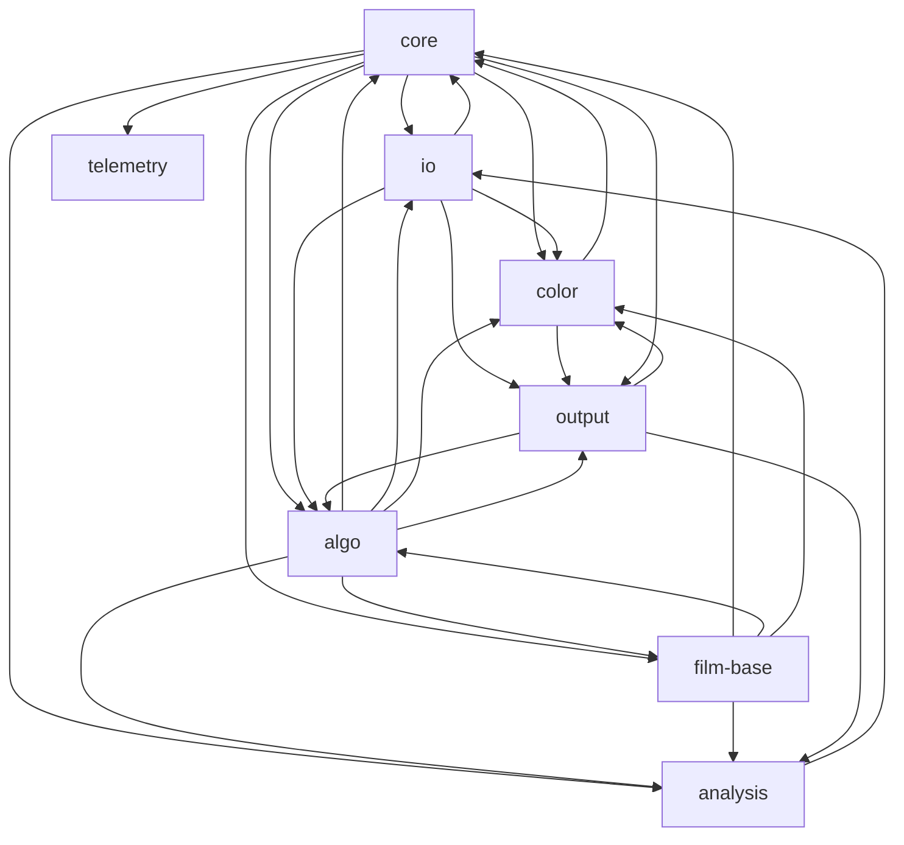

# Negative Converter — Tasks

Step-1 (MVP) plan for the `nc` CLI negative→positive converter. See
[design-spec.md](design-spec.md) for the full design.

> **Progress log:** one file per epic under [progress/](progress/) records *how*
> each task is carried out — what was done, decisions made, what works, what
> doesn't. **Before starting a task, read your epic's progress file in full, plus
> the `Epic summary` section of every epic you depend on** — then keep your own
> task's section updated as you work, so the next task can build on what you
> learned.

## Design

### Overview
A command-line tool (`nc`) that reads a film-negative scan (SilverFast HDR/HDRi
first), converts it to a positive image, and writes a TIFF (including the
display-linear and Rec.2100-coded HDR TIFFs) or an explicitly selected
`ultra-hdr-v1` gain-map JPEG or `hdr-pq`/`hdr-hlg` AVIF. "AI-friendly" means
**every conversion parameter is a CLI flag** and the tool is deterministic and
scriptable with JSON recipes/reports — not that ML processes the image.

### Architecture
Pure-function pipeline stages, orchestrated by the CLI layer:

```
decode → validate input semantics → film-base → preset dispatch
  ├→ legacy: stages::render
  │    → tagged reconstruction (simple | density, including density curve)
  │    → FilmRgbImage → finish_print → output ICC → TIFF encode
  ├→ film-master: stages::render
  │    → tagged reconstruction (simple | density, including density curve)
  │    → FilmRgbImage → NC film RGB v1 → linear ACEScg → TIFF encode
  └→ display presets: stages::render_display_source
       → tagged reconstruction (simple | density, including density curve)
       → FilmRgbImage → NC film RGB v1 → linear ACEScg → shared print controls
       → ultra-hdr-v1: SDR/HDR + gain map → JPEG package
       → hdr-pq / hdr-hlg: HDR → Rec.2100 PQ/HLG → 10-bit 4:4:4 AVIF
       → hdr-pq-tiff / hdr-hlg-tiff: the same signal → 16-bit TIFF codes
       → hdr-linear-tiff: HDR, no transfer → 32-bit float BT.2020 TIFF
```

The target `film-master` branch preserves NC's intentional film, lens,
development, and scanner rendering in unclamped linear ACEScg. It includes
reconstruction and the reference-anchored sigmoid's toe/midtone/shoulder
rendering, with fixed/roll Dmax placement, but bypasses later print/display
controls and rejects frame-local fitting. Exponential and simple remain
advanced/diagnostic paths pending a separate retirement decision. All paths
produce one typed `FilmRgbImage`; NC film RGB v1 interprets that rendering
consistently as linear Rec.709/D65 and maps it into ACEScg/D60. This is
film-rendering intent, not physical scene recovery. Optional measured correction
profiles have no downstream blockers. Today’s `--output-hdr` remains a rendered
float TIFF, not the future master branch.

One bullet per epic below — the name is the epic id the task list is grouped
under, and the parenthesized paths are the modules it owns.

- **io** (`io/decode.rs`, `io/encode.rs`, `pipeline/input_semantics.rs`) — SilverFast HDR (48-bit RGB) / HDRi (64-bit RGB+IR) → linear `f32` scanner measurements (IR carried through, consumed only by `film-base/ir-holder-detection`); input semantics remain explicit rather than silently assigning Rec.709. On the way out, `LinearImage` → 16-bit or 32-bit float TIFF with ICC, retaining linear ACEScg film masters; the planned display-output encoders are the `output` epic's. Buffer strategy (preflight, streaming) lives here too.
- **film-base** (`pipeline/film_base.rs`) — estimate `Dmin` from unexposed border,
  with CLI override, and measure the roll-fixed `Dmax` anchor from a reference
  frame. The two are *different quantities* (see design-spec §4) that share this
  measurement surface.
- **color** (`pipeline/color.rs`, `pipeline/working_space.rs`,
  `pipeline/colorimetry/`) — map typed NC film RGB v1 into linear ACEScg,
  centralize auditable color-space definitions and derived coefficients, then
  transform/render it for the selected output; optional correction is explicit.
- **algo** (`src/algo/`) — `algo::reconstruct` resolves the tagged
  `reconstruction` recipe object into simple or density reconstruction. The
  reference-anchored sigmoid is the candidate product default and owns
  floor/toe, midtone, and shoulder placement; exponential/simple remain explicit
  advanced references. `algo::finish_print` is the stage-4 print bridge.
- **output** (the encoders downstream of `color`) — the display renditions:
  Display P3 / SDR, BT.2020 PQ/HLG, explicit legacy Ultra HDR v1 gain-map JPEG
  (with final ISO metadata planned), AVIF, and the presets that resolve them
  together.
- **core** (`cli.rs`, `main.rs`, `types.rs`, `pipeline/stages.rs`) — clap subcommands (`convert`/`inspect`/`estimate`/`params`/`roll`), recipe load/merge, JSON report, exit codes, the roll/batch workflow, the shared types, and the pure algorithm→output-color render core the CLI drives.
- **telemetry** (`src/telemetry.rs`) — that module and the opt-in upload stack. Operational, never a conversion knob.
- **analysis** (`scripts/`) — the real-scan verification harness, the `nctool` Python toolkit, the asset manifest, and NLP comparison. Verifies the pipeline; is not part of it.

### Key choices
- **Rust**, single static binary. Pure functions per stage; CLI is the only orchestrator.
- **Normally 32-bit float linear image buffers:** scanner measurement coordinates before reconstruction, typed NC film RGB after the density curve, and linear ACEScg after the versioned working-space mapping; bit-depth reduction only at encode.
- **Pluggable algorithms** behind the tagged `reconstruction` recipe object, resolved by `algo::reconstruct` / `algo::finish_print`, so more can be added later.
- Density conversion and print rendering are **separate sub-stages** (core fidelity rule).
- IR channel is **preserved and not acted on by the conversion path**, with one exception: under an explicit `--film-type chromogenic` on a marker-verified IR plane, `film_base::estimate` consumes IR to mask the opaque holder before the auto rebate search (`film-base/ir-holder-detection`). IR dust removal remains a roadmap follow-up.

## Dependencies

Epic rollup (derived from the task graph — do not author epic-level edges here;
regenerate this whenever the task edges change). Cycles below are legitimate
projections of an acyclic task graph, not defects.


```mermaid
graph TD
  core
  io
  film-base
  algo
  color
  output
  telemetry
  analysis
  core --> io
  core --> color
  core --> film-base
  core --> algo
  io --> core
  color --> core
  film-base --> core
  algo --> core
  analysis --> io
  core --> analysis
  core --> telemetry
  algo --> analysis
  film-base --> analysis
  algo --> film-base
  algo --> io
  io --> color
  io --> algo
  io --> output
  film-base --> algo
  algo --> color
  film-base --> color
  color --> output
  algo --> output
  output --> color
  core --> output
  output --> algo
  output --> analysis
```


```mermaid
graph TD
  subgraph core
    core/project-foundation
    core/cli-framework
    core/pipeline-orchestration
    core/conversion-versioning
    core/recipe-replay-fidelity
    core/stdout-broken-pipe-safety
    core/value-domain-terminology
    core/dependency-hygiene
    core/release-readiness
    core/roll-conversion
    core/base-acquisition-planner
  end
  subgraph io
    io/silverfast-decode
    io/tiff-encode
    io/input-data-semantics
    io/transactional-output-writes
    io/memory-preflight
    io/streaming-tiled-io
    io/scanner-density-calibration
  end
  subgraph film-base
    film-base/estimation
    film-base/auto-base-redesign
    film-base/auto-base-neutral-stock
    film-base/ir-holder-detection
    film-base/white-holder-support
    film-base/content-fallback
    film-base/estimate-reuse-output
    film-base/grid-verdict-enum
    film-base/dmax-reference
    film-base/dense-base-dmax-plausibility
    film-base/dmax-anchor-reliability
    film-base/dmax-per-channel-reduction
  end
  subgraph algo
    algo/interface
    algo/simple
    algo/density
    algo/sigmoid
    algo/negative-reconstruction-density-curves
    algo/reference-anchored-sigmoid
    algo/content-aware-sigmoid-toe
    algo/dmax-white-anchor
    algo/density-safety-bounds
    algo/auto-neutral-wb
    algo/regional-color-balance
    algo/bw-support
    algo/film-stock-profiles
    algo/auto-anchor-interior-measurement
    algo/curve-endpoint-validation
    algo/sigmoid-parameter-calibration
  end
  subgraph color
    color/management
    color/film-rgb-working-space
    color/film-master-render-pipeline
    color/post-reconstruction-color-characterization
    color/optional-color-correction-profiles
    color/scanner-profile-before-density-experiment
    color/colorimetry-source-of-truth
  end
  subgraph output
    output/display-p3-output
    output/hdr-output-spike
    output/sdr-display-rendering
    output/hdr-display-rendering
    output/gain-map-hdr-output
    output/ultrahdr-dependency-externalization
    output/iso-gain-map-metadata
    output/mp-container-conformance
    output/gain-map-dialect-activation
    output/hdr-avif-output
    output/hdr-avif-windows-packaging
    output/lossless-hdr-tiff
    output/presets
  end
  subgraph telemetry
    telemetry/perf-instrumentation
    telemetry/perf-telemetry
    telemetry/strategy
    telemetry/schema-v2
    telemetry/ingestion-service
    telemetry/upload
    telemetry/panic-hook
  end
  subgraph analysis
    analysis/real-scan-verification
    analysis/display-output-acceptance
    analysis/conversion-analysis-tooling
    analysis/asset-manifest
    analysis/conversion-metrics
    analysis/nlp-comparison
    analysis/drive-asset-migration
    analysis/comparison-review-tooling
  end
  core/project-foundation --> io/silverfast-decode
  core/project-foundation --> io/tiff-encode
  core/project-foundation --> color/management
  core/project-foundation --> film-base/estimation
  core/project-foundation --> algo/interface
  core/project-foundation --> core/cli-framework
  algo/interface --> algo/simple
  algo/interface --> algo/density
  io/silverfast-decode --> core/pipeline-orchestration
  io/tiff-encode --> core/pipeline-orchestration
  color/management --> core/pipeline-orchestration
  film-base/estimation --> core/pipeline-orchestration
  algo/simple --> core/pipeline-orchestration
  algo/density --> core/pipeline-orchestration
  core/cli-framework --> core/pipeline-orchestration
  core/cli-framework --> core/stdout-broken-pipe-safety
  core/pipeline-orchestration --> io/transactional-output-writes
  core/pipeline-orchestration --> io/memory-preflight
  core/pipeline-orchestration --> core/dependency-hygiene
  core/pipeline-orchestration --> core/release-readiness
  core/pipeline-orchestration --> core/value-domain-terminology
  io/memory-preflight --> io/streaming-tiled-io
  analysis/real-scan-verification --> io/streaming-tiled-io
  film-base/estimation --> film-base/auto-base-redesign
  film-base/ir-holder-detection --> film-base/white-holder-support
  core/pipeline-orchestration --> film-base/estimate-reuse-output
  film-base/estimate-reuse-output --> film-base/grid-verdict-enum
  film-base/estimation --> film-base/grid-verdict-enum
  core/pipeline-orchestration --> analysis/real-scan-verification
  core/pipeline-orchestration --> telemetry/perf-instrumentation
  core/pipeline-orchestration --> telemetry/perf-telemetry
  telemetry/perf-telemetry --> telemetry/strategy
  telemetry/strategy --> telemetry/schema-v2
  telemetry/schema-v2 --> telemetry/ingestion-service
  telemetry/schema-v2 --> telemetry/upload
  telemetry/ingestion-service --> telemetry/upload
  telemetry/upload --> telemetry/panic-hook
  algo/dmax-white-anchor --> analysis/real-scan-verification
  film-base/dmax-reference --> analysis/real-scan-verification
  algo/density --> algo/dmax-white-anchor
  algo/interface --> algo/sigmoid
  algo/dmax-white-anchor --> algo/sigmoid
  algo/density --> algo/auto-neutral-wb
  core/pipeline-orchestration --> algo/auto-neutral-wb
  algo/density --> algo/regional-color-balance
  algo/density --> algo/density-safety-bounds
  core/pipeline-orchestration --> algo/density-safety-bounds
  algo/density --> algo/bw-support
  core/pipeline-orchestration --> algo/bw-support
  algo/dmax-white-anchor --> algo/bw-support
  film-base/estimation --> film-base/content-fallback
  film-base/auto-base-redesign --> film-base/ir-holder-detection
  film-base/auto-base-redesign --> film-base/auto-base-neutral-stock
  algo/dmax-white-anchor --> film-base/dmax-reference
  film-base/dmax-reference --> film-base/dense-base-dmax-plausibility
  core/pipeline-orchestration --> core/roll-conversion
  algo/dmax-white-anchor --> core/roll-conversion
  core/pipeline-orchestration --> core/conversion-versioning
  core/conversion-versioning --> core/recipe-replay-fidelity
  algo/reference-anchored-sigmoid --> core/recipe-replay-fidelity
  core/pipeline-orchestration --> io/input-data-semantics
  io/input-data-semantics --> color/scanner-profile-before-density-experiment
  color/management --> color/scanner-profile-before-density-experiment
  io/input-data-semantics --> algo/negative-reconstruction-density-curves
  film-base/dmax-reference --> algo/negative-reconstruction-density-curves
  algo/sigmoid --> algo/negative-reconstruction-density-curves
  algo/negative-reconstruction-density-curves --> algo/reference-anchored-sigmoid
  film-base/dmax-reference --> algo/reference-anchored-sigmoid
  algo/reference-anchored-sigmoid --> algo/film-stock-profiles
  algo/reference-anchored-sigmoid --> algo/auto-anchor-interior-measurement
  film-base/auto-base-redesign --> algo/auto-anchor-interior-measurement
  algo/auto-anchor-interior-measurement --> algo/content-aware-sigmoid-toe
  algo/reference-anchored-sigmoid --> algo/sigmoid-parameter-calibration
  algo/film-stock-profiles --> algo/sigmoid-parameter-calibration
  io/scanner-density-calibration --> algo/sigmoid-parameter-calibration
  film-base/dmax-reference --> film-base/dmax-anchor-reliability
  algo/reference-anchored-sigmoid --> film-base/dmax-anchor-reliability
  film-base/dmax-reference --> film-base/dmax-per-channel-reduction
  algo/reference-anchored-sigmoid --> film-base/dmax-per-channel-reduction
  algo/density --> algo/curve-endpoint-validation
  core/pipeline-orchestration --> algo/curve-endpoint-validation
  algo/reference-anchored-sigmoid --> algo/curve-endpoint-validation
  algo/reference-anchored-sigmoid --> analysis/comparison-review-tooling
  algo/film-stock-profiles --> io/scanner-density-calibration
  io/input-data-semantics --> io/scanner-density-calibration
  algo/reference-anchored-sigmoid --> algo/content-aware-sigmoid-toe
  core/roll-conversion --> algo/content-aware-sigmoid-toe
  output/presets --> algo/content-aware-sigmoid-toe
  algo/negative-reconstruction-density-curves --> color/film-rgb-working-space
  color/management --> color/film-rgb-working-space
  color/film-rgb-working-space --> color/film-master-render-pipeline
  film-base/dmax-reference --> color/film-master-render-pipeline
  color/film-rgb-working-space --> color/optional-color-correction-profiles
  color/film-master-render-pipeline --> color/optional-color-correction-profiles
  io/input-data-semantics --> color/post-reconstruction-color-characterization
  color/management --> color/post-reconstruction-color-characterization
  film-base/dmax-reference --> color/post-reconstruction-color-characterization
  color/management --> output/display-p3-output
  color/management --> output/hdr-output-spike
  color/film-master-render-pipeline --> output/sdr-display-rendering
  output/display-p3-output --> output/sdr-display-rendering
  output/hdr-output-spike --> output/sdr-display-rendering
  color/film-master-render-pipeline --> output/hdr-display-rendering
  output/hdr-output-spike --> output/hdr-display-rendering
  output/sdr-display-rendering --> output/gain-map-hdr-output
  output/hdr-display-rendering --> output/gain-map-hdr-output
  output/gain-map-hdr-output --> output/ultrahdr-dependency-externalization
  output/iso-gain-map-metadata --> output/ultrahdr-dependency-externalization
  output/gain-map-hdr-output --> output/iso-gain-map-metadata
  output/iso-gain-map-metadata --> output/mp-container-conformance
  output/iso-gain-map-metadata --> output/gain-map-dialect-activation
  output/gain-map-hdr-output --> color/colorimetry-source-of-truth
  output/hdr-display-rendering --> output/hdr-avif-output
  output/hdr-display-rendering --> output/lossless-hdr-tiff
  color/colorimetry-source-of-truth --> output/lossless-hdr-tiff
  io/transactional-output-writes --> output/lossless-hdr-tiff
  output/iso-gain-map-metadata --> output/presets
  output/hdr-avif-output --> output/presets
  output/hdr-avif-output --> output/hdr-avif-windows-packaging
  output/lossless-hdr-tiff --> output/presets
  algo/reference-anchored-sigmoid --> output/presets
  core/roll-conversion --> output/presets
  core/conversion-versioning --> output/presets
  output/presets --> analysis/display-output-acceptance
  analysis/real-scan-verification --> analysis/display-output-acceptance
  analysis/real-scan-verification --> analysis/conversion-analysis-tooling
  analysis/conversion-analysis-tooling --> analysis/asset-manifest
  analysis/asset-manifest --> analysis/conversion-metrics
  analysis/conversion-metrics --> analysis/nlp-comparison
  analysis/asset-manifest --> analysis/drive-asset-migration
  core/roll-conversion --> core/base-acquisition-planner
  film-base/auto-base-redesign --> core/base-acquisition-planner
  film-base/ir-holder-detection --> core/base-acquisition-planner
  film-base/content-fallback --> core/base-acquisition-planner
  film-base/dmax-reference --> core/base-acquisition-planner
```

Dependency list (a task is executable when all its deps are `[x]` done):

- `core/project-foundation`: (none)
- `core/cli-framework`: `core/project-foundation`
- `core/pipeline-orchestration`: `io/silverfast-decode`, `io/tiff-encode`, `color/management`, `film-base/estimation`, `algo/simple`, `algo/density`, `core/cli-framework`
- `core/conversion-versioning` (post-MVP): `core/pipeline-orchestration`
- `core/recipe-replay-fidelity` (post-MVP): `core/conversion-versioning`, `algo/reference-anchored-sigmoid`
- `core/stdout-broken-pipe-safety` (post-MVP, hardening): `core/cli-framework`
- `core/value-domain-terminology` (post-MVP, cleanup, **preserves data flow**): `core/pipeline-orchestration`
- `core/dependency-hygiene` (post-MVP, cleanup): `core/pipeline-orchestration` (dep removal is standalone)
- `core/release-readiness` (post-MVP, productization): `core/pipeline-orchestration`
  — doc fixes now; packaging best sequenced after analysis/display-output-acceptance
- `core/roll-conversion` (post-MVP): `core/pipeline-orchestration`, `algo/dmax-white-anchor`
- `core/base-acquisition-planner` (post-MVP): `core/roll-conversion`, `film-base/auto-base-redesign`, `film-base/ir-holder-detection`, `film-base/content-fallback`, `film-base/dmax-reference`
- `io/silverfast-decode`: `core/project-foundation`
- `io/tiff-encode`: `core/project-foundation`
- `io/input-data-semantics` (post-MVP): `core/pipeline-orchestration`
- `io/transactional-output-writes` (post-MVP, hardening): `core/pipeline-orchestration`
- `io/memory-preflight` (post-MVP, hardening): `core/pipeline-orchestration`
- `io/streaming-tiled-io` (post-MVP, **evaluate-first**): `io/memory-preflight`, `analysis/real-scan-verification`
- `io/scanner-density-calibration` (post-MVP): `io/input-data-semantics`, `algo/film-stock-profiles`
  — `algo/reference-anchored-sigmoid` is now transitive via `algo/film-stock-profiles`.
  The registry is a real prerequisite: this task's verification needs the per-stock
  nominal `D-min` and its own spec forbids keeping a second copy. Note the sigmoid task
  runs its *own* diagnostic checks inside its baseline harness, so it is never blocked
  here and cannot end up validating defaults against a scale only this task could have
  measured. Tier 1 (unexposed frame) is non-calibrating; tier 2 needs a calibrated
  transmission step wedge
- `film-base/estimation`: `core/project-foundation`
- `film-base/auto-base-redesign` (post-MVP): `film-base/estimation`
- `film-base/auto-base-neutral-stock` (post-MVP): `film-base/auto-base-redesign`
- `film-base/ir-holder-detection` (post-MVP): `film-base/auto-base-redesign`
- `film-base/white-holder-support` (post-MVP, the RGB-only fallback for the no-IR path):
  `film-base/ir-holder-detection`
  — film-base/auto-base-redesign is now transitive via film-base/ir-holder-detection
- `film-base/content-fallback` (post-MVP): `film-base/estimation`
- `film-base/estimate-reuse-output` (post-MVP): `core/pipeline-orchestration`
- `film-base/grid-verdict-enum` (post-MVP): `film-base/estimate-reuse-output`, `film-base/estimation`
- `film-base/dmax-reference` (post-MVP): `algo/dmax-white-anchor`
- `film-base/dense-base-dmax-plausibility` (post-MVP): `film-base/dmax-reference`
- `film-base/dmax-anchor-reliability` (post-MVP): `film-base/dmax-reference`, `algo/reference-anchored-sigmoid`
  — follow-up on a **completed** task's contract, so a new task rather than an edit: the
  leader-measured anchor is uncontrolled (same stock 0.295 apart while the base agrees to
  0.0005), is exceeded by real content, and `NOMINAL_DMAX = 2.0` is a poor fallback against
  measured rolls (0.90–1.74). `algo` candidates 2 and 3 are contingent on this
- `film-base/dmax-per-channel-reduction` (post-MVP): `film-base/dmax-reference`, `algo/reference-anchored-sigmoid`
  — sibling of `film-base/dmax-anchor-reliability` on a different axis: that one questions the
  anchor's *level*, this one the per-channel *ratio* the gray-mean reduction discards
  (`reference_dmax` measures `D_c` per channel, then averages). Measured spread is 0.05–0.14
  density (0.16–0.46 stops) with inconsistent direction. Redundant with `print.white_balance`
  under the **exponential** curve (a per-channel anchor is exactly a per-channel gain) but
  **not** under the sigmoid, which is the intended default — hence an investigation with a
  quantified verdict, not a presumed fix. Changes no pixels
- `algo/interface`: `core/project-foundation`
- `algo/simple`: `algo/interface`
- `algo/density`: `algo/interface`
- `algo/sigmoid` (post-MVP): `algo/interface`, `algo/dmax-white-anchor`
- `algo/negative-reconstruction-density-curves` (post-MVP): `io/input-data-semantics`, `film-base/dmax-reference`, `algo/sigmoid`
- `algo/reference-anchored-sigmoid` (post-MVP): `algo/negative-reconstruction-density-curves`, `film-base/dmax-reference`
- `algo/content-aware-sigmoid-toe` (post-MVP, **optional / deferred**): `algo/reference-anchored-sigmoid`, `core/roll-conversion`, `output/presets`, `algo/auto-anchor-interior-measurement`; no downstream blockers
  — the last is a hard prerequisite, not a nicety: content-driven anchoring is currently
  unusable because `DmaxSource::Auto` measures the whole frame and the opaque holder owns the
  top percentile
- `algo/curve-endpoint-validation` (post-MVP): `algo/density`, `algo/reference-anchored-sigmoid`, `core/pipeline-orchestration`
  — pre-decode check that a resolved curve places its tonal endpoints usefully. The shipped sigmoid
  defect (black asymptote 0.053 → 72/255) was computable from config the whole time; the same hole
  is open on the default exponential curve, where the film base renders to
  `10^(gamma*(D'base - Dmax))` (a measured `--d-max 0.391` at default gamma puts it at 0.406 and
  nothing warns). Both endpoints must be read off the renderer's own curve, not a re-derived closed
  form, and `DmaxSource::Auto` has no pre-decode value. Warning tier, not a hard error —
  `--sigmoid-white-at-d-max` is a retained diagnostic. Ships no pixel change
- `algo/film-stock-profiles` (post-MVP): `algo/reference-anchored-sigmoid`
- `algo/auto-anchor-interior-measurement` (post-MVP): `algo/reference-anchored-sigmoid`, `film-base/auto-base-redesign`
  — `DmaxSource::Auto` measures the whole frame, so the opaque holder owns the 99.5th
  percentile (resolves 2.23–2.37 against a roll Dmax of 1.28–1.38). Blocks every
  content-driven mode, hence the edge into `algo/content-aware-sigmoid-toe`
- `algo/sigmoid-parameter-calibration` (post-MVP): `algo/reference-anchored-sigmoid`, `algo/film-stock-profiles`, `io/scanner-density-calibration`
  — turns the provisional contrast/shoulder/offset values into calibrated ones. Needs a
  bracketed roll and a grey card, not merely more frames: per-frame exposure preference is
  frame optimisation and cannot select a parameter
  — deliberately **not** a dependency of `film-base/dense-base-dmax-plausibility`
  (that task can loosen its floor without a full registry; a false edge would kill
  real parallelism), but the two must be coordinated so stock-awareness is not
  solved twice
- `algo/dmax-white-anchor` (post-MVP): `algo/density`
- `algo/density-safety-bounds` (post-MVP): `algo/density`, `core/pipeline-orchestration`
- `algo/auto-neutral-wb` (post-MVP): `algo/density`, `core/pipeline-orchestration`
- `algo/regional-color-balance` (post-MVP): `algo/density`
- `algo/bw-support` (post-MVP): `algo/density`, `core/pipeline-orchestration`, `algo/dmax-white-anchor`
- `color/management`: `core/project-foundation`
- `color/film-rgb-working-space` (post-MVP): `algo/negative-reconstruction-density-curves`, `color/management`
- `color/film-master-render-pipeline` (post-MVP): `color/film-rgb-working-space`, `film-base/dmax-reference`
- `color/post-reconstruction-color-characterization` (post-MVP, **closed—superseded**; the deps below are decision history, not a live prerequisite set): `io/input-data-semantics`, `color/management`, `film-base/dmax-reference`
- `color/optional-color-correction-profiles` (post-MVP, **optional / deferred**): `color/film-rgb-working-space`, `color/film-master-render-pipeline`; no downstream blockers
- `color/scanner-profile-before-density-experiment` (post-MVP, **deferred experiment**): `io/input-data-semantics`, `color/management`
- `color/colorimetry-source-of-truth` (post-MVP, **deferred refactor**): `output/gain-map-hdr-output`
- `output/display-p3-output` (post-MVP): `color/management`
- `output/hdr-output-spike` (post-MVP, spike): `color/management`
- `output/sdr-display-rendering` (post-MVP): `color/film-master-render-pipeline`, `output/display-p3-output`, `output/hdr-output-spike`
- `output/hdr-display-rendering` (post-MVP): `color/film-master-render-pipeline`, `output/hdr-output-spike`
- `output/gain-map-hdr-output` (post-MVP): `output/sdr-display-rendering`, `output/hdr-display-rendering`
- `output/ultrahdr-dependency-externalization` (post-MVP, **deferred maintenance**; no downstream blockers): `output/gain-map-hdr-output`, `output/iso-gain-map-metadata`
  — **re-scoped 2026-08-05** from "externalize to a published crate" to "remove the
  native dependency entirely"; the id is deliberately unchanged so its links,
  progress sections, and the `check-vendored-native.py` reference keep resolving.
  The published `ultrahdr-sys` crate cannot qualify: it obtains libjpeg-turbo
  either by build-time clone at a mutable tag or from a machine-installed library,
  and that `GIT_TAG` lives inside the crate's own bundled CMake with no
  `ExternalProject_Add` override — so no version bump fixes it. `iso-gain-map-metadata`
  is a real prerequisite, not sequencing: re-implementing container assembly must
  reproduce **both** dialects, so its C.4.3/C.4.6 placement rules have to be settled
  or the ISO container work gets written twice
- `output/iso-gain-map-metadata` (post-MVP): `output/gain-map-hdr-output`
- `output/mp-container-conformance` (post-MVP, **deferred conformance**; no downstream blockers): `output/iso-gain-map-metadata`
  — split out 2026-08-06 after reading CIPA DC-007-2025: the gain map is typed
  `Undefined` (`000000`) where Table 4 assigns `050000` and marks `000000` "shall not
  be used", and the baseline is JFIF with no Exif APP1 where §4.2.1/§5.1 specify an
  Exif file. **Neither blocks function** — ImageIO reconstructs HDR from nc's file
  today with both gaps present — so this is conformance-claim work. Deliberately
  *not* a dependency of `output/presets`: it changes shipped `ultra-hdr-v1` container
  bytes and would otherwise hold the product default behind an unrelated change
- `output/gain-map-dialect-activation` (post-MVP; no downstream blockers): `output/iso-gain-map-metadata`
  — the two items `output/iso-gain-map-metadata` shipped without: Android 15+ decoder
  verification (the only platform that reads *both* dialects, so the only place
  coexistence is observable) and a CLI path for `Dialects::LegacyPlusIso`, which is
  implemented and reachable only from an `#[ignore]` test. **Deliberately not a
  dependency of `output/presets`** — presets owns the `gain-map-hdr` name and may
  activate the dialect itself; per the `hdr-avif-output` boundary rule, whichever
  ships the CLI surface owns the name
- `output/hdr-avif-output` (post-MVP): `output/hdr-display-rendering`
- `output/hdr-avif-windows-packaging` (post-MVP): `output/hdr-avif-output`
- `output/lossless-hdr-tiff` (post-MVP): `output/hdr-display-rendering`, `color/colorimetry-source-of-truth`, `io/transactional-output-writes`
- `output/presets` (post-MVP): `output/iso-gain-map-metadata`, `output/hdr-avif-output`, `output/lossless-hdr-tiff`, `algo/reference-anchored-sigmoid`, `core/roll-conversion`, `core/conversion-versioning`
- `telemetry/perf-instrumentation` (post-MVP, **parked**): `core/pipeline-orchestration`
  — LAB criterion benches; prototyped and parked on git branch
  prototype/perf-bench-instrumentation, superseded by telemetry/perf-telemetry as
  the real (real-world, not lab) direction
- `telemetry/perf-telemetry` (post-MVP): `core/pipeline-orchestration`
- `telemetry/strategy` (post-MVP, spike): `telemetry/perf-telemetry`
- `telemetry/schema-v2` (post-MVP): `telemetry/strategy`
- `telemetry/ingestion-service` (post-MVP): `telemetry/schema-v2`
- `telemetry/upload` (post-MVP): `telemetry/schema-v2`, `telemetry/ingestion-service`
- `telemetry/panic-hook` (post-MVP): `telemetry/upload`
- `analysis/real-scan-verification` (post-MVP): `core/pipeline-orchestration`, `algo/dmax-white-anchor`, `film-base/dmax-reference`
- `analysis/display-output-acceptance` (post-MVP): `output/presets`, `analysis/real-scan-verification`
- `analysis/conversion-analysis-tooling` (post-MVP, spike): `analysis/real-scan-verification`
- `analysis/asset-manifest` (post-MVP): `analysis/conversion-analysis-tooling`
- `analysis/conversion-metrics` (post-MVP): `analysis/asset-manifest`
- `analysis/nlp-comparison` (post-MVP): `analysis/conversion-metrics`
- `analysis/drive-asset-migration` (post-MVP, in progress — move+reorg+manifest done): `analysis/asset-manifest`
- `analysis/comparison-review-tooling` (post-MVP): `algo/reference-anchored-sigmoid`
  — promote the ad-hoc review pages into a maintained config-comparison tool; the user asked
  for it as a separate task rather than continued inline patching

> **Post-MVP follow-ups** are recorded for continuity and are **not** blockers of
> `core/pipeline-orchestration` / the Step-1 MVP. The `film-base` follow-ups came
> out of real-scan verification of `film-base/estimation`; the conversion-quality
> ones out of the PR #12 review and the Negative Lab Pro feature comparison (see
> [progress/](progress/)). Design-spec §12 is the roadmap these follow-ups sit
> against.

## Tasks

**Legend:** `[ ]` not started · `[~]` in progress · `[x]` done
**Epic status** is derived from its tasks — don't record it separately.

### core — [progress](progress/core.md)
> Project skeleton, shared types (`types.rs`), the clap command surface
> (`cli.rs` / `main.rs`), end-to-end orchestration — including
> `pipeline/stages.rs`, the pure algorithm→output-color render core the CLI
> drives — the roll/batch workflow, and the cross-cutting cleanup and release
> work that lands in those files.

- [x] [Project foundation and core types](tasks/core/project-foundation.md)
- [x] [CLI framework](tasks/core/cli-framework.md)
- [x] [Pipeline orchestration](tasks/core/pipeline-orchestration.md)
- [x] [Roll conversion (batch + frozen recipe)](tasks/core/roll-conversion.md)
- [ ] [Base-acquisition planner (the cascade)](tasks/core/base-acquisition-planner.md) — the roll-level `Dmin`/`Dmax` acquisition cascade: frozen recipe with provenance + confidence, and the roll→single fallback decision
- [x] [Conversion versioning & baseline comparison](tasks/core/conversion-versioning.md) — report `identity`, `pipeline_version` **1** (not 0 — `film-base/dmax-reference` already moved the default render) + the golden drift gate, `{meta,params}` sidecar envelope with bare legacy recipes still loading, and `nctool compare run|diff`; `v0` history in [reports/v0-baseline.md](reports/v0-baseline.md). **Known gap: the Python half runs under no CI gate.**
- [ ] [Recipe replay fidelity for non-default behavior changes](tasks/core/recipe-replay-fidelity.md) — `pipeline_version` covers the **default** path only, so a recipe opting into a non-default curve replays under a new build with the same label and different pixels (first instance: the 2026-08-03 sigmoid defaults). Decide the policy — widen the label, add a second one, generalize the drift warning, or keep historical defaults — then retrofit that instance and retire its bespoke warning.
- [ ] [Stdout broken-pipe safety](tasks/core/stdout-broken-pipe-safety.md) — make every
  stdout JSON write (the report via `emit_report`, `nc params`) tolerate a closed
  pipe (e.g. `nc … | head`) without a panic/backtrace. Pre-existing on `main`, not
  caused by the telemetry work.
- [ ] [Value-domain terminology & Dmin/Dmax clarity](tasks/core/value-domain-terminology.md) — extract design-spec §4 terminology into a standalone doc + an agent skill, and make `Dmin`/`Dmax` human-clear. Preserves the data flow; details at execution.
- [ ] [Dependency & module hygiene](tasks/core/dependency-hygiene.md) — from the
  hygiene review: drop three unused crates (`image`, `kamadak-exif`, `palette` —
  verified builds without them; `image` pulls a large codec tree) and unify the two
  `Algorithm` enums onto `types::Algorithm`, removing the dead copy and its
  `#[allow(dead_code)]`. Pure cleanup, byte-identical output.
- [ ] [Release readiness](tasks/core/release-readiness.md) — from the release-readiness
  review: (1) correct public docs that misstate the product (README "pre-implementation"
  + "planned", TASKS.md "two algorithms" omitting sigmoid, obsolete `--out-depth` in
  `core/pipeline-orchestration`, PUA-wrapped `citeturn` tokens in the research report); (2) license (user
  decision), Cargo release metadata, supported platforms (lcms2-sys C FFI constraint),
  and binary packaging.

### io — [progress](progress/io.md)
> Reading scans and writing artifacts: `io/decode.rs`, `io/encode.rs`,
> `pipeline/input_semantics.rs` (the resolver that interprets the SilverFast XMP
> packet), and the buffer/atomicity strategy for whole-image and streamed I/O.

- [x] [SilverFast HDR/HDRi decode](tasks/io/silverfast-decode.md)
- [x] [TIFF encode and output](tasks/io/tiff-encode.md)
- [x] [Input data semantics and validation](tasks/io/input-data-semantics.md) — resolve transfer encoding independently from scanner-device versus colorimetric meaning; report evidence and reject ambiguity instead of automatically applying an ICC transform before density conversion
- [x] [Transactional output writes](tasks/io/transactional-output-writes.md) — from
  the output-atomicity review: write every artifact (primary TIFF, IR, sidecar,
  report-file) to a same-directory temp, fsync, then rename, so a failed/interrupted
  run never leaves a truncated final file. Honest guarantee: no partial files +
  minimized inconsistency window, not literal multi-file atomicity (a crash between
  renames can still mix old/new artifacts).
- [x] [Memory preflight & in-place transform](tasks/io/memory-preflight.md) — from the
  memory-safety review (Phase A, cheap): predict peak allocation and fail loudly
  over a budget before allocating (reconciling the dishonest 4 GiB input limit),
  and drop the whole-image clone in `to_output` (transform in place, skip IR).
  **Done 2026-07-27** (see [progress/io.md](progress/io.md) `## memory-preflight`):
  `pipeline::memory` sizing model (decode 18 · film-base 16+12·s · render 32+12·s ·
  encode 38+12·s B/px) gated before decode from a metadata-only `io::decode::probe`,
  fixed 6 GiB default budget + `--max-memory` (operational, not a recipe key), new
  exit code 6; peak on the 74.65 MP `largest.tif` 3.808 → 3.146 GB and 975 → 681 MB
  at 18.66 MP (decimal GB/MB, a 30% cut), output byte-identical. Re-measurement
  feeds `io/streaming-tiled-io` STEP 0 (still a conditional GO).
- [ ] [Scanner density calibration](tasks/io/scanner-density-calibration.md) — turn the
  density-scale question into a shipped, reusable scanner profile. Tier 1 (unexposed
  frame only, no new user action) is a **non-calibrating diagnostic**: a scan value is a
  code-value ratio against full scale, so absolute density needs a same-settings
  open-gate reference. Tier 2 needs a **calibrated transmission step wedge** (a
  photographed grey card is not a known density). `algo/reference-anchored-sigmoid`
  performs the first diagnostic measurement inside its own baseline harness and does not
  wait on this task; this task productises the result.
- [ ] [Streaming / tiled I/O](tasks/io/streaming-tiled-io.md) — memory-safety review
  Phase B (expensive, **evaluate-first**): strip/tile decode + streaming encode.
  STEP 0 gate — evaluate from measured peak whether this is needed at all; if data
  is insufficient, collect it first; proceed only if real scans exceed the budget.

### film-base — [progress](progress/film-base.md)
> `pipeline/film_base.rs` and the `nc estimate` measurement surface: locating
> unexposed film, deriving the `Dmin` transmission anchor, and measuring the
> roll-fixed `Dmax` density anchor. `Dmin` and `Dmax` are **different quantities**
> (design-spec §4) that happen to share this code.

- [x] [Film-base / Dmin estimation](tasks/film-base/estimation.md)
- [x] [Robust auto film-base detection](tasks/film-base/auto-base-redesign.md)
- [ ] [Neutral-base robustness for auto film-base detection](tasks/film-base/auto-base-neutral-stock.md)
- [x] [IR-assisted film-holder detection](tasks/film-base/ir-holder-detection.md)
- [ ] [Light film holder support](tasks/film-base/white-holder-support.md)
- [ ] [Content-based film-base fallback (Tier 3)](tasks/film-base/content-fallback.md) — owns `--base-content`; supersedes the content-source sub-item in `film-base/auto-base-redesign` (tell that task's owner)
- [x] [Reuse-ready `nc estimate` output](tasks/film-base/estimate-reuse-output.md)
- [ ] [Grid agreement verdict enum](tasks/film-base/grid-verdict-enum.md)
- [x] [Roll-fixed Dmax from a fully-exposed reference frame](tasks/film-base/dmax-reference.md) — shipped roll-fixed acquisition/default policy; the replacement density-curve stage preserves scalar exponential placement and sigmoid curve shaping
- [ ] [Stock-aware Dmax plausibility (dense-base stocks)](tasks/film-base/dense-base-dmax-plausibility.md) — from real-scan verification (2026-07-23): the reference-Dmax `≳1.0` floor + base-uniformity check are C41-calibrated and false-alarm on Harman Phoenix's dense/non-orange base; make the floor stock-relative while keeping a loud failure on genuinely wrong regions
- [ ] [Dmax anchor reliability](tasks/film-base/dmax-anchor-reliability.md) — follow-up on a
  **completed** contract: the leader-measured anchor is *uncontrolled* (two rolls of one stock
  0.295 density apart while their red base agrees to 0.0005), real content measures *above* it,
  and leaders are uniform so it is not a fogging gradient. `NOMINAL_DMAX = 2.0` is also a poor
  no-reference fallback against measured rolls (0.90–1.74, median ≈1.35). `algo` candidates 2
  and 3 are contingent on this.
- [ ] [Per-channel Dmax and the gray-mean reduction](tasks/film-base/dmax-per-channel-reduction.md) —
  `reference_dmax` measures `D_c` per channel then reduces by `(r+g+b)/3`, asserting the highlight
  end shares the base's colour cast. Committed leader data says otherwise: spread 0.05–0.14 density
  (0.16–0.46 stops), direction inconsistent across stocks. A per-channel anchor is *algebraically* a
  per-channel gain, so it is redundant with `print.white_balance` under the exponential curve — but
  **not** under the sigmoid default, where it shifts each channel's toe/shoulder position.
  Investigation + impact verdict; ships no pixel change

### algo — [progress](progress/algo.md)
> `src/algo/`: the `reconstruct` / `finish_print` surface, negative
> reconstruction, the density curves (exponential / sigmoid), and the tone,
> white-balance, and color-model parameters of that stage. Deterministic
> statistics only — no ML.

- [x] [Algorithm interface](tasks/algo/interface.md)
- [x] [Simple inversion algorithm](tasks/algo/simple.md)
- [x] [Density-domain algorithm](tasks/algo/density.md)
- [x] [Display-range white anchor (Dmax)](tasks/algo/dmax-white-anchor.md) — shipped legacy semantics; the replacement density-curve stage owns its curve-specific placement/shape meaning
- [x] [Sigmoid / H&D-curve tone algorithm](tasks/algo/sigmoid.md)
- [x] [Negative reconstruction and density curves](tasks/algo/negative-reconstruction-density-curves.md) — adopt tagged simple/density reconstruction, make exponential/sigmoid tagged density curves, and produce typed `FilmRgbImage`
- [x] [Reference-anchored sigmoid calibration and redesign](tasks/algo/reference-anchored-sigmoid.md) — reproduce and quantify the shipped sigmoid's raised, narrow real-roll shadow spread, then choose the least invasive defaults/semantics/equation remedy against frozen film-master/SDR/HDR metrics
- [ ] [Content-aware sigmoid toe](tasks/algo/content-aware-sigmoid-toe.md) — **optional / deferred** explicit frame/roll convenience modes; the reference path remains the default and this blocks no output
- [ ] [Curve endpoint validation](tasks/algo/curve-endpoint-validation.md) — warn **before decode**
  when a resolved curve places its tonal endpoints so badly the render cannot approach white or
  black. Read both endpoints off the renderer's own curve: exponential's black end is the film
  base, `10^(gamma*(D'base - Dmax))` (and `D'base` is `density.offset`, not 0), sigmoid's is the
  post-shoulder asymptote, with the white side read off `s_curve(R)` as a **reference-placement**
  check, not a reachability one. The shipped sigmoid defect (0.053 → 72/255) was computable from
  config all along and took a visual review to find; the same hole is open on the **default**
  exponential curve, where a measured `--d-max 0.391` at default gamma renders the base at 0.406
  and only the encode-side clip counter says anything. Warning tier (`--strict` promotes);
  `--no-d-max` is exempt on **exponential only** (sigmoid already hard-errors) and `simple` is out
  of scope; ships no pixel change
- [x] [Auto neutral white balance](tasks/algo/auto-neutral-wb.md)
- [x] [Regional (shadow/highlight) color balance](tasks/algo/regional-color-balance.md)
- [ ] [Film-stock profiles](tasks/algo/film-stock-profiles.md) — a selectable registry of
  known stocks carrying the per-stock reference densities that reconstruction needs
  (the manufacturer-tabulated mid-grey and diffuse-white aims and their difference),
  sourced from datasheets with provenance, with a generic C-41 fallback so stock
  selection stays a refinement rather than a requirement. Measured roll `film_base`
  stays authoritative — a published `D-min` is a nominal diagnostic, never a substitute
- [ ] [Auto anchor: measure the interior, not the holder](tasks/algo/auto-anchor-interior-measurement.md) — `DmaxSource::Auto`
  takes the 99.5th percentile over the *whole* scan, so the nearly-opaque film holder owns it
  (resolves 2.23–2.37 against roll Dmax 1.28–1.38) and every frame renders black. Restrict the
  measurement to the picture area; an implausible anchor must fail loudly, not render a black
  image. Blocks every content-driven rendering mode.
- [ ] [Sigmoid parameter calibration](tasks/algo/sigmoid-parameter-calibration.md) — turn the
  provisional contrast (≈2.07), shoulder (≈0.6) and per-stock anchor offsets into calibrated
  values. Needs a **bracketed roll** (so exposure labels are true by construction) and a **grey
  card in frame**, not merely more frames — per-frame exposure preference is frame optimisation
  and cannot select a parameter.
- [ ] [Black & white negative support (mono color model)](tasks/algo/bw-support.md)
- [ ] [Density safety bounds](tasks/algo/density-safety-bounds.md) — from the
  density-safety review: physical bounds on `density_scale`/`offset`/`gamma` (the
  sigmoid-bounds analogue density lacks) + a degenerate-output (histogram/dynamic-
  range collapse) warning catching the finite-all-black underflow the loss counters
  miss, with a false-positive guard validated on real scans.

### color — [progress](progress/color.md)
> `pipeline/color.rs`, `pipeline/working_space.rs`, and
> `pipeline/colorimetry/`: ICC transforms, the versioned NC film RGB v1 →
> linear ACEScg mapping, auditable color-space definitions and derived
> coefficients, the film-master branch, and the optional measured-correction
> work.

- [x] [Color management](tasks/color/management.md)
- [x] [NC Film RGB working-space mapping](tasks/color/film-rgb-working-space.md) — map every film rendering through versioned NC film RGB v1 into typed linear ACEScg/D60
- [x] [Film-master and shared display pipeline](tasks/color/film-master-render-pipeline.md) — route intentional ACEScg film rendering to `film-master` or shared WB → exposure → black/range adjustments before SDR/HDR; `ultra-hdr-v1` is the first CLI consumer, while the convenient display aliases/default remain deferred to `output/presets`
- [x] [Post-reconstruction characterization runtime](tasks/color/post-reconstruction-color-characterization.md) — **closed—superseded**; retained as decision history and replaced by `algo/negative-reconstruction-density-curves`, `color/film-rgb-working-space`, `color/film-master-render-pipeline`, and `color/optional-color-correction-profiles`
- [ ] [Optional color-correction profiles](tasks/color/optional-color-correction-profiles.md) — **optional / deferred** measured neutralization with explicit selection and provenance; blocks no output task
- [ ] [Scanner ICC before-density experiment](tasks/color/scanner-profile-before-density-experiment.md) — **deferred / lower priority**: compare raw density ratios with applying the same scanner ICC to image and Dmin first; independent of the superseded characterization proposal and the normal NC film RGB mapping
- [x] [Colorimetry source of truth and update workflow](tasks/color/colorimetry-source-of-truth.md) — **deferred refactor after gain-map**: centralize standards provenance and pinned derived coefficients, migrate existing transforms, and make future color-space updates reproducible before lossless HDR TIFF work

### output — [progress](progress/output.md)
> The display renditions and encoders downstream of `color`: the color-accurate
> SDR path first, then standards-based HDR rendering, a backward-compatible
> gain-map output, lossless HDR TIFF interchange/display encodings, and the
> presets that resolve them together. These define the intended product default
> that `analysis` verifies.

- [x] [Display P3 output](tasks/output/display-p3-output.md) — synthesize and embed a standards-conforming Display P3 ICC profile for the SDR/base rendition
- [x] [HDR still-output spike](tasks/output/hdr-output-spike.md) — decided ISO HDR/gain-map container, encoder, metadata, reference-white, and cross-platform strategy; licensed-normative-text check waived at spike level and re-homed to the encoder tasks as a pre-merge gate (2026-07-24)
- [x] [SDR display rendering](tasks/output/sdr-display-rendering.md) — render intentional linear ACEScg film values into a valid Display P3 or sRGB SDR rendition with explicit reference-white, tone, and gamut policy
- [x] [Display-HDR rendering](tasks/output/hdr-display-rendering.md) — render intentional linear ACEScg film values into BT.2020 PQ/HLG with explicit headroom, tone, and gamut mapping
- [x] [Ultra HDR v1 gain-map JPEG output](tasks/output/gain-map-hdr-output.md) — write an explicit backward-compatible Display P3 JPEG plus public Ultra HDR v1 gain-map metadata
- [ ] [Remove the Ultra HDR native dependency](tasks/output/ultrahdr-dependency-externalization.md) — **deferred maintenance**, **re-scoped 2026-08-05** (id kept): delete `vendor/ultrahdr-sys` and end the C/C++ dependency by writing the Ultra HDR v1 XMP and MPF container in Rust, so neither `cargo build` nor `cargo test` needs CMake/clang/nasm/libjpeg or a network fetch. Only 6 native calls are on the shipping path and they merely assemble XMP+MPF around two JPEGs nc already encodes itself. The decode oracle is **replaced by captured goldens**, not kept as a dev-dependency (that would leave the native toolchain in CI). The published-crate route is recorded but not pursued — it fetches libjpeg-turbo at a mutable tag or links a system library, and no version bump changes that. Blocks no output work
- [x] [Final ISO gain-map metadata](tasks/output/iso-gain-map-metadata.md) — add verified ISO 21496-1:2025 metadata to the same JPEG and prove dual-dialect agreement. **Metadata and container halves implemented against the licensed text** (2026-08-04: `pipeline/gain_map/iso.rs` C.2.2 payload + normative validation; `io/ultra_hdr.rs` `Dialects::LegacyPlusIso` writing C.4.3/C.4.6 segments into both images, MPF-safe). **Code complete**; verified with exiftool (MPF index resolves, second image extracts, 2350+1186=3536 bytes) and `sips`. **Both blockers cleared 2026-08-06**: the CIPA DC-007 text was fetched and read (its two conformance gaps split into `output/mp-container-conformance`), and the external decoder oracle ran — Apple ImageIO, harness committed at `scripts/iso-decoder-oracle/`. The oracle found a real defect: the baseline segment sat *after* `SOF0`, where no reader scans, so ImageIO saw no gain map at all; fixed, and the metadata now reads back field-for-field as written (the decoder's 4.926 headroom is nc's own declared constant echoed back, not evidence — `GainMapMax` is). **Done 2026-08-07** on the strength of the Apple oracle plus libultrahdr; the Android 15+ half and CLI activation moved to `output/gain-map-dialect-activation` so they stop gating `output/presets`. **Note the `ts:` URN is the published first edition's, not a draft** — and libultrahdr's compact-denominator ISO layout is *non-conformant*, so nc owns its serializer.
- [ ] [MP container conformance (CIPA DC-007)](tasks/output/mp-container-conformance.md) — **deferred conformance**, split out of `iso-gain-map-metadata` on 2026-08-06 after reading the free CIPA text. Three gaps, none functional: the gain map carries MP Type `000000` (Undefined) where DC-007 Table 4 assigns `050000` and marks `000000` "shall not be used" in a Baseline MP File — inherited from libultrahdr, whose own output does the same — the baseline is JFIF with no Exif APP1 where §4.2.1/§5.1 specify an Exif file (§7's *tag* requirements are only "should"), and in the gain-map image libultrahdr's prepended XMP puts `APP1` before `APP0 JFIF`, so JFIF is not first in the dependent image (found by review, not in the CIPA read). The type code is a masked 4-byte MPEntry patch but **changes shipped `ultra-hdr-v1` bytes**; the Exif half must be probed against `package()` and re-run through the ImageIO oracle, since a marker-layout change is exactly what silently disabled the ISO metadata once. Blocks nothing
- [ ] [Gain-map dialect activation](tasks/output/gain-map-dialect-activation.md) — the two items `iso-gain-map-metadata` shipped without: **Android 15+** decoder verification (the only platform reading *both* dialects, so the only place coexistence is observable — record whichever it prefers as *observed behaviour*, never a conformance property) and a **CLI path** for `Dialects::LegacyPlusIso`, which is implemented, Apple-verified, and reachable only from an `#[ignore]` test. Removing its `#[allow(dead_code)]` is the mechanical definition of done. Blocks nothing; **not** a dependency of `output/presets` — per the `hdr-avif-output` boundary rule, whichever task ships the CLI surface owns the `gain-map-hdr` name, so coordinate rather than race. `ultra-hdr-v1` must stay byte-identical
- [x] [HDR AVIF output](tasks/output/hdr-avif-output.md) — 10-bit 4:4:4 Rec.2100 PQ/HLG AVIF via published `libaom-sys` plus an **nc-written MIAF container** (no libavif: no published crate ships ≥ 1.4.2, and `avif-serialize` cannot emit `MA1A`). `hdr-pq`/`hdr-hlg` are live as explicit `convert`-only presets; `av1C` is parsed back out of the codestream; `MA1A` only inside the published Advanced-Profile limits, else general-brand-only **with the reason reported**; `cq_level` and codec bounds calibrated and pinned by equality against `avifdec`/dav1d; `RunProfile::HdrAvif` calibrated on two real scans. Windows deferred → `output/hdr-avif-windows-packaging`; counsel review of the AOM patent grant stays with release
- [ ] [HDR AVIF Windows packaging](tasks/output/hdr-avif-windows-packaging.md) — add the missing `windows-latest` CI job and prove the static libaom build under MSVC; encoding behavior unchanged, and cross-build byte identity is explicitly not required
- [x] [Lossless HDR TIFF outputs](tasks/output/lossless-hdr-tiff.md) — preserve display-linear BT.2020 as 32-bit float TIFF and Rec.2100 PQ/HLG as losslessly stored 16-bit TIFF code values with truthful signaling. **Done 2026-08-06** in two chunks: A = `hdr-linear-tiff` (bit-exact f32 display-linear BT.2020), B = `hdr-pq-tiff`/`hdr-hlg-tiff` (full-range 16-bit codes stored exactly + the ICC `cicpTag` contract). Never blocked on a paywalled standard — ICC.1:2022 §9.2.17/§10.3 pins the code points (`9-16-0-1` PQ, `9-18-0-1` HLG) with **MatrixCoefficients 0** for RGB, unlike the AVIF path's 9. The PQ profile is an **extended-range A2B** (PCS `Y = L/203`, unclipped to ≈49.26) matching Adobe's reference BT.2100 profiles, since a matrix-shaper TRC cannot exceed 1.0; HLG's is scene-referred because its OOTF is not per-channel separable. Verified end to end: PQ-decoding the stored codes recovers the linear TIFF's samples to 0.0149% on a real 18.66 MP scan. Documented as **limited-interoperability interchange, not display-ready** — only a CICP-aware reader honours the tag; the 2026-08-06 viewer gate confirmed the files render correctly but was **not discriminating** for HDR presentation (diffuse-highlight scene, exponential default curve). **Two ICC conformance gaps are documented and deferred to `output/presets`** (§8.4.2 `BToA0Tag`, §8.2 `chromaticAdaptationTag`): the coded profiles are valid *sources* but not conformant Display-class profiles. Neither moves a stored code value; closing them changes the profile bytes, so it rides with preset activation
- [ ] [Output presets and guidance](tasks/output/presets.md) — make `gain-map-hdr` the default, expose clear compatibility/master/PQ/HLG choices, and migrate `nc roll` naming/manifests to resolved containers. **Also inherits** (deferred 2026-08-06) the two ICC conformance gaps in the `hdr-pq-tiff`/`hdr-hlg-tiff` profiles — §8.4.2 `BToA0Tag` and §8.2 `chromaticAdaptationTag` — which need two more pinned colorimetry artifacts and change the profile bytes

### telemetry — [progress](progress/telemetry.md)
> `src/telemetry.rs` and the opt-in upload stack (schema, ingestion service,
> uploader, panic hook), from the 2026-07-14 telemetry discussion: local-only
> instrumentation first, remote telemetry a deliberately separate opt-in roadmap
> item (design-spec §12). **Operational, never a conversion knob** — nothing here
> may perturb deterministic image output.

- [~] [Performance instrumentation](tasks/telemetry/perf-instrumentation.md) — **parked**:
  the LAB criterion-benchmark approach was prototyped and parked on branch
  `prototype/perf-bench-instrumentation` (not merged; see its
  `docs/prototypes/perf-bench-instrumentation.md`). The real, real-world direction
  shipped as `telemetry/perf-telemetry` below.
- [x] [Embedded performance + context telemetry](tasks/telemetry/perf-telemetry.md) — the
  real-world successor to `telemetry/perf-instrumentation`: an opt-in JSON telemetry record
  per `nc convert` run (image + timing + context) to a local JSONL log / one-off
  file, no new entrypoint. Lifts the prototype's per-stage timing.
- [x] [Telemetry strategy spike](tasks/telemetry/strategy.md) — approved
  [strategy](telemetry-strategy.md): custom JSON to Cloudflare Worker + D1,
  anonymous schema-minimized upload, persistent explicit consent, crash-safe
  detached draining, success/failure events, and sanitized panic reporting.
- [ ] [Telemetry event schema v2](tasks/telemetry/schema-v2.md) — add typed
  success/failure local events and a separately versioned, privacy-minimized
  upload projection with random per-event deduplication IDs.
- [ ] [Telemetry ingestion service](tasks/telemetry/ingestion-service.md) — build
  the validating Cloudflare Worker + D1 endpoint, exact deduplication, 180-day
  retention, hard FREE-plan quotas, abuse quarantine/kill switch, and initial
  advisory performance/failure queries.
- [ ] [Background telemetry upload](tasks/telemetry/upload.md) — ship the local
  consent-selected active JSONL through generation-bound collection/request
  leases and its private spool, durable recovery, detached helpers, retries,
  non-stranding retarget, lock-stable inactive purge, caps, and maintenance
  commands.
- [ ] [Sanitized panic telemetry](tasks/telemetry/panic-hook.md) — publish
  persistent-managed-consent panic events as isolated atomic ready files with
  only capped, normalized `nc` function/module frames; no per-run hook, shared
  append stream, payloads, source paths, or native-crash claim.

### analysis — [progress](progress/analysis.md)
> `scripts/`: the real-scan verification harness, the `nctool` Python toolkit,
> the nc-assets manifest, and NLP comparison. This epic *verifies* the pipeline;
> it is not part of it.

- [x] [Real-scan core verification](tasks/analysis/real-scan-verification.md) — exercise decoding, Dmin/Dmax, current TIFF conversion, IR, determinism, and resource use on full-size scans without waiting for the display-output roadmap. **Done 2026-07-23** (see [reports/real-scan-verification.md](reports/real-scan-verification.md)): all rows pass on 5 real rolls; measured peak ~930 MiB @ 18.7 MP feeds `io/streaming-tiled-io` STEP 0; frozen recipes + harness feed `analysis/display-output-acceptance`; follow-up `film-base/dense-base-dmax-plausibility` filed; default-SDR paleness routes to the display-output roadmap
- [ ] [Display-output acceptance](tasks/analysis/display-output-acceptance.md) — verify the final gain-map default, SDR fallback, explicit output presets, metadata, and cross-device behavior on the same real scans
- [x] [Conversion-analysis tooling (spike)](tasks/analysis/conversion-analysis-tooling.md) — grow the real-scan-verify harness into a toolkit: asset manifest, image-library analysis of results, and NLP-vs-nc comparison. **Done 2026-07-23** (spike): scope decided (Python `nctool` toolkit, JSON manifest of rolls+converted, configurable-but-local asset root, NLP global-metrics comparison without registration); split into the four child tasks below; see the task file's "Spike outcome" section.
- [x] [Asset manifest](tasks/analysis/asset-manifest.md) — tracked JSON manifest of `../nc-assets` (roll frames + roles + derived facts + converted outputs); `generate`/`validate`; retires the hard-coded `ROLLS` array
- [ ] [Conversion metrics & thumbnails](tasks/analysis/conversion-metrics.md) — the `nctool` Python package + per-image metric set (percentiles, black/white points, contrast, saturation, clip %) + thumbnails → JSON/Markdown; single documented entry point subsuming the harness
- [ ] [NLP vs nc comparison](tasks/analysis/nlp-comparison.md) — ingest NLP outputs, global-metric diff tables + side-by-side contact sheets (no registration); startable once NLP outputs are added
- [ ] [Drive asset migration](tasks/analysis/drive-asset-migration.md) — assets **moved** to the shared Google Drive folder + reorganized + self-relative `manifest.json` (2026-07-24); remaining: repo `../nc-assets` path convention (symlink/env), stream-on-demand materialization guard, sync hygiene
- [ ] [Comparison review tooling](tasks/analysis/comparison-review-tooling.md) — promote the
  ad-hoc review pages from `algo/reference-anchored-sigmoid` into a maintained tool for
  comparing rendering configurations by eye: one entry point, the matrix as data rather than
  code, HDR review for the frames whose range exceeds SDR, and build-vs-build comparison.
