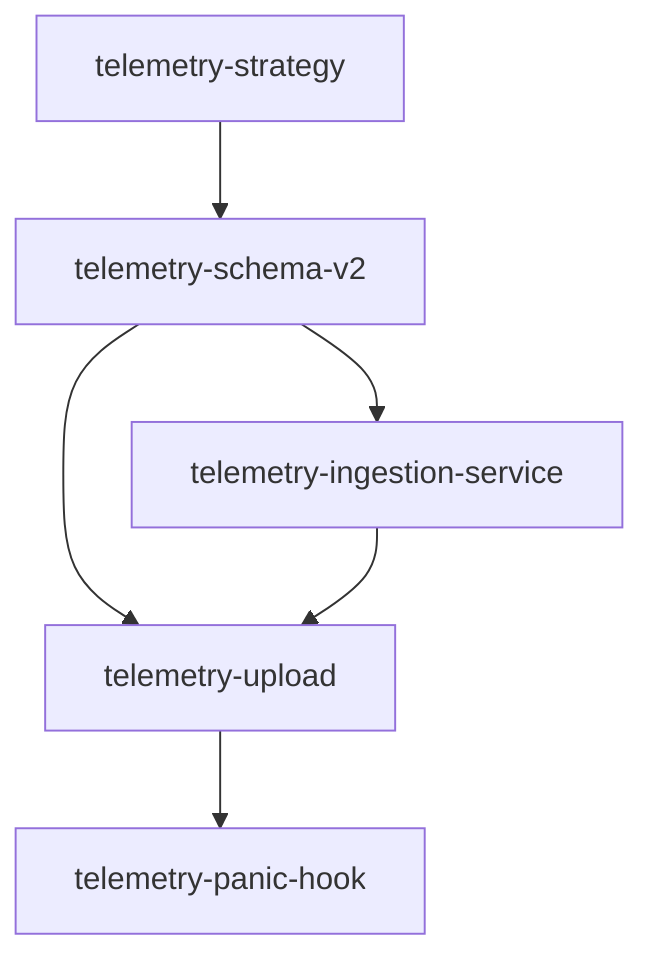

# Telemetry strategy

**Status:** approved 2026-07-23

This note decides how `nc` grows the shipped local-only performance record into
anonymous, explicitly consented remote telemetry. It is the output of the
[`telemetry-strategy`](tasks/telemetry-strategy.md) spike and scopes its
implementation children.

## Decision summary

- Optimize the first remote data set for **real-world performance** and
  **failure rates**. Feature-adoption analysis and general interaction tracking
  are not goals.
- Keep `nc`'s purpose-built JSON events and send privacy-filtered batches to a
  small owned ingestion API. Do **not** embed an OpenTelemetry SDK or require an
  OTel Collector on user machines.
- Host the first ingestion service as a **Cloudflare Worker backed by D1**.
  This is managed infrastructure with an nc-owned contract: low operational
  burden, exact event rows and SQL. V1 runs in a dedicated Cloudflare FREE-plan
  account with no billing-enabled resources; hard platform and application
  quotas fail closed before the approved $10/month ceiling can be crossed.
- Separate local collection from transmission consent. `nc telemetry enable`
  persistently opts into automatic collection and upload, including upload of
  records previously collected through the explicit local `--telemetry` flag.
- Never assign an installation, machine, user, or session identifier. Every
  event gets an independent random ID used only for retry deduplication.
- Keep the local `params_hash`, exact timestamp, dimensions, sizes, and parameter
  values **out of the upload projection**. "No paths" is necessary but not
  sufficient: stable hashes and exact derived facts can also fingerprint a
  workflow.
- Emit structured success and failure events. Panic events share the logical
  event stream but use an isolated panic-safe local spool and contain only
  sanitized `nc` function/module frames. This is panic reporting, not general
  native-crash capture.

## Fixed invariants

The shipped [`perf-telemetry`](tasks/perf-telemetry.md) boundaries remain
non-negotiable:

1. **Deterministic conversion:** telemetry never enters a recipe, sidecar, stage
   input, or encoded image. Enabling or disabling it cannot change output bytes.
2. **Fail-soft telemetry:** collection, serialization, helper launch, queue,
   network, and server failures cannot change a conversion's exit code. They do
   not enter report warnings and cannot be promoted by `--strict`.
3. **No stdout pollution:** background work inherits no user-facing standard
   streams. Only explicit telemetry inspection/maintenance commands print data.
4. **Bounded local resources:** an unavailable server cannot grow the automatic
   upload queue without limit.
5. **Inspectable contract:** the documented field manifest and
   `nc telemetry preview` describe the exact projection sent over the network.
6. **Bounded foreground overhead:** no network or endpoint latency is on the
   conversion critical path. The helper is spawned only after telemetry timing,
   output artifacts, report, and exit outcome are fixed. Process creation has
   nonzero but bounded launch overhead and is tested as such.

## Infrastructure decision

### Custom JSON rather than OTLP in the CLI

OTLP's trace, metric, and log transports are stable and vendor-neutral. Stage
timings could be modeled as spans and conversion outcomes as log events. That
benefit does not justify an OTel SDK/exporter and Collector in a small,
single-binary desktop CLI:

- The current record is already a versioned, purpose-built JSON object.
- OTLP does not solve the local durable queue, consent, crash recovery,
  acknowledgement, or deduplication requirements. A durable OTel deployment
  would normally add a Collector with persistent storage.
- Direct OTLP still adds transport/protobuf/TLS/runtime dependencies and maps a
  compact domain record into a more general envelope without improving the two
  chosen questions.
- A local Collector is not a reasonable prerequisite for ordinary `nc` users.

Therefore the client sends custom JSON over HTTPS. The server may later map
accepted events to OTLP or another observability backend without changing the
client protocol.

### Cloudflare Worker plus D1

The Worker is the public, versioned ingestion boundary. It validates and
allowlists every field before inserting an exact row into D1. D1 is preferred
over a managed observability product or Cloudflare Analytics Engine for v1:

- D1 supplies unique constraints for retry deduplication and ordinary SQL for
  version/stage/algorithm cohorts.
- Exact retained rows matter for retry deduplication and reproducible
  event-cohort queries. Analytics Engine may sample at high volume and has a
  fixed three-month retention window.
- The cost model below keeps v1 within a dedicated FREE-plan account. No paid
  Worker, paid D1 capacity, or other billing-enabled resource is attached.
- There is no vendor SDK or credential in the distributed binary. A secret in a
  public CLI would not authenticate individual anonymous installations anyway.

The endpoint is intentionally public and anonymous. A public client cannot prove
that a structurally valid event came from a genuine `nc` binary: schema checks
and rate limits reduce abuse but cannot prevent fabricated valid events. No
embedded secret is proposed because one distributed in a public binary would not
establish provenance. Protection is layered:
HTTPS, a 256 KiB request limit, at most 100 events per batch, strict JSON types
and enums, rejection of unknown fields, Cloudflare edge abuse controls, and a
coarse transient rate limit. The Worker also enforces a release/version
allowlist, quarantines anomalous or suspicious-volume cohorts outside the
analysis tables, and has an operational ingestion kill switch. Source IPs
necessarily reach Cloudflare but are never copied into events or D1; Worker
request/body logging is disabled. The privacy notice names Cloudflare as the
processor. Results are advisory, opt-in, and unverified; they must never be
presented as an exact population-wide failure rate.

## Two schemas, one explicit projection

Local and remote records have different privacy needs, so they are versioned
separately:

- **Local event schema v2** adds a real `outcome.status`, failure context, and a
  random `event_id`. It may retain local-only diagnostic facts such as the
  existing `params_hash`.
- **Upload schema v1** is the allowlisted result of
  `to_upload_event(local_event)`. It carries `source_schema_version` so the
  server can distinguish upgraded legacy records.

The upload endpoint is `POST /v1/events`. The canonical request envelope is:

```json
{"upload_schema_version":1,"events":[{...},{...}]}
```

It has exactly those two keys; `events` contains 1–100 events and the complete
UTF-8 JSON body is at most 262,144 bytes. Each event contains the common fields
and exactly one event-specific body described below. Records from today's local
schema v1 are upgraded while being moved to an immutable batch-ready spool file.
The assigned random ID is durably persisted in that file before the first
request, so every retry keeps the same ID.

The server responds only after D1 has committed:

```json
{
  "upload_schema_version": 1,
  "accepted": ["0123456789abcdef0123456789abcdef"],
  "duplicate": ["fedcba9876543210fedcba9876543210"],
  "rejected": [{
    "event_id": "00112233445566778899aabbccddeeff",
    "code": "invalid_field"
  }]
}
```

Accepted and duplicate IDs are acknowledged locally. Permanently rejected
records move to a bounded local quarantine visible through
`nc telemetry status`; they are not retried forever. Network failures, HTTP 429,
and HTTP 5xx retain the records for exponential-backoff retry. A malformed
top-level request receives HTTP 400 and is quarantined rather than retried.

## Upload field manifest

No field outside this list may cross the client projection or server validator.
The event object has exactly the common keys (`platform` is an exact nested
object) plus, for `conversion`, exact nested `outcome`, `timing_ms`, `image`, and
`conversion` objects, or, for `panic`, `frames`. Optional conversion fields may
be absent only where the table permits it; JSON `null` and unknown keys are
rejected.

### Common envelope

| Field | Wire form | Purpose |
|---|---|---|
| `source_schema_version` | integer `1` or `2` | Local-record migration/debugging |
| `event_id` | 32 lowercase hex characters (`[0-9a-f]{32}`) | Random 128-bit idempotency key; new for every event |
| `event_day` | integer `0..=65535`, UTC days since Unix epoch | Release trend without precise client time |
| `event_name` | `conversion` or `panic` | Event discriminator |
| `nc_version` | SemVer 2.0 core/prerelease string, ASCII, 1–64 bytes; no build metadata | Regression cohort |
| `platform.os` | `linux`, `macos`, `windows`, `other`, or `unknown` | Platform cohort |
| `platform.arch` | `x86_64`, `aarch64`, `x86`, `arm`, `other`, or `unknown` | Platform cohort |
| `platform.cpu_bucket` | `1`, `2`, `4`, `8`, `16`, `32`, `64_plus`, `unknown` | Performance normalization |
| `command` | `convert` | V1-supported command |
| `stage` | `parse`, `decode`, `film_base`, `algorithm`, `color`, `encode`, `ir_export`, `finalize`, or `unknown` | Active/completed/failed stage |

There is no install ID, machine ID, user ID, session ID, hostname, locale,
timezone, network address, or geographic field.

### Conversion event

| Field | Wire form | Purpose |
|---|---|---|
| `outcome.status` | `success` or `failure` | Failure-rate numerator/denominator |
| `outcome.exit_code` | integer `0..=5`, constrained with status/error as below | CLI outcome |
| `outcome.error_kind` | `usage`, `decode`, `unsupported`, `write`, `strict`, `other`, or `none` | Failure cohort without message text |
| `outcome.warning_bucket` | `0`, `1`, `2_3`, `4_plus` | Coarse quality context |
| `outcome.clipped_fraction_bucket` | `0`, `lt_0_1_pct`, `lt_1_pct`, `lt_10_pct`, `gte_10_pct`, `unknown` | Coarse quality context |
| `outcome.non_finite` | boolean or `unknown` | Numerical-fault signal |
| `timing_ms.total` | integer `0..=86400000`, rounded and saturated | End-to-end performance |
| `timing_ms.decode` | integer `0..=86400000` or absent | Completed-stage performance |
| `timing_ms.film_base` | integer `0..=86400000` or absent | Completed-stage performance |
| `timing_ms.algorithm` | integer `0..=86400000` or absent | Completed-stage performance |
| `timing_ms.color` | integer `0..=86400000` or absent | Completed-stage performance |
| `timing_ms.encode` | integer `0..=86400000` or absent | Completed-stage performance |
| `timing_ms.ir_export` | integer `0..=86400000` or absent | Completed-stage performance |
| `image.format` | `hdr`, `hdri`, or `unknown` | Decode cohort |
| `image.megapixels_tenths` | integer `0..=100000`, MP rounded to 0.1, or absent | Size-normalized performance |
| `image.input_size_bucket` | `lt_8_mib`, `8_31_mib`, `32_127_mib`, `128_511_mib`, `512_plus_mib`, `unknown` | I/O cohort without exact size |
| `image.bit_depth` | integer `16` or string `unknown` | Bits per sample; `format` distinguishes HDR/HDRi channel layout |
| `image.ir_present` | boolean or `unknown` | Decode cohort |
| `conversion.algorithm` | `simple`, `density`, `sigmoid`, or `unknown` | Performance cohort |
| `conversion.output_depth` | `u16`, `f32`, or `unknown` | Encode cohort |
| `conversion.output_mode` | `sdr`, `hdr`, or `unknown` | Encode/render cohort |
| `conversion.ir_exported` | boolean | I/O cohort |

A failed event contains only fields known before the failure. Absence is
different from a zero duration or `false`.

The shared schema enforces relational rules, not just field-level types:

- conversion `success` requires exit code `0` and error kind `none`;
- conversion `failure` requires a non-`none` error and exact mapping
  `usage` → `2`, `decode` → `3`, `unsupported` → `4`, `write` → `5`, and
  `strict` or `other` → `1`;
- `source_schema_version: 1` permits only a successful conversion event, never a
  failure or panic; version `2` permits conversion success/failure or panic.

These constraints are expressed in the checked-in JSON Schema with
`if`/`then`/`oneOf`, and each invalid pairing appears in the canonical rejected
corpus.

### Panic event

| Field | Wire form | Purpose |
|---|---|---|
| `frames` | array of 0–32 normalized symbol strings | nc function/module context |

The one string exception in the event body is a normalized `nc` frame. Every
frame is ASCII, 2–192 bytes, and matches
`^nc(?:::[A-Za-z_][A-Za-z0-9_]*){0,15}$`. Only frames that satisfy this complete
grammar are retained. Strip source
filenames, directories, line/column numbers, addresses, crate hash suffixes,
panic payload/message text, and raw backtrace text before the local event is
written. If safe sanitization fails, emit an empty frame list.

All strings elsewhere in the request are either the fixed enums listed above,
the bounded `nc_version`, or the fixed rejection codes
`invalid_field`, `unsupported_version`, `out_of_range`, and `release_blocked`.
Client serialization and Worker validation enforce the same encodings and
bounds.

The repository checks in one machine-readable upload-v1 JSON Schema plus a
canonical corpus of valid and invalid request/response JSON. That shared corpus
also owns the canonical byte-for-byte local-v2 `panic-ready` fixture. Rust
projection/panic/uploader tests and Worker validation tests consume the
applicable same files; no task or language maintains an independent, looser
fixture interpretation.

## Explicitly forbidden upload data

Client projection and server validation both reject:

- pixels, thumbnails, histograms, image content, EXIF/XMP/ICC strings;
- file or directory paths, filenames, command lines, environment values;
- recipe JSON, arbitrary flags, parameter values, film-base/Dmax values;
- `params_hash` or any other stable recipe/content fingerprint;
- exact width/height, exact byte sizes, or millisecond timestamps;
- raw error or warning text, panic payloads, raw backtraces, source locations;
- hostnames, usernames, IP addresses, locales, timezones, geographic data;
- persistent or cross-event user, machine, install, roll, or session IDs;
- secrets, tokens, and arbitrary free-form strings.

Hashing a forbidden value does not make it allowed. New fields are denied until
the design manifest, client projection, server validator, and privacy tests all
change together.

## Failure and panic collection

In v1 the only telemetry-supported command is `convert`. This includes
recoverable `convert` parse/usage failures when the parser can safely classify
the intended subcommand without retaining malformed text. `roll`, `inspect`,
`estimate`, `params`, and unknown-subcommand parse failures are out of scope, so
they cannot silently enter a denominator whose meaning is ambiguous.

When persistent consent is enabled, `nc` emits an event for every safely
classifiable attempted `convert`:

- Success is recorded only after required artifacts and strict checks succeed.
- Ordinary failures record the typed `NcError`/exit category, failed stage,
  elapsed time, completed stage timings, and only already-known coarse context.
  Error display strings are never handed to telemetry.
- A strict-warning promotion is a `failure` with `error_kind: strict`, not a
  successful conversion.
- Recoverable `convert` usage failures are captured only where the CLI can safely
  recover the fixed command/category; malformed input is never copied into the
  event.

The panic hook is installed only when invocation-start persistent managed
consent is active. Explicit per-run `--telemetry` and `--telemetry-file` do not
install it and therefore cannot create orphan custom panic spools. The invocation
holds its shared collection lease until ordinary process end or termination, so
the hook's generation and exact active/spool paths remain valid if it runs. It
never shares an append stream or lock with another process. Each panic writes
one bounded event in that snapshot's private spool to a uniquely named temporary
file, best-effort syncs it, and atomically renames it there to an immutable
`panic-ready` file. Names contain only a fixed prefix plus
cryptographically random 128-bit lowercase hex; content is capped at 16 KiB. A
collision or any I/O failure abandons capture rather than overwriting. Startup
removes stale partial panic temp files and validates every ready file before the
normal uploader projects it. Thus concurrent panics cannot interleave bytes, and
a panic while the ordinary queue lock is held cannot deadlock or corrupt that
queue. The hook delegates to the prior/default hook after its best-effort write
so normal stderr and exit behavior remain unchanged.

A Rust panic hook does not capture process aborts unrelated to panic, native
signals/access violations, forced termination, or OOM kills. The product and
documentation call this **panic reporting**, not crash reporting.

## Consent and user controls

Local per-run and persistent remote consent remain distinct:

- `--telemetry` explicitly appends a local event for that invocation.
- `--telemetry-file <path>` remains a one-off local inspection sink and does not
  imply queueing or upload.
- Exactly one active JSONL file path is managed for automatic collection and
  upload.
  `nc telemetry enable [--queue PATH]` resolves `PATH`, or the current
  `NC_TELEMETRY_LOG`/default path when omitted, displays the resolved path plus
  its local count/date range, field manifest, retention, and backend, and asks
  permission to rotate and drain that file. It prompts on a TTY and requires
  `--yes` when non-interactive. The selected path remains the permanent append
  path, including when it already contains local-v1 records. Its owned spool is
  the same-parent directory `.<selected-basename>.nc-telemetry-spool`; for
  example, `/data/custom.jsonl` owns
  `/data/.custom.jsonl.nc-telemetry-spool`. The first activation creates a fresh
  random immutable 128-bit consent generation and stores it with both normalized
  absolute paths; validation re-derives the spool path to require an exact match.
  Later automatic collection and upload use those stored paths regardless of
  environment changes; there is no filesystem discovery.
  Enabling an already-active identical path is an idempotent no-op: it reports
  already enabled and changes no generation, manifest, lock, or helper. Selecting
  a different path while consent is active is rejected.
- Once enabled, supported commands automatically collect success, failure, and
  panic events and launch the detached upload helper after the foreground
  outcome is fixed.
- `nc telemetry disable` revokes new invocation snapshots, helper launches, and
  network requests but preserves queued data and the last generation/active/spool
  paths. It does not wait for conversions that already captured consent; one may
  finish a local success/failure or panic event after disable. That event remains
  queued and unsent while consent is inactive. Disable does wait for bounded
  in-flight network work; after it returns, no request is in flight or may start.
- `nc telemetry purge` is allowed only while consent is inactive. It waits for
  already-started consented invocations before durably clearing recognized
  active/spool telemetry.
- `nc telemetry status` reports consent, queue/quarantine size, last successful
  upload, and last fail-soft upload error.
- `nc telemetry preview` prints the exact privacy projection without sending it.
- `nc telemetry flush` performs an explicit foreground drain and reports errors.
- `NC_TELEMETRY=0` overrides persistent consent for the process: no automatic
  collection, helper launch, or network. It does not disable an explicit
  local-only `--telemetry-file`.

Changing the upload field manifest requires a consent-version bump. Existing
consent becomes inactive until the user accepts the new manifest; reductions
that send strictly less data may retain the current consent version.

Consent is never accepted from a permissive cache. Before automatic collection
or helper launch, the process reads and validates the manifest generation, exact
paths, and `NC_TELEMETRY=0` override. Persistence is
a same-directory create-new temporary regular file, file flush + `fsync`, atomic
rename, then parent-directory `fsync`. The reader fails closed on missing,
torn, unreadable, unknown-version, wrong-owner/unsafe-permission, non-regular, or
symlinked manifests, active paths, or spool directories.

Every network request, including `flush`, uses a cross-process request lease
beside the consent manifest. Lease acquisition is serialized by a short
cross-process gate: a helper or foreground flush holds the gate while it acquires
a **shared** request lease and validates that active consent still has its
captured generation and exact active/spool paths, plus the environment override,
then releases the gate but holds the lease through the HTTPS response or fixed
10-second overall timeout. It releases the lease before considering another
batch. `disable` holds the gate
while it acquires the **exclusive** request lease, so no new shared holder can
overtake it; it waits for a current bounded request to finish/timeout, atomically
publishes inactive consent, then releases the lease and gate and returns.
Thus the check→disable→send race has only two outcomes: the helper already owns
the shared lease and disable waits for that request, or disable owns the
exclusive lease and the later helper observes inactive consent. `flush` never
bypasses this lease or inactive consent.

Collection uses a separate global cross-process collection lease beside the
manifest. At invocation start, a telemetry-supported `convert` acquires a
**shared collection lease**, then under the consent gate validates active
consent, generation, exact active/spool paths, and the environment override. A
valid snapshot is immutable for that invocation, which holds the shared lease
through its success/failure append or panic/process end. Disable changes consent
under the gate without acquiring collection-exclusive, so it does not wait for
the conversion. Before launching a helper, the ending invocation briefly
re-enters the gate and requires that its captured generation/paths are still the
active consent; disabled or retargeted consent suppresses launch.

Concurrent `enable`/`disable` operations use consent gate → exclusive request
lease and are atomic. Collection append order is shared collection lease →
queue lock. Helper order is drain lease → queue lock for rotation; it releases
the queue lock before consent gate → shared request lease for networking.
Disable uses consent gate → exclusive request lease. No network path holds the
queue lock, and disable takes neither collection, drain, nor queue locks.

Explicit custom telemetry paths not selected as the managed active file remain
local-only. The uploader never searches for, uploads, rotates, quarantines, or
deletes them, and later changes to `NC_TELEMETRY_LOG` do not retarget consent.
An explicit `--telemetry` append that resolves to the retained selected active
path briefly takes shared collection lease → consent-gate path check → that
spool's queue lock even while consent is inactive. This synchronizes the final
append with retarget/purge but does not grant a persistent managed invocation
snapshot or panic hook.

### Queue retargeting

Re-enabling the same path from **inactive** consent performs an explicit helper
handoff. It first acquires the **exclusive collection lease**, waiting for every
old-generation invocation to finish its success/failure append or panic/process
end. It then acquires that spool's drain lease, waiting for the old helper
without holding the consent gate. Only after old invocations and helper exit does
it acquire consent gate → exclusive request lease, revalidate the retained
inactive generation/paths, and durably publish a fresh generation for the same
path. It then releases request lease, gate, drain, and collection leases before
launching exactly one replacement helper for the immediate drain. The order
exclusive collection lease → drain lease → consent gate → exclusive request
lease lets an old helper holding drain finish its own gate/request work and
creates no cycle.

Changing selection from active file A to B must not strand A. It is rejected
while consent is active; the user must disable first. From inactive consent, the
retarget command takes exclusive collection lease → old-A drain lease → consent
gate → old-A queue lock, using the same non-reversing order as purge. Exclusive
collection waits out every old invocation snapshot, including a possible final
append/panic, and the drain lease excludes an old helper.

Under gate and queue lock it reconciles and validates the exact retained
generation/paths. Retarget proceeds only when A's active file is empty and its
spool has no raw event, batch, panic-ready, data-bearing temp, quarantine, or
other managed telemetry record. If any exists, the command leaves consent and
both queues unchanged and tells the user to either re-enable the **same A** and
drain it, or purge A while inactive. It never publishes B in that case.

Once A is proven empty, the command safely initializes B's active file and stable
private spool skeleton, resets only empty-A local status counters, and atomically
publishes a fresh B generation and exact paths while still holding the gate.
Late A managed appends/panics cannot appear after the empty proof because of the
exclusive collection lease. The old empty A spool skeleton may remain but
contains no uploadable or quarantined data.

`disable` and `purge` do not delete already accepted server events. With no
persistent identity or credential, the service cannot reliably find which
anonymous events belonged to one installation; accepted events instead expire
under the 180-day retention policy. The enable notice states this explicitly.

## Queue drain and crash safety

No network request runs on the conversion critical path. `enable` launches a
helper immediately; later eligible invocations spawn a short-lived detached
`nc telemetry upload-once` process with stdin/stdout/stderr disconnected. An
explicit foreground `flush` is also available. There is no resident daemon or OS
scheduler requirement.

Each helper captures the consent generation and exact active/spool paths at
launch. Before every batch request, a gate-held equality check prevents a stale
generation or path from sending. Active same-path enable is a no-op. Inactive
same-path enable waits old collection snapshots and the old drain holder before
publishing a fresh generation, then launches one replacement to drain the same
queue.

The queue protocol is at-least-once. The consent-selected JSONL remains the only
active append file. All other state, including the append/rotation lock and
single-helper drain lock, lives only in its owned same-filesystem spool directory:

- `<selected-active-path>` is the permanent append target under
  `<spool>/queue.lock`.
- `raw-ready-<id>.jsonl` is an immutable, uniquely named rotation awaiting
  validation/projection inside the spool.
- `batch-<id>.json` is an immutable, self-contained upload request with all
  event IDs assigned inside the spool; it is the sole network input.
- `.raw-<id>.tmp`, `.batch-<id>.tmp`, and `.quarantine-<id>.tmp` are incomplete
  spool publications and are never sent.
- `panic-ready-<id>.json`, `.panic-<id>.tmp`, quarantine/status state,
  `queue.lock`, and `drain.lock` also exist only inside this spool.

The spool is a private, safe regular directory created beside the active file;
neither it nor managed entries may be symlinks. Two selected files in the same
parent derive different spool names and can never share locks or state.

Under the lock, rotation flushes and `fsync`s the selected active file, atomically
renames it across the common parent into `<spool>/raw-ready-<id>.jsonl`,
`fsync`s the common parent and spool directory, recreates the selected active
path with safe regular-file/no-symlink semantics, `fsync`s the new file, and
`fsync`s its parent again before releasing the lock.
Projection writes a complete `.batch-<id>.tmp`, flushes and `fsync`s it, renames
it to `batch-<id>.json`, and `fsync`s the parent before deleting its raw-ready
input and syncing the parent once more.

At every uploader start, before rotation or networking, reconciliation enumerates
only these exact managed filenames in the consent-stored spool directory:
incomplete temp files are validated and either safely completed when their full
content is provable or quarantined/removed with a local counter; every raw-ready
file is projected; every batch is schema-validated; every panic-ready file is
projected or quarantined. Unexpected names are ignored. A missing selected active
file is recreated durably at its permanent path, and a non-regular/symlinked
managed state fails closed.

Each immutable batch is sent whole or in deterministic request-sized immutable
sub-batches. `accepted` and `duplicate` need no per-ID checkpoint: the
corresponding batch file is deleted only when the response accounts for every
ID as accepted/duplicate/permanently rejected, after rejected records have been
durably quarantined. Any transport loss, incomplete/mismatched response, or
crash retains the unchanged batch for full deduplicated retry.

A crash before acknowledgement causes a resend, never a silent drop. A crash
after server commit is harmless because `event_id` is the D1 primary key.
Truncated/malformed local lines move to quarantine rather than blocking later
records. Only one helper drains at a time; a second helper exits successfully.

The selected active file plus owned spool/quarantine storage is capped at 25 MiB
and records older than 30 days are expired locally. Dropped/expired counts are
retained as local status counters, never recursively emitted as telemetry. The
existing explicit one-off file behavior is not subject to this cap.

### Purge synchronization

Inactive consent retains its last generation and exact active/spool paths so
`purge` has a precise target and never discovers files. Purge acquires the
**exclusive collection lease**, waiting for all invocation snapshots (including
panic-capable processes) to end, then acquires the drain lease. It next acquires
the consent gate, revalidates that consent is inactive and that generation/paths
still match, and holds the gate through the queue operation so re-enable/retarget
cannot change the target; otherwise it aborts. It finally acquires the queue lock.
Because disable already waited for the exclusive request lease and inactive
consent prevents new requests, purge cannot race network work.

Under those locks, purge removes only recognized raw/batch/panic/temp/quarantine/
status records and counters, with file and parent-directory synchronization, and
atomically replaces the selected active JSONL with a safe empty regular file. It
leaves the inactive generation/paths in consent and preserves the private spool
directory plus the existing `queue.lock` and `drain.lock` files/inodes. It never
unlinks or recreates live lock files, so waiting/current processes cannot split
onto different locks. Unrelated spool names remain untouched. Lock order is
therefore:

- collection: shared collection lease → brief consent-gate validation, release
  gate, then queue lock at append;
- helper rotation: drain lease → queue lock, release queue, then consent gate →
  shared request lease per request;
- disable: consent gate → exclusive request lease;
- purge: exclusive collection lease → drain lease → consent gate validation →
  queue lock;
- inactive A→B retarget: exclusive collection lease → A drain lease → consent
  gate validation → A queue lock;
- inactive same-path re-enable: exclusive collection lease → drain lease →
  consent gate → exclusive request lease; release all before replacement launch.

No path acquires these locks in reverse order.

## Server cost, storage, retention, and queries

The v1 deployment has a hard cost boundary, not merely an alert:

- it uses a dedicated Cloudflare FREE-plan account/project with no payment
  method, paid plan, paid D1 capacity, R2, log retention, or billing-enabled
  add-on;
- a checked-in volume model computes bytes/event, requests/day, rows/day,
  D1 writes (including indexes and retention deletes), reads/query, and
  rolling 180-day storage at low/expected/worst accepted volume;
- application daily accepted-event/write/storage ceilings stay below the
  applicable platform free limits with documented safety margin; once any
  ceiling or platform limit is reached, ingestion rejects fail closed (429/503)
  and clients retain then locally expire events fail-soft;
- deployment asserts the expected account/plan, bindings, quotas, kill switch,
  logging state, and absence of paid resources. Limit/load tests cover event,
  byte, write, storage, and retention-delete ceilings.

Any move to a paid plan/resource or change that can exceed $10/month requires
explicit user approval and an updated cost model before deployment.

D1 stores the allowlisted event payload plus indexed cohort columns:
`event_id`, `event_day`, `received_day`, versions, event/status/error/stage,
platform, algorithm, image-size bucket, and total timing. `event_id` is the
primary key. `received_day` is day-granularity; the service does not retain a
precise receipt timestamp in the event table.

Remote events expire after 180 days through a scheduled deletion. Initial
operational queries must cover:

- failure rate by nc version, platform, command, error kind, and failed stage;
- total and per-stage timing distributions by version, algorithm, platform, CPU
  bucket, megapixel bucket, input-size bucket, and output mode;
- before/after release comparisons normalized by image-size cohorts;
- panic counts and sanitized nc frame groups.

No dashboard or query may invent a unique-user/install estimate from IP or other
metadata. Suspicious-volume/anomalous/release-disallowed cohorts are quarantined
from analytical tables. If D1 volume/query needs outgrow the hard v1 envelope,
collection fails closed until an explicitly approved paid migration or another
storage design lands.

Reported rates describe **unverified events submitted through opt-in clients**,
not all nc users and not unique people or machines. Selection bias, repeat
activity, and fabricated-event risk must be stated beside every failure-rate or
performance result; without a persistent identifier or client attestation,
user-normalized rates, distinct-install counts, and exact population failure
rates are intentionally unavailable.

## Verification gates

- Snapshot the complete local-v2 and upload-v1 wire shapes.
- The checked-in JSON Schema and canonical valid/invalid JSON corpus are consumed
  by both Rust and Worker tests.
- Schema tests include a known-16-bit legacy-v1 conversion fixture and reject
  48/64 as misinterpreted per-pixel totals. They cover every status/error/exit and
  source-version/event-name relational rule.
- Property/table tests prove every forbidden local field is absent from upload.
- Inject paths, filenames, usernames, newlines, recipe values, error messages,
  and panic source locations; none may survive projection or server validation.
- Server fixtures reject unknown keys, wrong enums/types, oversized batches, and
  unsupported versions.
- Retry tests cover network loss, 429/5xx, commit-before-response loss, duplicate
  IDs, partial rejection, a corrupt line, concurrent append/rotate, and a helper
  crash before/after every rename, file `fsync`, parent `fsync`, projection,
  quarantine publication, response, and deletion transition. Startup
  reconciliation covers every raw/batch/panic/temp state.
- Consent tests prove disabled/default and `NC_TELEMETRY=0` perform no automatic
  collection or network; missing/torn/unreadable/unknown/symlinked manifests fail
  closed. Exact check→disable→send interleavings prove disable waits for a
  shared-lease request (bounded by the 10-second request timeout) or wins first
  and blocks the send; after disable returns none is in flight. Default, selected
  custom, unset, and later-changed environment paths prove only the stored active
  file and derived spool are touched. Existing local-v1 default/custom files are
  imported, and two same-parent selected filenames derive non-colliding spools.
- Invocation-snapshot tests prove disable does not wait for a running conversion,
  that an already-started consented invocation may append exactly one final local
  event afterward, and that it launches no helper and sends nothing while
  inactive. Explicit `--telemetry`/`--telemetry-file` never installs the panic
  hook or creates a panic spool.
- Retarget tests reject active A→B and make active same-A enable an idempotent
  no-op with unchanged generation and no new helper.
  Inactive A→B waits late append/panic snapshots and the old helper, then rejects
  a preexisting A active record, batch, panic, temp, or quarantine without
  publishing B. The error directs same-A drain or inactive purge. Only an empty A
  atomically transitions to a fresh B generation.
- An exact inactive same-path handoff test holds the old helper's drain lease
  while enable starts, and an old consented conversion finishes after disable.
  Enable must wait collection-exclusive for that conversion's final append, then
  wait drain without holding the gate, publish its fresh generation only after
  both invocation and helper exit, release every lock, and leave exactly one
  replacement helper to perform the immediate drain.
- Unix and Windows subprocess tests race purge with managed collection append,
  explicit `--telemetry` append to the retained active path, panic, rotation,
  helper drain, disable, and re-enable. Purge is inactive-only, waits
  collection-exclusive, cannot race requests, touches only recognized selected
  data, recreates a safe empty active file at its linearization point, preserves
  the spool and original lock inodes, and obeys the documented lock order without
  deadlock. A final-transition purge-versus-explicit-append test proves both
  Unix and Windows keep one lock domain with no split-brain recreation.
- Conversion outputs, sidecars, reports, exit codes, and recorded telemetry
  timing remain invariant with a deliberately hanging endpoint. A separate
  platform-tolerant test enforces the documented bounded helper-launch overhead;
  it does not assert impossible byte-for-byte wall-clock equality.
- Concurrent-process panic tests prove unique ready events cannot interleave;
  partial temps reconcile safely; only capped grammar-valid `nc` symbols survive;
  and the prior panic hook still runs.
- Worker tests cover the release allowlist, ingestion kill switch,
  suspicious-cohort quarantine, hard daily/storage/write quotas, retention-delete
  costs, and fail-closed behavior at every limit.

## Implementation tasks



- [`telemetry-schema-v2`](tasks/telemetry-schema-v2.md) owns typed success/failure
  events and the privacy projection.
- [`telemetry-ingestion-service`](tasks/telemetry-ingestion-service.md) owns the
  Worker, D1 schema, validation, retention, and initial queries.
- [`telemetry-upload`](tasks/telemetry-upload.md) owns persistent consent,
  crash-safe draining, detached upload, and maintenance commands.
- [`telemetry-panic-hook`](tasks/telemetry-panic-hook.md) owns sanitized panic
  capture after the uploader supplies managed consent generations, collection
  leases, spool lifecycle, and purge synchronization.

Coarse algorithm/output fields live in the conversion event because they are
needed to segment performance and failure results. There is no standalone usage
or interaction-event task.

## Research references

- [OpenTelemetry protocol specification](https://opentelemetry.io/docs/specs/otlp/)
- [OpenTelemetry log data model](https://opentelemetry.io/docs/specs/otel/logs/data-model/)
- [OpenTelemetry Collector resiliency](https://opentelemetry.io/docs/collector/resiliency/)
- [Cloudflare Workers and D1 pricing](https://developers.cloudflare.com/workers/platform/pricing/)
- [Cloudflare Analytics Engine limits](https://developers.cloudflare.com/analytics/analytics-engine/limits/)
- [Rust panic module](https://doc.rust-lang.org/stable/std/panic/)
- [OWASP logging guidance](https://cheatsheetseries.owasp.org/cheatsheets/Logging_Cheat_Sheet.html)
